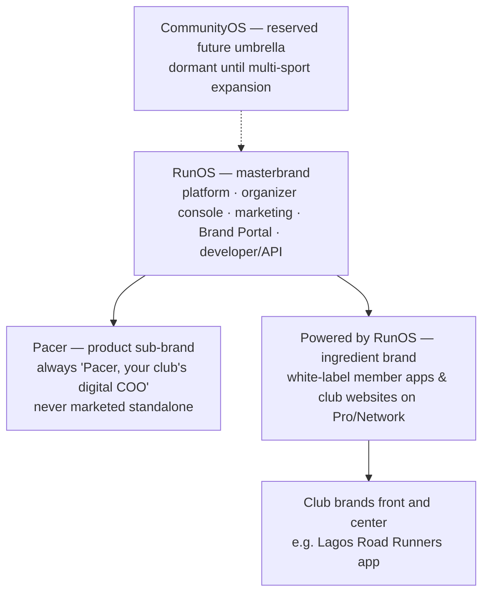

# RunOS Brand Strategy

> **Status:** Canonical. Consistent with [`docs/00-foundation/canonical-brief.md`](../00-foundation/canonical-brief.md). Product name is always **RunOS**. The AI assistant is always **Pacer**. Tagline: *The Operating System for Running Communities.*

---

## 1. Brand Platform

### Purpose (why we exist)

**Give the people who build running communities their lives back — and their communities a future.**
Behind every great run club is a Maya doing 15 hours of invisible, unpaid admin a week. We exist so that human energy goes into culture, coaching, and belonging — and the boring stuff runs itself.

### Positioning statement

> **For** running-club organizers and the communities they lead, **RunOS is the Community Operating System** — the single platform that runs membership, events, money, growth, engagement, partnerships, and intelligence — **unlike** the patchwork of spreadsheets, group chats, forms, and payment apps clubs use today, **because** RunOS unifies everything into one source of truth the club owns, orchestrates the tools clubs already love (Strava, WhatsApp, Stripe, Shopify), and puts a digital COO — Pacer — behind every organizer.

**Category we create:** Community Operating System (vertical OS for run clubs).
**Frame of reference we accept:** "the Shopify of run clubs" — useful shorthand for investors and brands; never used member-facing.
**Frames we refuse:** Strava competitor, social network, events site (see vision doc §6).

### Promise

**"We run the boring stuff so you can run the club."**
Every surface, feature, and email must be able to point at the boring stuff it just eliminated.

### Personality

Five traits, each with a guardrail:

| Trait | Means | Never becomes |
|---|---|---|
| **Confident** | Declarative sentences; we know clubs | Arrogant, dismissive of organizers' hacks |
| **Warm** | We're of the community, not above it | Cutesy, exclamation-point spam |
| **Athletic** | Energetic, disciplined, verbs over adjectives | Bro-hustle, "crush it" culture |
| **Precise** | Stripe-like clarity; numbers with sources | Corporate-cold, jargon |
| **Understated** | Apple-like restraint; the club is the hero | Boastful; RunOS upstaging the club's brand |

### Values

1. **The club is the hero.** Our brand recedes so club brands shine — up to full white-label invisibility.
2. **Consent is non-negotiable.** We market our privacy model as loudly as our features.
3. **Craft respects volunteers.** A confusing screen wastes a volunteer's unpaid evening; quality is an ethical position.
4. **Show, don't hype.** Demos, numbers, and receipts over adjectives.
5. **Sweat equity.** We show up at runs. The brand is built at 6 AM in parks, not just on landing pages.

---

## 2. Naming Rationale

**Chosen name (per the canonical brief): RunOS.** Below is the honest tradeoff analysis of the final four.

| Criterion (weight) | RunOS | CommunityOS | ClubOS | PaceOS |
|---|---|---|---|---|
| Instantly says what it is (25%) | **5** — vertical + category in five letters | 3 — category clear, vertical absent | 4 — "club" is ambiguous (nightclubs, golf, SaaS grab-bag) | 3 — "pace" reads as training/coaching |
| Category creation: "OS" claim (20%) | **5** | 5 | 5 | 5 |
| Distinctive & ownable (20%) | 4 — short, chantable, some generic-collision risk | 2 — descriptive to the point of genericness; crowded "community" space | 2 — existing collisions in club-management software | 4 — distinctive but niche-sounding |
| Room to grow (15%) | 3 — honest weakness: it says *run* | **5** — any community, any sport | 4 | 2 — narrower than RunOS |
| Says it out loud test (10%) | **5** — two syllables, hard consonants, sounds like a command | 2 — five syllables | 4 | 4 |
| Emotional fit with runners (10%) | **5** — identity word ("I run") | 2 — abstract | 3 | 4 — insider-y but cold |
| **Weighted total** | **4.4** | 3.2 | 3.5 | 3.6 |

**Why RunOS won:** the wedge is run clubs, and vertical trust is won by *sounding* vertical. "RunOS" tells Maya in one breath that this was built for her world, carries the OS category claim, and doubles as a verb-adjacent identity word runners already own. CommunityOS is strategically bigger but tactically weaker — it would make us sound like the fifteenth horizontal community tool in a crowded, undifferentiated space, exactly when we need to win a specific tribe.

**The honest tradeoff:** RunOS caps the name at running. We accept that cost deliberately and hedge it structurally: **CommunityOS is reserved as the future multi-sport umbrella brand.** When Year-3+ expansion beyond running begins, the architecture becomes CommunityOS (holding/platform brand) → RunOS (the running vertical, unchanged for its market) → future verticals as siblings. Nothing about winning running is sacrificed to a future we haven't earned yet.

**Runner-up dispositions:** defensively secure ClubOS/PaceOS-adjacent domains and marks where cheap; do not use them.

---

## 3. Voice & Tone

**House voice (from the brief):** confident, warm, athletic. Never corporate-cold, never bro-hustle. Short sentences. Verbs over adjectives. "We run the boring stuff so you can run the club."

Voice is constant; tone flexes by surface:

### 3.1 Organizer app (desktop console — Maya)

Tone: **calm operator.** Maya is competent and tired; be her chief of staff, not her cheerleader. Light-first UI, information-dense, keyboard-fast.

| | Example |
|---|---|
| ✅ Do | "14 members haven't attended in 30 days. Start a win-back journey?" |
| ✅ Do | "Saturday's long run: 87 registered, 121 predicted. Order supplies for 130." |
| ❌ Don't | "Uh oh! 😱 Some members might be ghosting you!" |
| ❌ Don't | "Leverage our churn-mitigation module to optimize member retention KPIs." |

Rules: lead with the number, follow with the action, one tap to resolve. Pacer speaks in this tone too — a COO, not a mascot. Empty states teach ("No segments yet. Segments let you message just your 5K beginners.").

### 3.2 Member app (mobile, white-label — Leo)

Tone: **teammate energy.** Warm, brief, celebratory when earned. Dark-mode-first. Critically: on Pro/Network the app speaks **in the club's voice**, not ours — RunOS provides defaults the club can override.

| | Example |
|---|---|
| ✅ Do | "You're in for Saturday. Pace group B, 5:30/km. 46 teammates so far." |
| ✅ Do | "That's 8 Saturdays straight. Streak badge unlocked." |
| ❌ Don't | "Congratulations on optimizing your engagement streak!!! 🎉🎉🎉" |
| ❌ Don't | "RunOS has processed your registration." (RunOS never says its own name inside a white-label club app) |

Rules: celebrate real-world effort, not app usage. Consent prompts are plain-spoken and honest: "Your club will see that you attended, not your heart-rate data. Change anytime."

### 3.3 Brand portal (Sofia)

Tone: **precise, measurable, Stripe-grade.** Sofia defends budgets; give her defensible numbers and honest caveats. No community-kumbaya fluff.

| | Example |
|---|---|
| ✅ Do | "Campaign reach: 12,400 verified runners across 31 clubs. Redemptions: 1,847 (14.9%). Aggregated audiences; individual data only with explicit member opt-in." |
| ❌ Don't | "Connect authentically with passionate running tribes!" |
| ❌ Don't | Anything implying access to individual member data without opt-in — the consent model is a *headline*, not fine print |

### 3.4 Marketing site (mixed: organizers first)

Tone: **empathy, then proof.** Name the pain in the organizer's own words, then show the product doing the work. Short, kinetic, screenshot-heavy.

| | Example |
|---|---|
| ✅ Do | "214 unread messages. A spreadsheet called FINAL_final. A sponsor deck due Friday. There's a better way to run a club." |
| ✅ Do | "Set up your club in 10 minutes. Free under 50 members." |
| ❌ Don't | "A revolutionary AI-powered platform disrupting community management." |
| ❌ Don't | Feature-first headlines ("Multi-tenant CRM with granular RBAC") — features prove, pain sells |

### Vocabulary sheet

| Say | Not |
|---|---|
| members, runners, the club | users, end-users, audience (except in Brand Portal: "audiences", always "aggregated") |
| organizer | admin (except in permission labels) |
| Pacer | the AI, the bot, the assistant |
| run the club | manage your community |
| benefits passport, community score, Unified Runner Profile | (never rename canonical features) |
| "Powered by RunOS" | "built on RunOS", "a RunOS app" |

---

## 4. Messaging Architecture

### One-liner

**RunOS is the operating system for running communities.**

### Elevator pitch (30 seconds)

> Running clubs exploded into the defining communities of this decade — but the people running them are drowning in spreadsheets, WhatsApp chaos, and unpaid admin hours. RunOS is the operating system for running communities: one platform for members, events, money, growth, and sponsors, with an AI COO called Pacer doing the repetitive work. We don't compete with Strava or WhatsApp — we orchestrate them and own the workflow above them. Clubs get their time back, members get one home and real perks, and brands finally get measurable access to verified running audiences. Free to start; clubs upgrade as they grow.

### Three pillars with proof points

| Pillar | Claim | Proof points |
|---|---|---|
| **1. One source of truth** | Everything about your club in one place — owned by the club, controlled by members | Unified Runner Profile (identity → activity → purchases → community score); 8 integrated surfaces; 10+ fitness integrations (Strava, Garmin, COROS, Polar, Suunto, Apple Health, Google Health Connect, Fitbit, TrainingPeaks, Zwift); consent scopes with member control |
| **2. Runs itself** | The boring stuff is automated; Pacer is your club's digital COO | Recurring event automation with QR check-in and waivers; attendance & churn prediction; auto-reconciled Stripe Connect payments; Pacer drafts newsletters, sponsor proposals, landing pages, "Plan October"; Growth OS journeys |
| **3. Turns community into livelihood** | Clubs monetize professionally; members get real benefits; brands get real ROI | Memberships, tickets (2% + $0.30 on Starter/Club), merch; Sponsor CRM + Brand Portal with campaign ROI reporting; vendor marketplace (10% commission); benefits passport; low platform fees (2% → 0.5% by tier) |

### Boilerplate (press/footer)

> RunOS is the operating system for running communities — a single platform where clubs manage members, events, money, growth, engagement, and partnerships, powered by Pacer, the club's AI COO. RunOS integrates the tools clubs already use, from Strava and Garmin to Stripe and Shopify, into one source of truth owned by the club and controlled by its members. Clubs start free and scale from local crews to multi-chapter organizations with white-label apps under their own brand, "Powered by RunOS."

---

## 5. Audience-Specific Messaging Matrices

### Maya — Organizer (primary buyer)

| | |
|---|---|
| Core pain | Unpaid second job: spreadsheets, WhatsApp chaos, hand-built sponsor decks, burnout |
| Headline | **Run your club. Not your spreadsheets.** |
| Value promise | 10–15 hours/week back; club runs like a professional org |
| Key proof | Event builder + QR check-in + waivers; auto-reconciled payments; Pacer drafts and predicts; churn alerts |
| Objection → counter | "My club is used to WhatsApp" → We don't replace WhatsApp; we make sure the important stuff never drowns in it. Start free under 50 members. |
| CTA | Set up your club free in 10 minutes |

### Leo — Member

| | |
|---|---|
| Core pain | Five apps, zero recognition, misses sign-ups, no idea what his loyalty earns |
| Headline | **One home for your running life.** (delivered in the *club's* brand voice) |
| Value promise | Belong, improve, get recognized, unlock perks — without managing five apps |
| Key proof | One-tap event sign-up in the club's own app; streaks, badges, community score; benefits passport perks; his data, his consent toggles |
| Objection → counter | "Another app?" → It's *your club's* app — and it connects the accounts you already have (Strava, Garmin…). You control what's shared. |
| CTA | Join through your club's link |

### Sofia — Brand manager

| | |
|---|---|
| Core pain | Paid ads decaying; sponsorships unmeasurable "spreadsheet-and-hope" deals |
| Headline | **Verified running audiences. Measurable ROI. Zero creepiness.** |
| Value promise | Campaigns against real, consented, verified running communities with closed-loop measurement |
| Key proof | Aggregated audience insights across clubs; campaign manager + redemption tracking; benefits-passport placements; k-anonymized data, opt-in only |
| Objection → counter | "Is this just another ad network?" → No — you fund perks and partnerships members opt into. That's why it converts. |
| CTA | Book a Brand Portal demo (seats from $499/mo) |

### Emre — Vendor

| | |
|---|---|
| Core pain | Empty calendar slots; marketing to strangers; invoicing and reviews scattered |
| Headline | **High-intent local athletes, booked into your calendar.** |
| Value promise | Fill the calendar with runners who need you; get paid and reviewed in one place |
| Key proof | Marketplace listing to nearby clubs; in-platform booking, payment, reviews; 10% commission only when booked |
| Objection → counter | "Another lead-gen fee?" → You pay only on booked, paid sessions. No subscription, no ads. |
| CTA | List your practice |

### Amsterdam Active — City / enterprise (with Priya's multi-chapter orgs on the same Network tier)

| | |
|---|---|
| Core pain | No visibility into community sport; funding decisions made blind; impact unmeasurable |
| Headline | **See, fund, and measure community sport — with privacy built in.** |
| Value promise | Aggregate dashboards of participation across the city; measurable outcomes for health & tourism budgets |
| Key proof | City Portal aggregate-only dashboards; k-anonymity (no segment under 50); Network tier: SSO, SLA, API, dedicated CSM; multi-chapter tooling that chapter leads like Priya actually use |
| Objection → counter | "Citizen-data risk?" → Cities never see individuals — only anonymized aggregates. EU data residency available. |
| CTA | Talk to us about a city program (Network, from $999/mo, custom) |

---

## 6. Visual Identity Direction

*Direction, not final art. References per the brief: Linear (quality), Notion (flexibility), Stripe (clarity), Apple (restraint), Superhuman (speed).*

**Logo direction.** A wordmark first: "RunOS" set in a customized geometric grotesque, with the "OS" subtly differentiated (weight or a single-color shift) to make the category claim visible. Companion symbol: an abstract mark fusing a **route line and a power/command glyph** — a single continuous stroke that reads as both a running path and a system symbol. Must survive: 16px favicon, embroidered cap, race-bib print, and the small "Powered by RunOS" lockup. No running-man clichés, no shoe icons, no swooshes.

**Color world.** Two-mode system by design (member surfaces dark-first, organizer desktop light-first):

- *Foundation:* near-black "asphalt" and warm off-white "chalk" — the road at night and at dawn.
- *Primary accent:* one high-energy signal color in the orange-red "flare" family (dawn-run energy; safety-vest heritage; distinct from Strava's orange by shifting warmer/deeper — validate side-by-side).
- *System colors:* a restrained functional set (success/warn/danger/info) tuned for both modes.
- *Data palette:* 6–8 step categorical + sequential ramps for Intelligence dashboards, accessible in both modes.
- *White-label rule:* the entire palette is tokenized; club themes replace accent and brand hues, RunOS retains only functional colors. AA contrast minimum everywhere, AAA for body text.

**Typography direction.** A contemporary grotesque with true tabular figures for the product (numbers are everywhere: paces, payments, predictions) — Inter-class, possibly lightly customized later. A slightly more characterful cut or variable-weight display use for marketing headlines. Monospace for data/receipts/API. Type does the athletic work through scale and weight contrast — big confident numerals, quiet labels — not through italics-and-speed-lines theatrics.

**Photography style.** Real clubs, real weather, real effort: pre-dawn parks, post-run coffee, the 6 AM huddle, hands scanning a QR code. Documentary warmth over stock gloss — imperfect light, genuine sweat, every body type and age. People > products; community > individual heroics. UI is always shown honestly (real screens, real data density), Stripe-style. Never: stock high-fives, staged finish-line ecstasy, lone-wolf-at-sunset hero shots.

**Motion principles.** Motion = pace: quick starts, clean stops. (1) **Fast by default** — 150–250ms, ease-out, nothing decorative blocking input (Superhuman rule: perceived speed is the brand). (2) **Momentum metaphors** — progress, streaks, and check-ins animate like motion down a route line. (3) **Celebrate sparingly** — earned moments (PR, streak, sponsorship closed) get one signature flourish; everything else stays quiet. (4) **Respect reduced-motion** system settings fully.

---

## 7. Brand Architecture: Masterbrand vs. White-Label

**Where RunOS leads (masterbrand surfaces):** marketing site, organizer console, Brand Portal, City Portal, vendor marketplace, docs/API, pricing, sales. Full RunOS identity; house voice.

**Where the club leads (white-label surfaces):** member apps and club websites on Pro (white-label web) and Network (white-label mobile app). The club's name, logo, colors, and voice own the experience end to end.

**"Powered by RunOS" rules:**

1. **Placement:** a discreet lockup in app-store listing metadata, website footer, and the app's settings/about screen. Never in the member's primary UI flow, never in the club's push notifications.
2. **Tiers:** Starter carries visible RunOS branding (it's part of the free deal and an acquisition channel). Club tier: reduced RunOS branding. Pro: white-label web. Network: full white-label including the mobile app.
3. **Non-removable surfaces:** consent screens, privacy policy, and payment receipts always disclose RunOS as processor/infrastructure — trust and legal are never white-labeled away.
4. **Co-branding:** case studies and launch announcements are "Club × RunOS," club logo first.
5. **What clubs may not do:** present RunOS-powered apps as their own proprietary technology in *sales to third parties* (e.g., a franchise reselling "their platform"); resale rights are a Network-tier contractual matter.
6. **Pacer in white-label:** clubs may rename the assistant's display name on Network tier; capabilities remain identical, and "Pacer" remains the canonical internal/product name in all documentation.

**Naming hygiene:** it is always **RunOS** (capital R, capital OS, one word) — never Run OS, RunOs, or runOS. The tagline is always *The Operating System for Running Communities*.
