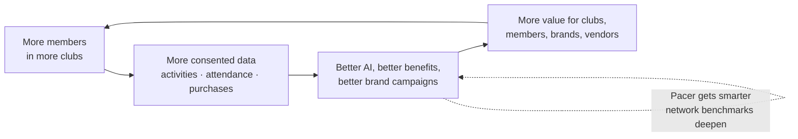

# RunOS Product Vision

> **Status:** Canonical. Derived from and consistent with [`docs/00-foundation/canonical-brief.md`](../00-foundation/canonical-brief.md). If anything here contradicts the brief, the brief wins.

---

## 1. The Big Vision

**Strava owns activity. WhatsApp owns communication. Instagram owns attention. Eventbrite owns events. Shopify owns merchandise. HubSpot owns customer data. Nobody owns the operating system.**

That gap is the company.

Running clubs are the fastest-growing social institution of the decade — part sports team, part social network, part small business, part local media channel. And yet the people who run them operate like it's 2009: spreadsheets, group chats, Venmo screenshots, and heroic unpaid labor. Every tool they use owns a slice of the club's life; no tool owns the *club*.

RunOS is the **Operating System for Running Communities**: the connective layer that lets running clubs manage, scale, monetize, and own their communities from a single platform — one login, one database, one workflow, one ecosystem. We don't replace Strava, WhatsApp, or Eventbrite. We orchestrate them, and we own the workflow layer above them.

The category we create is the **Community Operating System** — the vertical OS for run clubs first, and eventually the operating layer for organized community sport everywhere.

---

## 2. The Problem: Running a Club Today Is a Second Unpaid Job

A 450-member run club is a real organization. It has recurring events, money in and out, sponsors, merchandise, volunteers, chapters, safety obligations, and a brand. What it doesn't have is software. Instead it has a stack of eight disconnected consumer tools duct-taped together by one exhausted human.

The fragmentation, concretely:

| Job the club must do | Tool used today | What breaks |
|---|---|---|
| Member roster & profiles | Google Sheets | Stale within a week; no consent model; no history |
| Communication | WhatsApp (3–7 groups) | 200 unread messages; announcements buried under memes |
| Event sign-ups | Google Forms / Eventbrite / link-in-bio | No-shows unknown; no check-in; waivers on paper |
| Payments & dues | Bank transfers, Venmo, cash | Reconciliation by hand; nobody knows who paid |
| Runs & training data | Strava club page | Data belongs to Strava, not the club |
| Sponsorship | PowerPoint decks + guesswork | No verified audience data; unmeasurable ROI |
| Merch | Instagram DMs + a spreadsheet | Stockouts, lost orders, no margin visibility |
| Growth | Instagram + word of mouth | No funnel, no attribution, no retention view |

The consequences compound:

- **Organizers burn out.** 10–20 hours a week of unpaid admin is the norm at 300+ members. Clubs plateau or die when the founder does.
- **Members churn silently.** Nobody notices when a regular stops showing up, because attendance lives in nobody's system.
- **Money is left on the table.** Sponsors want run clubs desperately — verified, high-intent, local audiences — but clubs can't prove reach, demographics, or engagement, so sponsorships stay small, informal, and in-kind.
- **The data evaporates.** Every check-in, kilometer, purchase, and PR is generated and immediately lost across eight silos. The most valuable asset a community produces — its own record of itself — belongs to everyone except the community.

### A day in the life of Maya — before RunOS

Maya Okafor founded Lagos Road Runners four years ago. It's now 450 members strong. She's also its CRM, treasurer, events team, sponsorship agency, and customer support desk.

**Tuesday, 6:05 AM.** Maya wakes up to 214 unread WhatsApp messages across four groups. Somewhere in there: two new-member requests, a question about Saturday's route, and a member reporting she paid dues last week (Maya can't find the transfer).

**7:30 AM.** She updates the member spreadsheet on her phone — v14, "FINAL_final" — before her actual job starts. She forgets to add one of the two new members.

**12:40 PM (lunch break).** She builds Saturday's long run sign-up in Google Forms, copies the link into all four WhatsApp groups, then screenshots it for Instagram Stories. She has no idea how many of the 450 will actually show up — last month she ordered 60 bananas for a run where 140 people appeared.

**7:00 PM.** A running-shoe brand emails asking about a sponsorship. They want member numbers, attendance data, demographics. Maya opens PowerPoint and starts guessing. The deck will take her three evenings. The brand will offer product-in-kind because she can't prove anything.

**10:30 PM.** She reconciles dues: bank app in one hand, spreadsheet in the other, 38 unmatched payments. She falls asleep mid-row. Tomorrow there are pace-group assignments, a waiver problem, and a volunteer who quit.

Maya loves her club. Her club is slowly consuming her life. **Multiply Maya by hundreds of thousands of clubs worldwide.**

### The same day — with RunOS

**Tuesday, 6:05 AM.** One notification, from Pacer — her club's digital COO: *"Overnight: 2 membership requests approved and welcomed, 3 dues payments reconciled, Saturday's long run is at 87 registrations (predicted attendance: 121 ± 9). One flag: 14 members are at churn risk — want a win-back sequence?"* Maya taps "yes" and goes for her own run.

**12:40 PM.** Saturday's event already exists — Pacer drafted it Sunday from the club's recurring template: route from the routes library, pacer assignments, waiver attached, QR check-in armed, weather watch on. Maya reviews for 90 seconds and hits publish. It posts to the community feed, sends targeted push to the right pace segments, and updates the club's white-label site.

**7:00 PM.** The shoe brand's inquiry landed in the Sponsor CRM. Pacer has drafted a proposal from live, consented, verified data: 450 members, 61% weekly-active, average attendance 118, aggregate demographics, engagement benchmarks vs. anonymized network norms. Maya edits two sentences and sends a live Brand Portal link instead of a PDF. The deal that closes will be cash, not just shoes — and measurable.

**7:10 PM.** Maya has her evening back. The club runs on RunOS. Maya runs the club — the parts only a human should: the vision, the culture, the people.

**Time saved: ~15 hours a week. Revenue unlocked: sponsorship, dues she can actually collect, merch with margins she can see. Members who feel it: all 450.**

---

## 3. The Product Thesis

### 3.1 Infrastructure, not another app

Members don't want a ninth app; organizers don't want a ninth login. So RunOS behaves like infrastructure:

- **For organizers**, RunOS is the console — eight surfaces (Community, Events, Money, Growth, Engage, Partners, Intelligence, Platform) covering every operational job.
- **For members**, RunOS mostly disappears: on Pro and Network tiers it ships as the *club's own* branded website and mobile app — "Powered by RunOS" — the way Shopify powers stores and Stripe powers checkouts.
- **For the existing stack**, RunOS integrates rather than competes: Strava, Garmin, COROS, Polar, Suunto, Apple Health, Google Health Connect, Fitbit, TrainingPeaks, and Zwift feed the activity layer; Stripe, Shopify, Mailchimp, HubSpot, Meta, TikTok, Google Analytics, Slack, Discord, and WhatsApp handle their jobs — orchestrated from one place.

Great infrastructure is judged by what it makes possible, not by time-in-app. Our north star is **Weekly Active Community Members (WACM)** — members who attended, logged, posted, redeemed, or transacted in the last 7 days, across all clubs — because it measures whether communities are *alive*, not whether people are staring at our screens.

### 3.2 One source of truth

The core artifact is the **Unified Runner Profile**: one profile per member aggregating identity, membership, activity, attendance, purchases, events, friends, volunteer hours, challenges, rewards, coach notes, nutrition, goals, brand interactions, merch history, race history, content appearances, community score, and lifetime value.

Today that picture exists nowhere. Once it exists in one place, everything downstream becomes trivially possible: churn prediction, fair pace groups, sponsorship proof, benefit targeting, volunteer recognition, safety at events. One login, one database, one workflow, one ecosystem — every module reads and writes the same truth, so every module makes every other module better.

### 3.3 The data layer is the moat

Every action inside RunOS creates valuable data — and RunOS is the only place that data converges. The moat has an explicit ethical architecture (see brief §4 and §9): **data belongs to the club and is shared only with member consent.** Members control granular scopes (`profile.basic`, `activity.summary`, `activity.detailed`, `health.medical`, `location.live`, `marketing.brands`, `photos.appearances`); clubs get the operational view; the network gets only anonymized, aggregated insight with k-anonymity thresholds (no segment smaller than 50).

This isn't just ethics — it's strategy. Consented, verified, structured community data is the one asset that cannot be scraped, bought, or fast-followed. It compounds daily, it powers Pacer, and it's what brands will pay for precisely *because* it's consented and verified.

### 3.4 The flywheel

Each turn of the wheel lowers acquisition cost and raises switching cost:

1. **More members** → clubs onboard members to get operational relief; members join because the club experience is better.
2. **More data** → every check-in, kilometer, redemption, and payment enriches the Unified Runner Profile and the anonymized network layer.
3. **Better AI / benefits / brands** → Pacer's predictions sharpen; the benefits passport fills with perks brands fund to reach verified runners; campaigns get measurable ROI.
4. **More value** → clubs earn more and work less; members get perks and recognition; brands get results — which attracts the next cohort of members and clubs.

### 3.5 Automate everything repetitive; measure everything

Pacer — the club's digital COO — is not a chatbot bolted on; it's the expression of principles 2 and 6 (automate everything repetitive; every workflow is measurable). Attendance prediction, churn-risk lists, ambassador scoring, brand-fit matching, sponsor proposal drafting, event pages, Instagram carousels, newsletters, revenue forecasts, "Plan October." Grounded in the club's own data plus anonymized network benchmarks; never exposing another club's raw data.

---

## 4. Vision Horizons

### Year 1 — Own the club workflow (the wedge)

**Goal:** Become the tool Maya cannot imagine losing.

- Nail Community + Events + Money end-to-end: roster, feed, messaging, event builder, QR check-in, waivers, memberships, Stripe Connect payments.
- Ship Pacer v1 (drafting, digests, attendance prediction) and the fitness ingestion layer (Strava first, then Garmin/COROS/Polar/Suunto/Apple Health/Google Health Connect/Fitbit/TrainingPeaks/Zwift).
- Prove the activation motion: **first 3 events published, 30% of members joined** — the canonical activation bar.
- Land the Starter→Club→Pro upgrade path; white-label web on Pro.
- **Success looks like:** clubs saving 10+ hours/week, WACM growing week over week, organic club-to-club referral as the #1 acquisition channel.

### Year 2 — Own the ecosystem (the marketplace)

**Goal:** Turn saved time into new money — for clubs, members, brands, and vendors.

- Launch the **Brand Portal** at scale: Sofia runs measurable campaigns against consented, aggregated audiences; sponsor CRM + campaign manager + ROI reporting become the standard way brands buy run-club reach.
- Launch the **vendor marketplace**: Dr. Emre Kaya fills his physio calendar with high-intent local athletes; 10% commission on bookings.
- **Benefits passport** goes network-wide: perks funded by brands, redeemed by members, measured by everyone.
- Multi-chapter and franchise management matures; Priya runs her chapter with autonomy inside the parent org.
- **Success looks like:** GMV (memberships + tickets + merch + marketplace + campaigns) becoming a revenue line as large as SaaS; the first clubs earning more through RunOS than they pay for it.

### Year 3 — Own the network (the category)

**Goal:** Make "Community Operating System" a category with one obvious leader.

- **Network intelligence** at full power: anonymized cross-club benchmarks that make every club smarter ("clubs like yours retain 22% better with a beginners' pace group").
- **City Portal** scales: municipalities like Amsterdam Active discover, fund, and measure community sport through aggregate dashboards.
- Network tier (white-label mobile apps, API, SSO, SLA) wins federations, franchise clubs, and city programs.
- The runner-side network effect ignites: Leo's Unified Runner Profile travels with him between cities and clubs — joining a new club anywhere means instant belonging.
- **Success looks like:** RunOS is how the run-club world *works* — the default rails for community sport, with the multi-sport expansion (under the reserved CommunityOS umbrella) ready to open.

---

## 5. The End Game

The numbers we run the company toward:

| Dimension | End-game target |
|---|---|
| Clubs on platform | **50,000** |
| Runners with Unified Runner Profiles | **18,000,000** |
| Brands buying through the Brand Portal | **500** |
| Countries | **150** |

At that scale, RunOS is not a SaaS tool — it is the economic and data infrastructure of a global movement: the rails on which community sport organizes, transacts, and grows. Every serious run club runs on it, every serious running brand buys through it, and every runner carries one profile across the whole network. That's what "owning the OS" means.

---

## 6. Why Now, Why Us, What We Are NOT

### Why now

1. **The run-club boom.** Post-pandemic, running clubs became the defining third place for a generation — social fitness is replacing nightlife and even dating apps as how people meet. Club formation and club size are compounding, and the organizer pain compounds with them.
2. **The creator-economy playbook reached communities.** Organizers now expect to professionalize and monetize — the way creators did with Shopify, Substack, and Patreon. The tooling for *communities* hasn't caught up. We are that tooling.
3. **Brands are fleeing paid ads for communities.** Rising CAC, dying cookies, and ad blindness are pushing field-marketing budgets toward authentic, local, verified communities — exactly what run clubs are and exactly what they can't currently sell, because they can't prove anything.
4. **AI just made the "digital COO" buildable.** Two years ago Pacer would have been a demo. Today, LLMs grounded in a club's own structured data can genuinely draft, predict, plan, and automate — which means a volunteer can operate like a professional org.
5. **The infrastructure primitives are commodity.** Stripe Connect, device APIs (Strava/Garmin/etc.), and modern multi-tenant stacks make it possible for a startup to ship enterprise-grade vertical infrastructure fast.

### Why us

- **We are building infrastructure, not an app** — the harder, less crowded, more defensible position, with the architecture decisions (multi-tenant RLS, consent scopes, event-driven automation, white-label from day one) made for it from the first commit.
- **We hold the quality bar of Linear, Stripe, Notion, Apple, and Superhuman** — in a market whose incumbent tooling is a Google Form. Craft is a moat when the buyer is a volunteer with no patience for bad software.
- **We chose the ethical data architecture early.** Consent-scoped, club-owned, k-anonymized. That's the only version of this company that brands, members, and regulators all want to exist — and it can't be retrofitted by whoever moves fast and breaks trust.
- **We are wedge-disciplined.** Everyone else picks a slice (chat, events, payments). We picked the *workflow* — and workflows, once owned, own everything downstream.

### What we are NOT

- **Not a Strava competitor.** Strava owns the activity graph and does it brilliantly. We ingest from Strava (and nine other sources); we don't track runs. Strava is a partner and a data source, never the enemy.
- **Not a social network.** We are not competing for attention or scroll time. The community feed exists to serve the club's operations and belonging — WACM measures real-world participation, not screen time.
- **Not an events site.** Eventbrite sells tickets to strangers. Our Events surface is one module of eight — events are a workflow inside a relationship, not the product.
- **Not a group-chat replacement.** WhatsApp and Discord keep doing chat; we orchestrate and integrate. The announcement that matters shouldn't die under 200 memes — that's a workflow problem, not a chat problem.
- **Not an ad network.** Brands never buy access to members. They fund benefits, perks, and campaigns against aggregated, consented audiences — with individual participation always opt-in (`marketing.brands` scope).

---

## 7. Core Principles (elaborated)

These are the ten principles from the canonical brief. They are product law: every spec, screen, and schema is checked against them.

**1. One source of truth — one login, one database, one workflow, one ecosystem.**
Fragmentation is the root problem, so unification is the root principle. There is exactly one member record, one event record, one payment record — and every surface reads and writes it. We would rather ship one integrated 80% module than two disconnected 100% tools, because the value of RunOS is the *joins*: attendance × payments × activity × consent in a single query. If a feature would create a second copy of truth, we redesign it.

**2. Automate everything repetitive.**
Maya's 15 weekly admin hours are a design failure of the current world, and eliminating them is the wedge. Anything a club does twice — event creation, welcome messages, dues chasing, reconciliation, sponsor reporting, monthly planning — must be automatable through Growth OS journeys and Pacer. The bar: a healthy club should run its recurring operations on review-and-approve, not create-from-scratch. Human time goes to culture; machine time goes to logistics.

**3. Every action creates valuable data.**
A QR check-in isn't just entry control — it's attendance history, churn signal, sponsor proof, and pace-group input. We design every interaction to emit structured events into the data layer, so the platform gets smarter with use. The corollary is a design duty: never ask a human to enter data the system already knows, and never collect data that doesn't return value to the member or the club.

**4. Data belongs to the club and is shared only with member consent.**
Members control granular sharing through explicit scopes; clubs get the operational view; the network gets only anonymized, aggregated insight with k-anonymity (no segment under 50). Medical and brand-marketing scopes are always opt-in, with conservative defaults. This is the constitutional principle: it protects members, it makes clubs owners rather than tenants of their own community, and it makes our data asset the *legitimate* one — the only kind brands and cities can safely buy and the only kind that survives regulatory scrutiny in 150 countries.

**5. Every module connects to every other module.**
A challenge (Engage) can trigger a reward funded by a sponsor (Partners), redeemed at an event (Events), paid through the platform (Money), boosting a member's community score (Community), feeding a churn model (Intelligence), and firing a win-back journey (Growth) — configured once (Platform). Eight surfaces, one nervous system. When we spec a module, "what does it feed and what feeds it" is a required section, not an afterthought.

**6. Every workflow is measurable.**
If a club runs a referral program, a sponsor campaign, or a training block through RunOS, it must see the funnel: reach → action → outcome → revenue. Measurability is what converts organizer intuition into organizer leverage, and what converts sponsorship from "spreadsheet-and-hope" into a budget line brands renew. Internally, the same law applies to us: every feature ships with its success metric wired into the WACM input tree (acquisition → activation → engagement → monetization → network effects).

**7. Every screen reduces operational friction.**
The user is a volunteer at 10:30 PM after her real job. Every screen must answer "what needs my attention and what's the one tap that resolves it." We count taps, we default aggressively, we surface next actions, and we treat a confusing screen as a bug with the same severity as a crash. The Linear/Stripe/Superhuman bar is not aesthetic vanity — for exhausted volunteers, speed and clarity are the difference between a club that scales and an organizer who quits.

**8. Mobile-first with desktop power.**
Maya runs Saturday's check-in from a phone in a park at 6 AM; she reconciles finances and builds sponsor reports on a laptop on Sunday. Members live entirely on mobile (dark-mode-first, in the club's own brand); organizers get a light-first desktop console with keyboard-driven power (⌘K everywhere, Pacer omnipresent). Neither experience is a port of the other; both read the same truth.

**9. Enterprise-grade architecture.**
Clubs trust us with money, medical flags, minors' waivers, and live location — from day one, before we're "big enough to deserve it." That means row-level security on every tenant query, consent enforcement in the data layer (not the UI), audit trails, EU + US data residency, SSO and SLA readiness for the Network tier, and payment flows on Stripe Connect done correctly. Infrastructure companies don't get a second chance on trust.

**10. Multi-tenant SaaS supporting thousands of clubs.**
Every feature is designed for the 50,000-club world on day one: organization → chapters → members tenancy, white-label theming as configuration not code, per-tenant limits and roles, network intelligence that only works *because* thousands of tenants share one anonymized layer. The discipline this imposes — no bespoke hacks, no single-tenant shortcuts — is exactly what makes the flywheel (§3.4) physically possible.

---

## 8. How We'll Know It's Working

| Stage | Signal | Canonical metric |
|---|---|---|
| Acquisition | Clubs sign up, mostly by referral | New clubs/week; % referral-sourced |
| Activation | Clubs reach the bar | First 3 events published + 30% members joined |
| Engagement | Communities are alive | **WACM** (north star) |
| Monetization | Value converts | SaaS MRR + GMV (payments, tickets, merch, marketplace, campaigns) |
| Network effects | The flywheel spins | Benefits redemptions, brand campaigns, marketplace GMV |

One sentence to keep on the wall: **when Maya gets her evenings back, Leo feels more at home, Sofia renews her campaign, and Emre's calendar is full — WACM goes up, and everything else follows.**
