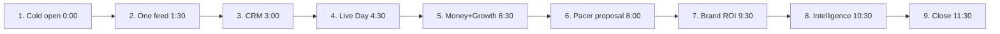

# RunOS — Demo Flow

> Owner: UX Director / Head of Product Design (with Sales)
> Status: v1.0 — execution-ready. Conforms to `docs/00-foundation/canonical-brief.md`.
> Contents: the scripted 12-minute sales demo (demo club: **Harbor City Runners**), the 3-minute self-serve product tour, and the demo environment / seed data spec.

---

## 1. The 12-Minute Sales Demo

**Audience:** club organizers (Maya-type), often with a co-organizer; adaptable for multi-chapter (Priya/Network) by extending Beat 8.
**Narrative arc:** *chaos → control → money → intelligence → proof.* Every beat lands one wow, and the four **money beats** are: WhatsApp-chaos-to-one-feed (Beat 2), QR check-in day (Beat 4), Pacer writing a sponsor proposal from real data (Beat 6), brand ROI report (Beat 7).
**Setup:** organizer app at Today dashboard, logged into Harbor City Runners; phone (or simulator window) with the club-branded member app; second browser profile with the Brand Portal. Demo clock: hard beats — practice to time.

### Beat 1 — Cold open: the Today dashboard (0:00–1:30)

- **Screen:** Organizer → Today.
- **You click:** nothing yet. Let it sit.
- **You say:** "This is Harbor City Runners — 438 members, run by two volunteers. Before RunOS: six WhatsApp groups, four spreadsheets, an Eventbrite, a Linktree, and a treasurer with a shoebox. This screen is their entire morning now. Next event, live RSVP count, the three things that actually need a human, and their AI — Pacer — has already read everything."
- **Wow:** the Pacer digest line "7 members at churn risk → Review list" — *the software noticed before the organizer did.*

### Beat 2 — MONEY BEAT: WhatsApp chaos → one feed (1:30–3:00)

- **Screen:** phone in hand — member app Home feed (club-branded, dark).
- **You click:** scroll the feed once; tap `I'm going` on Saturday Long Run; point at the organizer screen — RSVP count ticks 84→85 live.
- **You say:** "Here's the same club from a runner's pocket — notice it's *their* brand, not ours. This feed replaces the 400-message group chat: next event pinned, one tap to commit, and… (point at desktop) …the organizer's count just moved. One tap on a phone, one source of truth everywhere. Nobody asks 'is the run still on?' ever again."
- **Wow:** the live RSVP tick across devices. Pause on it.

### Beat 3 — The club gets a memory: Member CRM (3:00–4:30)

- **Screen:** Community → Members; open Leo Martins' profile.
- **You click:** filter chip `Attendance <2/mo` (450 → 23 members, live count); clear it; open Leo; hover the 🔒 "Detailed splits — not shared" chip.
- **You say:** "Every member, one profile: streak, attendance, lifetime value, what they've unlocked. Watch the count as I filter — this is a segment, and segments feed everything: messages, automations, win-backs. And see this lock? Leo hasn't shared detailed workouts — members control exactly what the club sees. That consent model is why runners actually connect their Strava."
- **Wow:** live-count filtering + the consent lock (trust as a feature).

### Beat 4 — MONEY BEAT: QR check-in day (4:30–6:30)

- **Screen:** Events → Saturday Long Run → Live Day (pre-set to *live* state); phone shows Leo's QR ticket.
- **You click:** scan the phone's QR with the demo scanner (or click the simulated scan) → green flash "✅ Leo Martins — 3rd run this month"; point at the board: 68→69/84; click the amber "waiver unsigned" row → resolve in one tap.
- **You say:** "Event morning. One volunteer, one phone. Scan — done — and the runner gets a moment: 'third run this month.' Attendance is now *data*, not a guess. It works offline in a park with no signal. And exceptions — unsigned waiver, walk-in — are one tap, not a clipboard. This screen is why clubs say check-in went from 25 chaotic minutes to 4."
- **Wow:** scan-to-green in under half a second, and attendance becoming a real-time chart.

### Beat 5 — Money & the robots: memberships + Growth OS (6:30–8:00)

- **Screen:** Money → Overview (30 s), then Growth → Automations → open "Win-back: lapsed 30 days".
- **You click:** point at MRR $3,120 and next payout; switch to the automation canvas; press `Test run` — watch the per-member trace execute.
- **You say:** "Memberships, event fees, merch — Stripe-powered, paid to the club's bank, fully itemized for the treasurer. And here's the part that gives volunteers their evenings back: automations. This one notices a member's gone quiet for 30 days, sends a personal nudge, waits a week, then offers a bring-a-friend pass. Read the sentence at the top — the canvas *is* that sentence. Last month it quietly won back 11 members."
- **Wow:** the plain-language sentence + the live test-run trace.

### Beat 6 — MONEY BEAT: Pacer writes a sponsor proposal from real data (8:00–9:30)

- **Screen:** Partners → Sponsors; then Pacer panel.
- **You click:** `✦ Draft proposal` on Harbor Sports; Pacer streams the proposal — audience size, attendance history, redemption benchmarks, suggested package $1,450/quarter — then `Export PDF`.
- **You say:** "This is the beat organizers don't believe until they see it. Sponsorship used to be a weekend in Canva and a guess. Watch: 'Pacer, draft a proposal for Harbor Sports.' It's pulling *this club's real numbers* — 1,020 verified check-ins last quarter, 32% perk redemption, against anonymized network benchmarks — and pricing the package. Sixty seconds to a document that used to take a weekend. That's a club acting like a business."
- **Wow:** watching real attendance data become a priced, sendable proposal in real time. This is the demo's peak — protect the silence while it streams.

### Beat 7 — MONEY BEAT: the brand ROI report (9:30–10:30)

- **Screen:** Partners → Brand reports → Harbor Sports Q3 (then 15 s of Brand Portal in the second browser profile).
- **You click:** open the live report; point at "Redemptions 134 · $2,680 driven · +9pp vs benchmark · 👁 viewed 3 times"; flip briefly to the Brand Portal campaign dashboard.
- **You say:** "And when the season ends, renewal isn't a begging email — it's this link. Reach, redemptions, event presence, everything verified, and you can see the sponsor opened it three times. Flip to the sponsor's side: brands get their own portal — aggregated audiences only, never individual members, nothing under a cohort of fifty. Measurable for them, safe for your runners. That's why sponsors renew — and pay more."
- **Wow:** the same data serving both sides — club proof and brand ROI — with privacy visibly enforced.

### Beat 8 — Intelligence: the club that sees around corners (10:30–11:30)

- **Screen:** Intelligence → Analytics home.
- **You click:** hover the attendance forecast band on Saturday's event (71 ±6); click Churn radar → the ranked 7 with reasons → `✉ Nudge them` (don't send).
- **You say:** "Everything you've seen becomes foresight. Saturday's forecast: 71 runners — order 71 coffees, not 100. These seven members are drifting, and it tells you *why* — new members with no friend connections. One click runs the play. And the benchmark line — 'clubs like yours' — is the whole network's anonymized intelligence working for this club."
- **Wow:** a churn list with reasons and a one-click fix.
- *(Network-tier variant: 60 s here on the chapter switcher + all-chapters rollup for Priya's story.)*

### Beat 9 — Close (11:30–12:00)

- **Screen:** back to Today.
- **You say:** "Twelve minutes ago this was WhatsApp and spreadsheets. Now: one feed, a CRM with a memory, four-minute check-ins, money in the bank, a robot doing retention, and sponsorship proposals that write themselves. Starter is free under 50 members; this club runs on Pro at $199 a month — it earned that back on this one sponsor. Import runs on a CSV, a WhatsApp export, or your Strava club — you'd be live before your next Saturday run. Want us to import yours right now?"
- **Ask:** live import of *their* data, on the call. Highest-converting close we have.

---

## 2. The 3-Minute Self-Serve Product Tour

In-product interactive tour (also cut as a 3-min video). Runs on a read-only Harbor City Runners sandbox; visitor clicks through 5 stops; every stop's final frame has `Start free — import your club`.

| Stop | Time | Screen | Interaction | Caption (on-screen copy) |
|---|---|---|---|---|
| 1 | 0:00–0:30 | Today dashboard | Pulse-highlight the Pacer digest | "One screen replaces six apps. Your club's whole morning, handled." |
| 2 | 0:30–1:10 | Member app feed → RSVP → live tick on desktop (split-screen) | Visitor taps `I'm going` themselves | "Your members get *your* app. One tap, one source of truth." |
| 3 | 1:10–1:50 | Live Day + QR scan animation | Visitor clicks `Scan` → green flash | "Event day in one hand. Offline-proof. 4-minute check-ins." |
| 4 | 1:50–2:30 | Pacer proposal streaming (pre-recorded stream, real seed numbers) | Visitor clicks `✦ Draft proposal` | "Pacer turns your real attendance into a sponsor proposal. Sixty seconds." |
| 5 | 2:30–3:00 | Setup Score + import cards | — | "CSV, WhatsApp export, or Strava club. Live before Saturday. Free under 50 members." |

Instrumentation: `tour_started`, `tour_stop_completed` (n), `tour_cta_clicked`; target ≥45% reach Stop 4 (the proposal is the conversion beat here too).

---

## 3. Demo Environment Requirements (Seed Data Spec)

One scripted reset (`demo:reset harbor-city`) rebuilds the environment in <60 s to exactly this state. All personal data is synthetic; names below are canonical demo fixtures.

**Club:** Harbor City Runners — coastal-city club, founded 2023, 438 members, 2 chapters (Harbor Central, Northside), Pro plan, brand kit: teal `#0E7C86` on dark (proves white-label ≠ orange), logo set (light/dark).

**People (fixtures):**
- Organizer login: `demo-maya@runos.demo` (Owner). Volunteer-coordinator and Finance logins available for role-demo.
- Member device login: **Leo Martins** — 6-week streak, 3 check-ins this month, `activity.summary` + `photos.appearances` granted, `activity.detailed` NOT granted (powers the Beat-3 lock), Strava-connected, in October 100K at 64/100 km, rank 12.
- 438 members total: realistic name/locale mix; 60% Active membership, 25% Guest, 15% Lapsed; attendance distribution long-tailed; 23 members matching `Attendance <2/mo`; exactly 7 on churn radar with generated reasons ("new, no friend connections", "streak broken after injury-tagged post").
- Consent distribution: `activity.summary` 78%, `activity.detailed` 31%, `health.medical` 22%, `marketing.brands` 41%, `location.live` 12%, `photos.appearances` 66% — realistic, quotable.

**Events:** 62 past events over 18 months (weekly Saturday Long Run, Tuesday Track, monthly socials, 2 races) with attendance 55–90 forming a plausible seasonal curve; **Saturday Long Run 12K** seeded 2 days out with 84 RSVPs (85 after the live demo tap — reset restores 84), forecast 71 ±6, weather ☀ 22°, one member with unsigned waiver (Zara K.), Live Day pre-armable to *live* state with 68 checked in; route library with 8 routes incl. River Loop 12K with real-looking GPX.

**Money:** MRR $3,120 (3 plans: Community $5, Club $12, Race Team $20); next payout Friday, itemized; 14 merch orders; 2 open invoices; one intentionally failed payment in the Action queue.

**Growth/Engage:** "Win-back: lapsed 30 days" automation Active with 30-day history (41 runs, 11 conversions) and a safe Test-run member; "Welcome series" active; **October 100K** challenge live, 137 joined, leaderboard with Leo at #12; Benefits Passport: 4 unlocked perks incl. Harbor Sports 20% (134 redemptions) and Dr. Emre Kaya physio 10%; ambassador roster of 5 with Pacer flagging one candidate.

**Partners:** Sponsor pipeline exactly as W7 (NoxRun lead fit-87, HydraFuel contacted, Harbor Sports at proposal *and* renewal with the Q3 report seeded: 412 members reached, 38k impressions, 134 redemptions, $2,680 driven, +9pp vs benchmark, viewed 3×); Brand Portal workspace (NoxRun, login `demo-sofia@runos.demo`) with 3 campaigns matching W16 incl. one k<50 suppressed cohort (the privacy talking point); Vendor: Dr. Emre Kaya listed, 4.9★, 23 bookings.

**Pacer:** proposal generation runs against seed data with a warmed cache — streams start <1.5 s, deterministic numbers matching this spec (the $1,450/quarter package), full generation ≤45 s; digest pre-computed with the 3 canonical items; churn explanations pre-generated. Fallback: if generation fails live, the panel replays a cached stream (visually identical) — the demo never stalls.

**Environment rules:** isolated demo tenant, no external sends (email/SMS/push sandboxed to a viewer), Stripe in test mode with seeded payout objects, offline mode toggle for the Live Day beat, network-throttle-proof (all beat screens pre-cached), reset idempotent, and demo watermark off (it must *feel* like production because it is production code).
