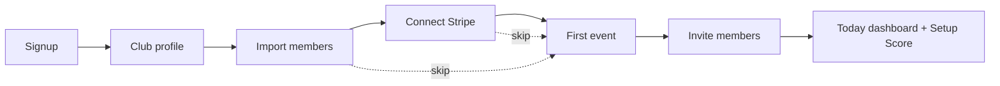

# RunOS — Onboarding Flows

> Owner: UX Director / Head of Product Design
> Status: v1.0 — execution-ready. Conforms to `docs/00-foundation/canonical-brief.md`.
> Covers: club (organizer) onboarding, member onboarding (incl. consent design), brand & vendor onboarding, activation metrics & instrumentation.

Design stance: onboarding is not a tour, it's the first workout. Every step produces a real asset (a CRM, an event, a payment rail). Skip anything, come back via the **Setup Score** checklist. Copy voice: confident, warm, athletic; short sentences; verbs over adjectives.

---

## 1. Club Onboarding (Maya)

**Goal:** signup → club profile → import members → connect Stripe → first event published in <10 min of active effort → members invited.
**Structure:** 6 steps; steps 3–5 individually skippable; progress persists; resumable from any device.



### Step 0 — Signup

**Screen:** split layout; left = form, right = live preview panel that builds the club as she types (empty phone mockup → filled club app).
- Fields: email or Google/Apple SSO → name → password (or magic link).
- **Headline:** "Run the club. We'll run the boring stuff."
- **Sub:** "Free for clubs under 50 members. No card required."
- CTA: `Create your club`
- Skip logic: none (identity required). Social SSO first-position — measured to convert 1.4× email.

### Step 1 — Club profile

**Screen:** single card, 5 inputs, the right-side preview becomes her club's join page in real time.
- Inputs: club name → city → logo upload (skippable, auto-monogram fallback) → primary color (color picker with **live contrast guardrail** preview) → approximate size (`<50 / 50–200 / 200–1000 / 1000+`) → "How do you run things today?" (multi-select: WhatsApp · Spreadsheets · Strava club · Eventbrite · Instagram · Paper).
- **Headline:** "Make it yours."
- **Sub:** "This becomes your club's join page and member app. You can change everything later."
- The "how do you run things" answer personalizes Step 2 (import order) and later empty states.
- CTA: `Looks good →` · Skip: logo/color only.

### Step 2 — Import members (the first aha)

**Screen:** three big source cards, ordered by her Step-1 answer, plus "start from zero".

```
┌──────────────────────────────────────────────────────────┐
│ Bring your people. Watch a spreadsheet become a club.    │
│                                                          │
│ ┌ 📄 CSV / Excel ┐ ┌ 💬 WhatsApp export ┐ ┌ 👟 Strava ┐  │
│ │ any columns —  │ │ export your group  │ │ connect   │  │
│ │ we'll map them │ │ chat → we find the │ │ your club │  │
│ │ [Upload]       │ │ people [How? 30s ▶]│ │ [Connect] │  │
│ └────────────────┘ └────────────────────┘ └───────────┘  │
│            or [Start fresh — invite people later]        │
└──────────────────────────────────────────────────────────┘
```

- **CSV:** upload → column-mapping with smart guesses (name/email/phone/join date/tags) → preview 5 rows → import. Bad rows quarantined with reasons, never block the batch.
- **WhatsApp:** inline 30-second video ("Group → Export chat → Without media"); parser extracts participants (names, phones) + last-active signal; explicit note: *"We read the participant list and activity dates. We don't store your messages."*
- **Strava club:** OAuth; pulls member list + recent club activity; imported members are `Guest` status until they accept an invite (no ghost-consent — activity shown only as club-level aggregates until each member joins and grants scopes).
- Multi-source allowed; **dedupe review** runs after: swipeable merge cards ("Same person? Tunde A. (CSV) + Tunde Adeyemi (WhatsApp)") — keyboard `y/n`.
- **Success moment (aha #1):** the CRM renders with real people, tags, and activity aggregates. Toast: *"212 members in. Your club now has a memory."*
- **Copy:** headline "Bring your people." · sub "CSV, WhatsApp export, or your Strava club — 3 minutes, no formatting homework."
- Skip: `I'll do this later` → Setup Score item created.

### Step 3 — Connect Stripe

**Screen:** one card, honest framing, explicitly deferrable.
- **Headline:** "Get paid like a real organization."
- **Sub:** "Memberships, event fees, merch — paid out to your club's bank. Setup takes ~5 minutes with Stripe. You can skip until you charge for something."
- Bullets: payouts weekly · club is the merchant of record · platform fee by plan (2% Starter / 1% Club / 0.5% Pro).
- CTA: `Connect Stripe` (OAuth to Stripe Connect onboarding) · Skip: `Skip — I'm not charging yet` (prominent, not shame-styled).
- If skipped: any later "make this paid" action re-offers inline.

### Step 4 — First event (<10 minutes promise, measured)

**Screen:** Event builder (see `ux-wireframes.md` W4), pre-filled aggressively:
- Pacer pre-drafts from import signals: *"Your WhatsApp group is most active Saturdays 6–8am. Start with 'Saturday Long Run'?"* — title, time, description drafted; route left for her (map pin or draw).
- Timer honesty: small "most clubs publish in ~4 min" note; the wizard is 3 required fields (title confirm, date confirm, location).
- **Headline:** "Publish your first event."
- **Sub:** "This is the moment your club stops living in a group chat."
- CTA: `Publish event` → success sheet = **Share kit**: pre-written WhatsApp message + link + branded image, `Copy message` one tap.
- Skip: allowed; Setup Score item created; Today dashboard's Next Event card takes over the nag duty (momentum-framed, not guilt-framed).

### Step 5 — Invite members

**Screen:** the Share kit expands: invite link, QR poster PDF ("print for your next run"), personal invites to imported members (batch email/SMS: *"Lagos Road Runners has a new home — claim your profile"*), per-source stats to come.
- **Headline:** "Open the doors."
- **Sub:** "Members join in under a minute. They control what they share — you get the operational view."
- CTA: `Send invites` · Skip: `Later` — but the event published in Step 4 auto-carries the join link, so skipping still leaks invites organically.

### Setup Score (activation checklist)

Persistent card on Today until 100%, then it graduates into Platform → Knowledge base.

| Item | Weight | Why (shown on hover) |
|---|---|---|
| Club profile complete (logo + color) | 10 | "Your app looks like *your* club" |
| Members imported (≥10) | 20 | "Everything gets smarter with people in" |
| First event published | 25 | "The heartbeat" |
| Invites sent (≥10) / join link shared | 15 | "30% of members joined = activated club" |
| Stripe connected | 15 | "Ready to earn" |
| First automation on (welcome series template) | 10 | "Your first robot" |
| Tracker-connected members ≥5 | 5 | "Challenges come alive" |

Score bands: 0–40 "Warming up" · 45–75 "In stride" · 80–100 "Race ready". Pacer references the score in digests with exactly one suggested next item.

### Empty-state-to-aha design

Every surface Maya visits before data exists sells its future (per IA §10): Money shows a ghosted revenue dashboard + "Connect Stripe"; Intelligence offers watermarked sample data; Partners shows "You already have the proof sponsors want — ✦ draft a proposal" once ≥3 events have attendance. The onboarding never dead-ends: the checklist, dashboards, and Pacer digest are three concentric nets that catch a dropped step.

---

## 2. Member Onboarding (Leo)

**Goal:** invite link → joined with informed consent → tracker connected → first RSVP. Target: **<3 minutes** to joined, RSVP within 48 h.

### Flow

1. **Invite link → club join page** (browser, club-branded, no install wall)
   - Shows: club name/logo, inviter ("Ana invited you"), member count, next event, 3 member faces.
   - CTA: `Join Lagos Road Runners`. App install offered *after* joining.
2. **Sign in** — Apple/Google one-tap or email magic link. Name + photo (photo skippable).
3. **Consent screens** — see below. Two screens max.
4. **Connect tracker** — provider grid (Strava, Garmin, COROS, Polar, Suunto, Apple Health, Google Health Connect, Fitbit, TrainingPeaks, Zwift). Pre-connect preview: *"Here's what your club will see"* rendered against his granted scopes. Skippable: `I'll connect later` (re-offered when he views a challenge).
5. **Notification level** — one screen, three options: Everything / The essentials (default) / Only my events.
6. **Land on Home feed** — never empty: next-event card (one-tap RSVP), welcome post, connect-tracker card if skipped.

### Consent design (the trust surface)

Principles: **informed opt-in without dark patterns** — no pre-checked non-essential scopes, no "Allow all" button, decline paths equally weighted and styled, value stated per scope, everything reversible in Me → Privacy & sharing, contextual re-asks capped (one re-ask per scope per 90 days, only at a genuinely relevant moment).

**Screen C1 — the baseline (required to be a member):**
> **"To be a member, the club needs the basics."**
> Card: **Basic profile** (`profile.basic`) — your name, photo, and membership status. Why: "so organizers know who's coming and volunteers can check you in."
> CTA: `That's fine` · Secondary: `What else can I share?` (goes to C2) — declining C1 = not joining, stated plainly, no guilt copy.

**Screen C2 — the optional scopes (each an independent card, all default OFF except `activity.summary` which is presented ON-suggested but requires an explicit tap to confirm):**

| Card (plain name) | Scope | Value line (copy) | Default |
|---|---|---|---|
| Weekly running summary | `activity.summary` | "Your distance and run count — makes challenges, streaks, and leaderboards work." | suggested, explicit confirm |
| Detailed workouts | `activity.detailed` | "Routes, splits, heart-rate zones — helps coaches help you. Your exact routes stay off the feed." | off |
| Emergency & medical info | `health.medical` | "Only opened in an emergency, by trained staff, always logged where you can see it." | off (separate deliberate flow with its own explainer) |
| Live location at events | `location.live` | "Only during events you join, only to organizers, auto-off when the event ends." | off |
| Offers from club partners | `marketing.brands` | "Perks and trials from brands your club approves. Zero data leaves without this on." | off |
| Photos of me | `photos.appearances` | "Let the club tag you in event photos and recaps." | off |

Footer of C2: *"Change any of this anytime in your profile. Off means off."* CTA: `Continue` (enabled regardless of selections).

Contextual asks later (never stacked): joining a challenge with no `activity.summary` → single-scope sheet; a brand campaign appears → `marketing.brands` explainer; first event RSVP → optional `health.medical` setup suggestion ("takes 60 seconds, could matter").

---

## 3. Brand Onboarding (Sofia) — brief

1. **Signup** (work email, company verification) → workspace created in **explore mode**: full Audience explorer with aggregates only, sample campaign dashboard (watermarked).
2. **Fit moment:** builds a saved audience; sees reachable verified runners + matched clubs with fit scores.
3. **Paywall at intent:** launching a campaign or contacting clubs requires a seat plan (from $499/mo). Trust center (DPA, k-anonymity methodology) linked at the paywall — procurement pre-answered.
4. **First campaign wizard:** objective → audience → offer/perk → budget → clubs → submit; approval-status timeline sets expectations. Activation = first campaign approved by ≥1 club.

## 4. Vendor Onboarding (Emre) — brief

1. **Signup** → listing builder (services, pricing with category benchmarks, photos) → credential upload → **verification pending** state (listing browsable, "verified" badge withheld; ETA shown).
2. **Availability:** calendar OAuth (Google/Outlook) or manual slots; service radius.
3. **Stripe Connect** onboarding for payouts (required before accepting a booking; commission — 10% — disclosed on the same screen, next to "€0 acquisition cost").
4. Activation = first booking accepted. Empty state: "Clubs near you looking for physio: 3 — introduce yourself" (aggregate demand signal).

---

## 5. Activation Metrics & Instrumentation

**Canonical activation definitions**
- **Club activated:** first 3 events published **and** ≥30% of imported/invited members joined (brief §10).
- **Member activated:** joined + ≥1 RSVP within 14 days (tracker connect is a multiplier, not a gate).
- **Brand activated:** first campaign approved by ≥1 club.
- **Vendor activated:** first booking accepted.

**Funnel instrumentation — club onboarding** (event names are canonical; all events carry `club_id`, `session_id`, `step_duration_ms`, `source`):

| Step | Events | Target conv. (step→step) | Guardrail metric |
|---|---|---|---|
| Signup | `org_signup_started`, `org_signup_completed` (method) | 65% | SSO share ≥60% |
| Club profile | `club_profile_completed` (logo?, color?, size, tools[]) | 92% | time <90 s |
| Import | `import_started` (source), `import_completed` (source, row_count, error_count), `dedupe_reviewed` (merges) | 70% attempt, 90% completion | rows quarantined <5% |
| Stripe | `stripe_connect_started/completed/skipped` | 35% now, 70% by day 30 | skip is healthy — watch day-30 |
| First event | `event_publish_started`, `event_published` (used_pacer_draft?, elapsed_ms), `share_kit_copied` | 75% within session | median publish time <6 min; p90 <10 min |
| Invites | `invites_sent` (count, channel), `join_link_shared` | 65% | ≥10 invites median |
| Activation | `club_activated` | 45% of signups by day 14 | — |

**Funnel instrumentation — member onboarding:**

| Step | Events | Target |
|---|---|---|
| Invite tap | `member_invite_opened` (inviter_type: friend/club/event) | — |
| Join | `member_joined` (elapsed_ms) | 70% of opens; median <3 min |
| Consent | `consent_screen_viewed`, `consent_scope_set` (scope, granted, surface: onboarding/contextual) | `activity.summary` grant ≥75%; comprehension survey ≥90% correct |
| Tracker | `tracker_connect_started/completed/skipped` (provider) | 55% in-flow, 75% by day 14 |
| First RSVP | `first_rsvp` (hours_since_join) | 60% within 48 h |
| Activation | `member_activated` | 65% of joins by day 14 |

**Consent-specific dashboards (non-negotiable):** grant/deny/revoke rates per scope per surface; time-on-consent-screen distribution (too fast = not reading → test copy); revocation within 7 days of a contextual ask (>15% = the ask was manipulative → redesign). Dark-pattern tripwire: any experiment that raises grants while raising 7-day revocations ships nowhere.

**Attribution to north star:** every funnel event joins to WACM cohorts — report "activated clubs' WACM at day 30/60/90 by onboarding path (import source, Pacer-draft usage, Stripe timing)" to keep onboarding investment honest.
