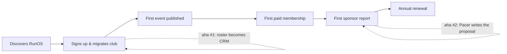

# RunOS — User Journeys

> Owner: UX Director / Head of Product Design
> Status: v1.0 — execution-ready. Conforms to `docs/00-foundation/canonical-brief.md`.
> Format: journey-map tables (Stage / Actions / Emotions / Friction / Design opportunities), plus the aha moment, time-to-value target, and the metric each journey moves.

Personas used exactly as canonical: **Maya Okafor** (organizer), **Leo Martins** (member), **Sofia Lindqvist** (brand manager), **Dr. Emre Kaya** (vendor), **Priya Sharma** (chapter lead).

Emotion scale used below: 😫 frustrated · 😕 skeptical · 😐 neutral · 🙂 hopeful · 😃 delighted · 🤩 evangelist.

---

## 1. Maya — From Spreadsheet Chaos to Professional Club

**Journey:** discovers RunOS → migrates club → first event published → first paid membership → first sponsor report → renews annually.

| Stage | Actions | Emotions | Friction points | Design opportunities |
|---|---|---|---|---|
| **1. Discovers RunOS** | Sees another organizer's club running on RunOS (branded event page, QR check-in); googles it; reads "for organizers" page; watches 3-min tour; clicks "Start free" | 😕→🙂 skeptical of "another app", tired of 6-tool stack | "Is this another Eventbrite?"; fear of migration effort; fear of losing WhatsApp group | Marketing site leads with the *migration* story, not features; show real organizer time-saved numbers; "Starter is free under 50 members" removes commitment fear |
| **2. Migrates club** | Signup (email/Google); club profile wizard; **Import center**: uploads members CSV, uploads WhatsApp chat export (parses names/phones/activity), connects Strava club (pulls members + recent runs); reviews merge/dedupe; connects Stripe | 😐→😃 anxious during upload, delighted at result | Messy spreadsheet columns; WhatsApp export format confusion; duplicate people across sources; Stripe KYC feels heavy | Column-mapping with smart guesses + preview; WhatsApp import with a 30-sec how-to video inline; dedupe as a swipeable review queue, not a table; Stripe deferred — allowed to skip until first paid thing; **Setup Score** checklist keeps momentum |
| **3. First event published** | Opens Event builder; Pacer pre-drafts "Saturday Long Run" from imported patterns; picks route from auto-suggested routes; sets capacity + waiver; publishes; shares link to WhatsApp; RSVPs roll in | 🙂→😃 "that took 4 minutes" | Habit pull back to posting plain text in WhatsApp; worry members won't click | One-tap "Share kit" (pre-written WhatsApp message + link + image); event page opens instantly for members with no forced app install; RSVP count updates live on her dashboard — visible momentum |
| **4. First paid membership** | Creates membership plans (Pacer suggests tiers from club size/geography benchmarks); maps perks to tiers; announces via broadcast; first member pays; sees payout schedule | 😕→😃 nervous about asking members for money | Pricing paralysis; fear of member backlash; Stripe payout opacity | Benchmark-informed price suggestions ("clubs your size in Nigeria charge ₦X–Y"); pre-written announcement copy in club voice; Money overview shows the payment *and* exactly when it lands in the bank |
| **5. First sponsor report** | Local shoe store asks "what do we get?"; Maya opens Sponsor CRM, adds sponsor; asks Pacer "draft a proposal for Harbor Sports"; Pacer builds proposal from real attendance/reach/redemption data; after the campaign, one-click brand report link | 😐→🤩 this used to take a weekend in Canva | Doesn't know what data sponsors want; imposter syndrome pitching | Proposal composer templates the ask; report auto-refreshes as a live link; "sent & viewed" tracking gives her negotiating confidence |
| **6. Renews annually** | Reviews year-in-review (Pacer's annual digest: hours saved, revenue, WACM growth); upgrades Club → Pro for white-label + predictions; refers two organizer friends | 🤩 identity shift: "I run a professional organization" | Annual price moment; feature audit ("do we use this?") | Year-in-review makes value undeniable *before* the renewal email; usage-honest plan recommendation (never upsell what she won't use); organizer referral program |

- **Aha moment:** the imported spreadsheet/WhatsApp/Strava mess renders as a clean, live CRM with activity data already flowing (Stage 2); the second, deeper aha is Pacer drafting a sponsor proposal from her real data (Stage 5).
- **Time-to-value target:** import complete + first event published **< 45 minutes** from signup; first event in **< 10 minutes** once members are in.
- **Metric it moves:** club activation ("first 3 events published, 30% members joined") → SaaS MRR; upstream driver of **WACM**.

---

## 2. Leo — From Invite Link to Ambassador

**Journey:** invited by friend → joins club → connects Strava → first event RSVP + QR check-in → earns first perk → joins challenge → becomes ambassador.

| Stage | Actions | Emotions | Friction points | Design opportunities |
|---|---|---|---|---|
| **1. Invited by friend** | Taps friend's invite link in WhatsApp; lands on club-branded join page (not RunOS-branded); sees faces he knows, next event, member count | 😐→🙂 mild social obligation, curiosity | "Another app to install?"; login fatigue | Join page works fully in browser; app install is suggested *after* first RSVP, not before; friend's avatar shown ("Ana invited you") |
| **2. Joins club** | One-tap sign-in (Apple/Google); name + photo; **consent screens**: plain-language scope cards, conservative defaults, granular toggles; picks notification level | 😐 wants this over with | Consent walls usually feel legal and scary; over-asking kills trust | Consent designed as value exchange per scope ("Share weekly summary → count toward challenges"); only 2 scopes requested at join (`profile.basic`, `activity.summary`); others asked contextually later; skippable without guilt |
| **3. Connects Strava** | Prompted after joining: "Make your runs count"; OAuth to Strava; sees his last 4 weeks appear on his club profile; streak starts counting | 🙂→😃 "it already knows my runs" | OAuth redirect anxiety; privacy worry ("who sees my routes?") | Preview *before* connect showing exactly what the club will see under his granted scopes; explicit "your exact routes stay private unless you share `activity.detailed`" |
| **4. First RSVP + QR check-in** | Sees Saturday Long Run in feed; opens event detail (route, pace groups, 23 going incl. 2 friends); RSVPs; gets calendar + reminder; Saturday: opens ticket, volunteer scans QR in 2 seconds, name pops with a ✅ and "3rd run this month" | 🙂→😃 belonging; check-in feels like a race bib moment | Morning-of fumbling for the ticket; poor signal at park | Wallet pass + lock-screen surfacing 1h before start; QR works offline; check-in confirmation is celebratory (haptic + streak count), not transactional |
| **5. Earns first perk** | Push: "You unlocked 20% at Harbor Sports 🎉" after 5 attendances; opens Benefits Passport; redeems in-store via QR | 😃 tangible payback | Forgetting perks exist; redemption awkwardness at the till | Perk unlocks tied to milestones (earned, not given); passport shows "membership value redeemed: $34"; store-mode redemption screen is big, bright, cashier-legible |
| **6. Joins challenge** | "October 100K" appears in feed with friends already in; joins; progress ring on home; weekly nudges reference his actual pace; finishes, gets badge + leaderboard placement | 😃→🤩 motivated; runs 4×/week becomes 5× | Mid-challenge dropout when behind pace | Pacer-tuned nudges ("18K this week keeps you on track") not shame-y; team sub-challenges so slower runners still matter |
| **7. Becomes ambassador** | Pacer flags Leo to Maya (top-decile attendance + 4 successful referrals); Maya invites him in-app; Leo accepts, gets ambassador toolkit (tracked invite link, exclusive perks, early event access) | 🤩 recognized; status made real | Ambassador role feeling like unpaid work | Ambassador framed as status + perks, with visible impact ("your invites brought 11 runners"); toolkit makes sharing effortless |

- **Aha moment:** QR check-in + instant recognition ("3rd run this month") at Stage 4 — the moment the club feels *organized around him*.
- **Time-to-value target:** invite tap → joined with tracker connected **< 3 minutes**; first RSVP within **48 hours** of joining.
- **Metric it moves:** **WACM** (north star) directly; referral coefficient; challenge participation rate.

---

## 3. Sofia — From Spreadsheet Sponsorships to Measurable Campaigns

**Journey:** hears about network → self-serve Brand Portal signup → audience discovery → launches first campaign → reads ROI report → renews at higher tier.

| Stage | Actions | Emotions | Friction points | Design opportunities |
|---|---|---|---|---|
| **1. Hears about the network** | Receives a Pacer-generated proposal from a club (Maya's); notices "via RunOS Brand Portal" footer; visits brands page; sees aggregate network stats (verified runners, redemption rates) | 😕→🙂 burned by unmeasurable sponsorships before | Skepticism of reach claims; procurement inertia | Proposals as acquisition channel — every club proposal is a brand-side lead; brands page leads with *verification and measurement*, not audience size |
| **2. Self-serve signup** | Creates brand workspace; verifies company; picks seat plan (from $499/mo); invites a teammate | 😐 standard SaaS motion | Legal/procurement for a new vendor | Free "explore mode" (audience discovery with sample-level data) before paid seats; SOC2/DPA docs one click away in trust center |
| **3. Audience discovery** | Opens Audience explorer; filters: city, weekly distance band, shoe-rotation proxy, event attendance; sees only aggregates (k≥50); shortlists clubs by fit score | 🙂→😃 "this is media-grade audience data for running" | Wants person-level data (can't have it); segment too small in her city | k-anonymity explained as a feature ("verified but private = engaged"); fit score explains *why* a club matches; waitlist alert when a small segment crosses k=50 |
| **4. Launches first campaign** | Campaign builder: objective (trial of new stability shoe) → audience → offer (perk: free gait analysis + 20% off) → budget → selects 4 clubs → submits; clubs approve (Maya approves in her queue); campaign goes live into Benefits Passports and one event activation | 🙂 nervous — first spend | Club approval wait feels opaque; asset specs | Approval status timeline per club with expected-response SLAs; asset checker validates creative instantly; Pacer-for-brands suggests offer structures that historically redeem well |
| **5. Reads ROI report** | Campaign detail live during flight: passport impressions, redemptions, event check-ins at sponsored runs, opted-in UGC; end-of-campaign report: cost-per-verified-trial vs. her paid-social benchmark | 😃→🤩 first sponsorship she can defend in a QBR | Attribution questions from her boss | Report speaks marketing language (CPA, reach, frequency) not running language; methodology page linked from every number; one-click PDF for the QBR deck |
| **6. Renews at higher tier** | Renews annually, upgrades seats, books always-on perk placement + quarterly campaigns across 12 clubs | 🤩 running clubs become a named line in her media plan | Budget cycle timing | Quarterly rollup reports timed to planning season; multi-club campaign templates; CSM-assisted annual plan for larger spends |

- **Aha moment:** the Audience explorer — verified, consented, aggregated running audiences she can actually target and *measure* (Stage 3), confirmed by the first ROI report (Stage 5).
- **Time-to-value target:** signup → first campaign submitted **< 1 week**; first campaign live **< 3 weeks** (club approvals included).
- **Metric it moves:** brand-side SaaS revenue + campaign fees; benefits redemptions (network-effect input); club sponsorship GMV.

---

## 4. Emre — From Empty Slots to Preferred Physio

**Journey:** lists services → first booking → payment + review → becomes club's preferred physio.

| Stage | Actions | Emotions | Friction points | Design opportunities |
|---|---|---|---|---|
| **1. Lists services** | Signs up via marketplace invite from a club or marketing site; builds listing: credentials upload, service menu (gait analysis, injury consult), pricing, availability sync with his calendar; verification review | 😐→🙂 hopes it beats Instagram DMs | Credential verification wait; pricing uncertainty | Verification with a clear ETA + progress states; pricing benchmarks from category ("physios in your city list at €60–90"); listing preview as members will see it |
| **2. First booking** | Appears in Harbor City Runners' vendor directory; a member with a niggling knee books a slot; Emre gets request → accepts; intake form arrives filled (member chose what to share — no scope, no data) | 🙂→😃 high-intent client, zero marketing spend | No-show risk; thin first-booking trust | Booking includes club-context badge ("Member of Harbor City Runners since 2025"); deposit option; reminder automation for both sides |
| **3. Payment + review** | Session happens; payment auto-captured via Stripe Connect; 10% marketplace commission shown transparently on his statement; member leaves 5★ review; review appears on listing | 😃 paid without invoicing chase | Commission grumbling; review anxiety | Statement shows commission next to "customer acquisition cost: €0"; review response tool; reviews summarized on listing by verified-member badge |
| **4. Becomes club's preferred physio** | Club books him for monthly presence at Saturday runs (club-level booking); featured in club's Benefits Passport as a perk (10% member discount); steady referral flow; upgrades availability | 🤩 the club is now a distribution channel | Capacity management as demand grows | "Preferred vendor" badge + passport placement as an earned tier (rating + volume thresholds); calendar-first portal home so capacity is always the top signal; waitlist when full |

- **Aha moment:** the first booking arriving with context and payment handled — a client he didn't chase (Stage 2).
- **Time-to-value target:** listing live **< 1 day** (verification pending state still browsable); first booking **< 30 days**.
- **Metric it moves:** marketplace GMV (10% commission line); vendor retention; member passport value redeemed.

---

## 5. Priya — From Volunteer Captain to Empowered Chapter Lead

**Journey:** parent club adds chapter → she onboards → runs her first chapter event.

| Stage | Actions | Emotions | Friction points | Design opportunities |
|---|---|---|---|---|
| **1. Parent club adds chapter** | Maya creates "Abuja chapter" in Platform → Chapters; sets delegated permissions (local events ✓, local comms ✓, org billing ✗); invites Priya as chapter lead | 🙂 (Maya) confident delegation; 😐 (Priya) "what am I signing up to run?" | Maya's fear of losing control/brand consistency; Priya's fear of admin burden | Delegation matrix with sensible defaults per template ("standard chapter"); brand kit enforced automatically so Priya *can't* get it wrong; invite email sets expectations ("~2 hrs/week, here's what's automated") |
| **2. She onboards** | Accepts invite; guided chapter tour scoped to her permissions; sees org-shared resources read-only (routes library, event templates, brand kit) with "Managed by HQ" badges; imports her 40 local contacts; her Setup Score checklist is chapter-sized | 😐→🙂 relief — the system is pre-built | Confusion about what's hers vs. HQ's; smaller import (no spreadsheet, just a phone contact list + small WhatsApp group) | Scope pill (`· Abuja chapter`) always visible; "yours vs. shared" visual language (badge + lock) consistent everywhere; WhatsApp-export import shines at small scale too |
| **3. Runs her first chapter event** | Duplicates the org's "Saturday Long Run" template; localizes route + time; publishes; shares to her local group; runs Live Day check-in solo from her phone; post-event: auto thank-you automation fires, recap posts to chapter feed, stats roll up to Maya's all-chapters dashboard | 🙂→🤩 ran a professional event alone, on a phone | Solo check-in while also hosting; template rigidity | Template duplication keeps waiver/comms/branding intact — she edits 3 fields; Live Day designed for one-person operation (scan + board on one screen); Maya sees rollup without micromanaging — autonomy with visibility |

- **Aha moment:** publishing a fully professional, on-brand event by editing three fields of a template, then running check-in alone from her phone (Stage 3).
- **Time-to-value target:** invite → first chapter event published **< 1 week**; onboarding session itself **< 30 minutes**.
- **Metric it moves:** chapter activation rate (input to Network-tier expansion revenue); multi-chapter WACM; Network tier retention.

---

## 6. Cross-Journey Design Requirements (rollup)

| Requirement | Journeys it serves | IA/system home |
|---|---|---|
| Import center must handle CSV + WhatsApp export + Strava club, with dedupe review | Maya 2, Priya 2 | Community → Import center |
| Consent as contextual value-exchange, never a wall | Leo 2–3, Sofia 4, Emre 2 | Member app → Privacy & consent; onboarding-flow.md §3 |
| Live Day operable by one person on one phone | Maya 3, Priya 3 | Events → Live Day |
| Pacer proposals/reports from real data are both retention (Maya) and acquisition (Sofia) | Maya 5, Sofia 1 | Partners → Proposal composer / Brand reports |
| k-anonymity presented as a trust feature, not a limitation | Sofia 3, city persona | Brand Portal → Audience explorer |
| Earned status mechanics (perks, badges, ambassador, preferred vendor) | Leo 5–7, Emre 4 | Engage; Vendor Portal |
| Year-in-review / value receipts before every renewal moment | Maya 6, Sofia 6 | Intelligence → Pacer digests |
