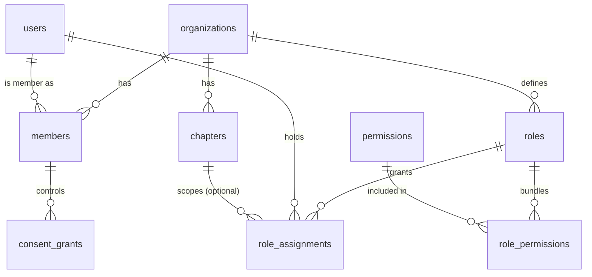
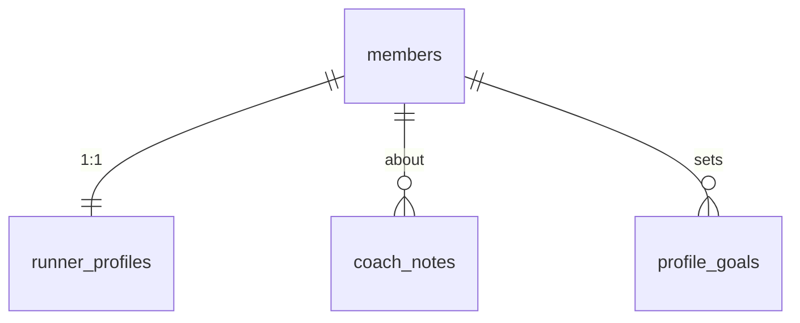
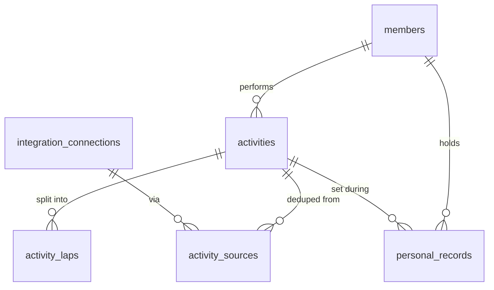
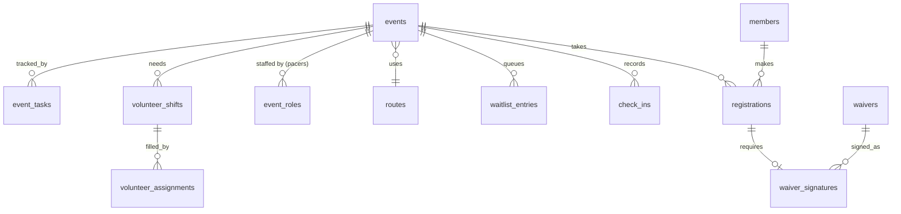
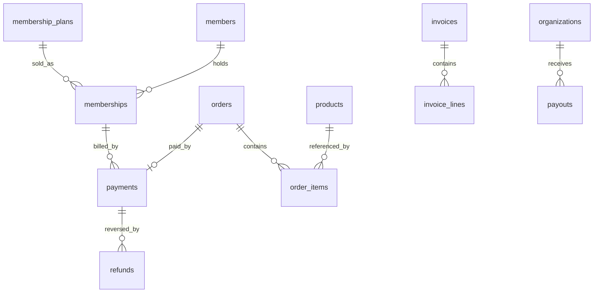
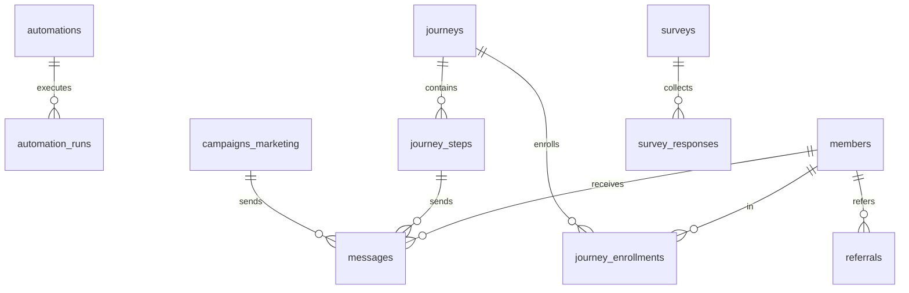
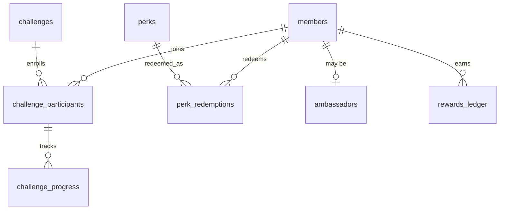
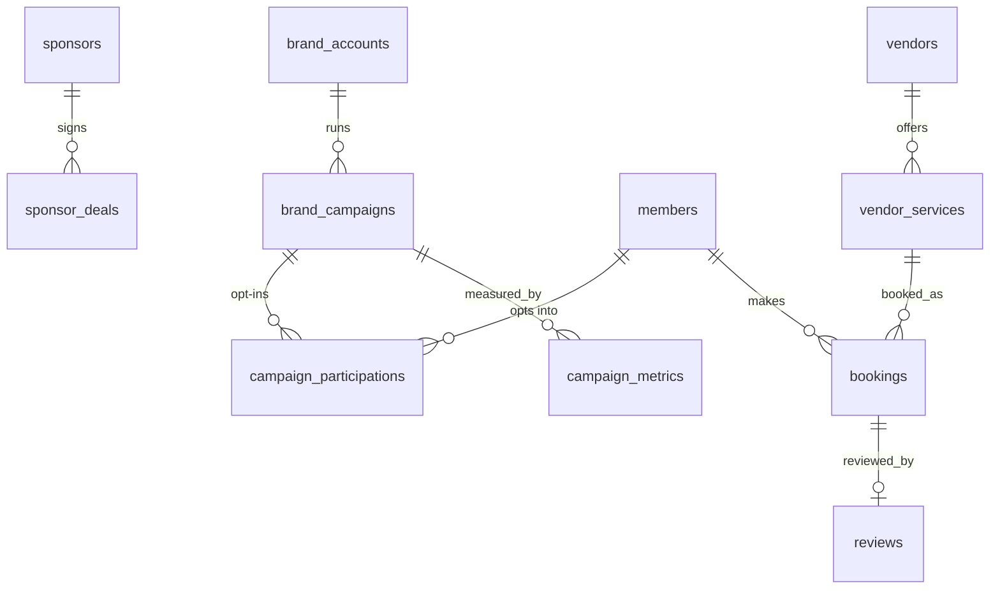
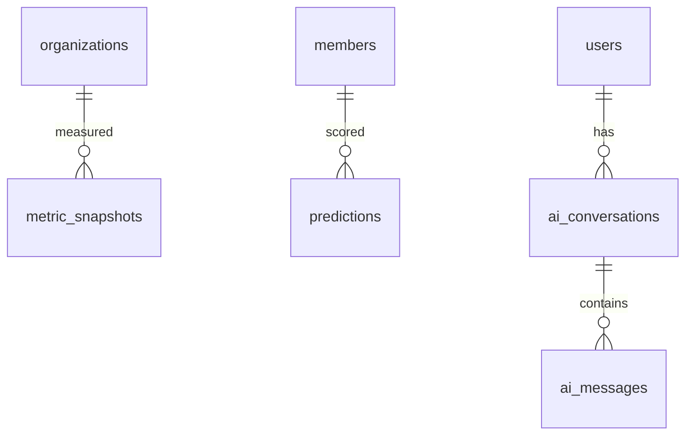
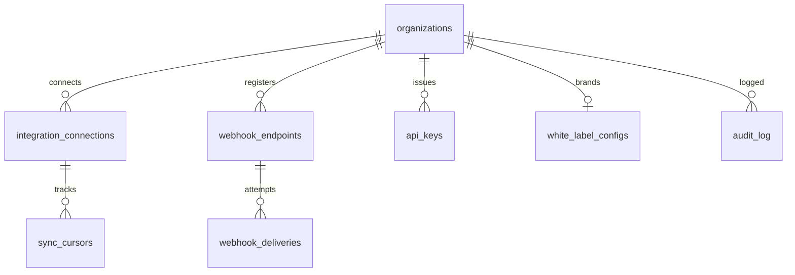

# RunOS — Database Schema

> PostgreSQL 16. Multi-tenant via `club_id` + Row-Level Security (canonical brief §8).
> All DDL below is executable in dependency order. ULID primary keys as prefixed `text`
> (`org_…`, `mem_…`, `act_…`) generated in the application layer.

---

## 0. Conventions & Design Notes

- **PKs:** ULIDs, `text` with type prefix (e.g. `mem_01J8ZK2W7C9XQ4NPM6T3R8VBHE`).
  Sortable by creation time, no sequence contention, safe to expose in APIs. Column type
  `text` + `CHECK (id LIKE '<prefix>_%')` omitted below for brevity, enforced app-side.
- **Tenancy:** every tenant table has `club_id text NOT NULL REFERENCES organizations(id)`
  as the *leading column of every composite index*, plus RLS (pattern §0.1). Global
  tables (`users`, `brand_accounts`, `vendors`, provider catalogs) have ownership-based
  RLS instead.
- **Timestamps:** `created_at timestamptz NOT NULL DEFAULT now()`, `updated_at
  timestamptz NOT NULL DEFAULT now()` (touch trigger) on every table; not repeated in
  DDL below except where other columns exist between them. Assume both exist everywhere.
- **Soft deletes:** `deleted_at timestamptz` on user-facing entities (members, events,
  products, perks, campaigns…). Partial indexes `WHERE deleted_at IS NULL`. Hard delete
  happens only via the GDPR erasure workflow (`security-and-privacy.md` §4) which
  deletes/anonymizes for real. Financial and audit tables are **never** soft- or
  hard-deleted inside retention windows.
- **Audit strategy:** append-only `audit_log` (platform domain) populated by a bus
  consumer for every domain event + explicit sensitive reads (medical data views, exports,
  brand data access). Monthly range-partitioned; exported to S3 (Object Lock) after 13
  months.
- **JSONB rules:** JSONB is allowed only for (1) provider raw payloads (`*_raw`),
  (2) settings/config documents validated by zod schemas in the app, (3) sparse
  extension attributes (`metadata`). Never for fields that are filtered, joined, or
  aggregated in hot paths — those get real columns. Every JSONB column names its schema
  in a `COMMENT`.
- **Partitioning:** `activities`, `check_ins`, `messages`, `audit_log`,
  `outbox_events`, `webhook_deliveries` are range-partitioned by month on
  `created_at`/`recorded_at` (declarative partitioning, `pg_partman` for management).
  Old partitions detach → cold storage. All other tables stay unpartitioned until
  > ~100 M rows.
- **ClickHouse mirrors:** the bus feeds ClickHouse tables `events_all` (every domain
  event, CloudEvents envelope flattened) plus purpose-built mirrors
  `ch.activities_facts`, `ch.check_ins_facts`, `ch.messages_facts`,
  `ch.payments_facts`, `ch.campaign_metrics_facts` — denormalized, `club_id`-first
  ORDER BY, TTL per data class. ClickHouse is derived-only and rebuildable by bus replay.
- **Money:** integer minor units (`amount_cents bigint`) + `currency char(3)`. Never
  floats.
- **Enums:** Postgres `CREATE TYPE ... AS ENUM` for closed sets that gate logic; `text +
  CHECK` for sets that grow (providers, event types).

### 0.1 RLS pattern (canonical)

Representative full policies are given for `members`, `activities`, and `payments`.
**Every other tenant table gets the identical `tenant_isolation` policy** — created by
the `create_tenant_table()` migration helper, verified by the CI RLS gate.

```sql
-- One-time helper: application sets these per transaction
-- SELECT set_config('app.club_id', $club_id, true);
-- SELECT set_config('app.actor_kind', $kind, true);   -- staff|member|api_key|brand|system
-- SELECT set_config('app.member_id', $member_id, true);

CREATE OR REPLACE FUNCTION app_club_id() RETURNS text
  LANGUAGE sql STABLE AS $$ SELECT current_setting('app.club_id', true) $$;
```

---

## 1. Identity & Tenancy



```sql
CREATE TABLE organizations (
  id               text PRIMARY KEY,                          -- org_
  name             text NOT NULL,
  slug             text NOT NULL UNIQUE,                      -- white-label subdomain
  tier             text NOT NULL DEFAULT 'starter'
                     CHECK (tier IN ('starter','club','pro','network')),
  residency_region text NOT NULL CHECK (residency_region IN ('eu','us')),
  country          char(2) NOT NULL,
  timezone         text NOT NULL DEFAULT 'UTC',
  stripe_account_id text UNIQUE,                              -- Stripe Connect acct
  settings         jsonb NOT NULL DEFAULT '{}',               -- zod: OrgSettings
  parent_org_id    text REFERENCES organizations(id),         -- franchise/federation
  created_at       timestamptz NOT NULL DEFAULT now(),
  updated_at       timestamptz NOT NULL DEFAULT now(),
  deleted_at       timestamptz
);

CREATE TABLE chapters (
  id         text PRIMARY KEY,                                -- chp_
  club_id    text NOT NULL REFERENCES organizations(id),
  name       text NOT NULL,
  city       text,
  country    char(2),
  timezone   text,
  is_default boolean NOT NULL DEFAULT false,
  settings   jsonb NOT NULL DEFAULT '{}',
  created_at timestamptz NOT NULL DEFAULT now(),
  updated_at timestamptz NOT NULL DEFAULT now(),
  deleted_at timestamptz,
  UNIQUE (club_id, name)
);
CREATE INDEX chapters_club_idx ON chapters (club_id) WHERE deleted_at IS NULL;

-- GLOBAL table: one user, many clubs. Lives in the control plane directory +
-- a per-cell replica containing only users who belong to clubs in that cell.
CREATE TABLE users (
  id                 text PRIMARY KEY,                        -- usr_
  email              citext NOT NULL UNIQUE,
  email_verified_at  timestamptz,
  password_hash      text,                                    -- argon2id; NULL if SSO-only
  totp_secret_enc    bytea,                                   -- MFA, envelope-encrypted
  full_name          text NOT NULL,
  avatar_url         text,
  locale             text NOT NULL DEFAULT 'en',
  last_login_at      timestamptz,
  created_at         timestamptz NOT NULL DEFAULT now(),
  updated_at         timestamptz NOT NULL DEFAULT now(),
  deleted_at         timestamptz
);

CREATE TABLE members (
  id              text PRIMARY KEY,                           -- mem_
  club_id         text NOT NULL REFERENCES organizations(id),
  user_id         text REFERENCES users(id),                  -- NULL until account claimed (imports)
  chapter_id      text REFERENCES chapters(id),
  status          text NOT NULL DEFAULT 'active'
                    CHECK (status IN ('invited','pending','active','paused','alumni','banned')),
  display_name    text NOT NULL,
  email           citext,                                     -- may differ pre-claim
  phone           text,
  date_of_birth   date,                                       -- drives minor logic
  is_minor        boolean GENERATED ALWAYS AS
                    (date_of_birth IS NOT NULL AND date_of_birth > (now() - interval '16 years')::date) STORED,
  guardian_user_id text REFERENCES users(id),                 -- required when is_minor
  emergency_contact jsonb,                                    -- zod: EmergencyContact; gated by health.medical scope
  joined_at       timestamptz NOT NULL DEFAULT now(),
  source          text NOT NULL DEFAULT 'signup'
                    CHECK (source IN ('signup','invite','csv_import','whatsapp_import','strava_invite','eventbrite_import','meetup_import','api')),
  tags            text[] NOT NULL DEFAULT '{}',
  metadata        jsonb NOT NULL DEFAULT '{}',
  created_at      timestamptz NOT NULL DEFAULT now(),
  updated_at      timestamptz NOT NULL DEFAULT now(),
  deleted_at      timestamptz,
  UNIQUE (club_id, user_id)
);
CREATE INDEX members_club_status_idx ON members (club_id, status) WHERE deleted_at IS NULL;
CREATE INDEX members_club_email_idx  ON members (club_id, email);
CREATE INDEX members_club_chapter_idx ON members (club_id, chapter_id);

-- ===== REPRESENTATIVE FULL RLS: members =====
ALTER TABLE members ENABLE ROW LEVEL SECURITY;
ALTER TABLE members FORCE ROW LEVEL SECURITY;

CREATE POLICY tenant_isolation ON members
  USING (club_id = app_club_id())
  WITH CHECK (club_id = app_club_id());

-- Members (non-staff actors) additionally only see themselves at the row level;
-- staff visibility is handled by the policy engine above RLS.
CREATE POLICY member_self ON members
  AS RESTRICTIVE
  USING (
    current_setting('app.actor_kind', true) <> 'member'
    OR id = current_setting('app.member_id', true)
  );

CREATE TABLE permissions (                                     -- GLOBAL catalog
  key         text PRIMARY KEY,                                -- e.g. 'events.checkin.write'
  surface     text NOT NULL CHECK (surface IN
                ('community','events','money','growth','engage','partners','intelligence','platform')),
  description text NOT NULL
);

CREATE TABLE roles (
  id          text PRIMARY KEY,                                -- rol_
  club_id     text REFERENCES organizations(id),               -- NULL = system role template
  key         text NOT NULL,                                   -- 'owner','admin','organizer','coach',
                                                               -- 'finance','content','volunteer_coordinator',
                                                               -- 'read_only', or custom (Pro+)
  name        text NOT NULL,
  is_system   boolean NOT NULL DEFAULT false,
  created_at  timestamptz NOT NULL DEFAULT now(),
  updated_at  timestamptz NOT NULL DEFAULT now(),
  UNIQUE (club_id, key)
);

CREATE TABLE role_permissions (
  role_id        text NOT NULL REFERENCES roles(id) ON DELETE CASCADE,
  permission_key text NOT NULL REFERENCES permissions(key),
  PRIMARY KEY (role_id, permission_key)
);

CREATE TABLE role_assignments (
  id         text PRIMARY KEY,                                 -- ras_
  club_id    text NOT NULL REFERENCES organizations(id),
  user_id    text NOT NULL REFERENCES users(id),
  role_id    text NOT NULL REFERENCES roles(id),
  chapter_id text REFERENCES chapters(id),                     -- NULL = org-wide; set = chapter-scoped
  granted_by text REFERENCES users(id),
  expires_at timestamptz,
  created_at timestamptz NOT NULL DEFAULT now(),
  UNIQUE (club_id, user_id, role_id, chapter_id)
);
CREATE INDEX role_assignments_user_idx ON role_assignments (user_id, club_id);

CREATE TABLE consent_grants (
  id          text PRIMARY KEY,                                -- cgr_
  club_id     text NOT NULL REFERENCES organizations(id),
  member_id   text NOT NULL REFERENCES members(id),
  scope       text NOT NULL CHECK (scope IN
                ('profile.basic','activity.summary','activity.detailed',
                 'health.medical','location.live','marketing.brands','photos.appearances')),
  status      text NOT NULL CHECK (status IN ('granted','revoked')),
  granted_at  timestamptz,
  revoked_at  timestamptz,
  granted_via text NOT NULL DEFAULT 'app'
                CHECK (granted_via IN ('app','onboarding','web','guardian','import_claim')),
  guardian_user_id text REFERENCES users(id),                  -- who consented for a minor
  version     integer NOT NULL DEFAULT 1,                      -- consent-text version signed
  created_at  timestamptz NOT NULL DEFAULT now(),
  updated_at  timestamptz NOT NULL DEFAULT now(),
  UNIQUE (club_id, member_id, scope)
);
CREATE INDEX consent_grants_member_idx ON consent_grants (club_id, member_id) WHERE status = 'granted';
```

---

## 2. Unified Runner Profile

One row per member — the materialized aggregate of everything the brief's Unified Runner
Profile lists (identity, membership, activity, attendance, purchases, volunteer hours,
challenges, rewards, coach notes, goals, brand interactions, community score, LTV).
Maintained by Community-module event consumers; raw truth stays in the source tables.



```sql
CREATE TABLE runner_profiles (
  member_id            text PRIMARY KEY REFERENCES members(id),
  club_id              text NOT NULL REFERENCES organizations(id),
  -- activity aggregates (respecting activity.summary consent; NULL when not granted)
  total_activities     integer NOT NULL DEFAULT 0,
  total_distance_m     bigint  NOT NULL DEFAULT 0,
  total_moving_time_s  bigint  NOT NULL DEFAULT 0,
  last_activity_at     timestamptz,
  weekly_avg_km_90d    numeric(8,2),
  -- attendance / engagement
  events_attended      integer NOT NULL DEFAULT 0,
  events_registered    integer NOT NULL DEFAULT 0,
  last_checkin_at      timestamptz,
  volunteer_hours      numeric(8,2) NOT NULL DEFAULT 0,
  challenges_completed integer NOT NULL DEFAULT 0,
  rewards_points       bigint NOT NULL DEFAULT 0,             -- cached from rewards_ledger
  community_score      numeric(6,2) NOT NULL DEFAULT 0,       -- 0-100, scored nightly
  -- commerce
  lifetime_value_cents bigint NOT NULL DEFAULT 0,
  purchases_count      integer NOT NULL DEFAULT 0,
  -- misc profile
  goals_summary        text,
  shoe_size            text,                                  -- perk fulfillment (profile.basic extended)
  tshirt_size          text,
  content_appearances  integer NOT NULL DEFAULT 0,            -- photos.appearances-consented tags
  brand_interactions   integer NOT NULL DEFAULT 0,            -- marketing.brands-consented only
  refreshed_at         timestamptz NOT NULL DEFAULT now(),
  created_at           timestamptz NOT NULL DEFAULT now(),
  updated_at           timestamptz NOT NULL DEFAULT now()
);
CREATE INDEX runner_profiles_club_score_idx ON runner_profiles (club_id, community_score DESC);
CREATE INDEX runner_profiles_club_last_activity_idx ON runner_profiles (club_id, last_activity_at);

CREATE TABLE profile_goals (
  id         text PRIMARY KEY,                                 -- gol_
  club_id    text NOT NULL REFERENCES organizations(id),
  member_id  text NOT NULL REFERENCES members(id),
  kind       text NOT NULL CHECK (kind IN ('race','distance','frequency','pace','custom')),
  target     jsonb NOT NULL,                                   -- zod: GoalTarget
  target_date date,
  status     text NOT NULL DEFAULT 'active' CHECK (status IN ('active','achieved','abandoned')),
  created_at timestamptz NOT NULL DEFAULT now(),
  updated_at timestamptz NOT NULL DEFAULT now()
);
CREATE INDEX profile_goals_member_idx ON profile_goals (club_id, member_id, status);

CREATE TABLE coach_notes (
  id         text PRIMARY KEY,                                 -- cno_
  club_id    text NOT NULL REFERENCES organizations(id),
  member_id  text NOT NULL REFERENCES members(id),
  author_user_id text NOT NULL REFERENCES users(id),
  visibility text NOT NULL DEFAULT 'coaches' CHECK (visibility IN ('coaches','staff','shared_with_member')),
  body       text NOT NULL,
  created_at timestamptz NOT NULL DEFAULT now(),
  updated_at timestamptz NOT NULL DEFAULT now(),
  deleted_at timestamptz
);
CREATE INDEX coach_notes_member_idx ON coach_notes (club_id, member_id) WHERE deleted_at IS NULL;
```

---

## 3. Activities (normalized, multi-provider)



```sql
-- Partitioned by month on started_at. Hot 3 months on fast storage.
CREATE TABLE activities (
  id                text NOT NULL,                             -- act_
  club_id           text NOT NULL REFERENCES organizations(id),
  member_id         text NOT NULL REFERENCES members(id),
  sport             text NOT NULL DEFAULT 'run'
                      CHECK (sport IN ('run','trail_run','virtual_run','walk','ride','swim','other')),
  started_at        timestamptz NOT NULL,
  timezone          text,
  -- summary tier (visible with activity.summary consent)
  distance_m        integer,
  moving_time_s     integer,
  elapsed_time_s    integer,
  elevation_gain_m  integer,
  avg_pace_s_per_km integer,
  is_race           boolean NOT NULL DEFAULT false,
  name              text,
  -- detailed tier (stored/visible only with activity.detailed consent)
  avg_hr            smallint,
  max_hr            smallint,
  avg_cadence       smallint,
  calories          integer,
  polyline          text,                                      -- encoded route; detailed tier
  start_latlng      point,                                     -- detailed tier; rounded to 3dp at rest
  detail_level      text NOT NULL DEFAULT 'summary'
                      CHECK (detail_level IN ('summary','detailed')),
  dedup_fingerprint text NOT NULL,                             -- see integrations.md §8.2
  visibility        text NOT NULL DEFAULT 'club' CHECK (visibility IN ('private','club')),
  created_at        timestamptz NOT NULL DEFAULT now(),
  updated_at        timestamptz NOT NULL DEFAULT now(),
  deleted_at        timestamptz,
  PRIMARY KEY (id, started_at)
) PARTITION BY RANGE (started_at);

CREATE INDEX activities_club_member_idx ON activities (club_id, member_id, started_at DESC);
CREATE INDEX activities_club_started_idx ON activities (club_id, started_at DESC) WHERE deleted_at IS NULL;
CREATE UNIQUE INDEX activities_dedup_idx ON activities (club_id, member_id, dedup_fingerprint, started_at);

-- ===== REPRESENTATIVE FULL RLS: activities (tenant + member-self + consent tier) =====
ALTER TABLE activities ENABLE ROW LEVEL SECURITY;
ALTER TABLE activities FORCE ROW LEVEL SECURITY;

CREATE POLICY tenant_isolation ON activities
  USING (club_id = app_club_id())
  WITH CHECK (club_id = app_club_id());

CREATE POLICY member_self ON activities
  AS RESTRICTIVE
  USING (
    current_setting('app.actor_kind', true) <> 'member'
    OR member_id = current_setting('app.member_id', true)
  );
-- Consent tiering (summary vs detailed columns) is enforced in the query layer's
-- consent filter, which selects column sets per grant; RLS guards row access.

CREATE TABLE activity_sources (
  id                   text PRIMARY KEY,                       -- asr_
  club_id              text NOT NULL REFERENCES organizations(id),
  activity_id          text NOT NULL,                          -- FK to activities.id (app-enforced across partitions)
  member_id            text NOT NULL REFERENCES members(id),
  connection_id        text NOT NULL,   -- FK to integration_connections added in §10 (defined later)
  provider             text NOT NULL CHECK (provider IN
                         ('strava','garmin','coros','polar','suunto','apple_health',
                          'google_health_connect','fitbit','trainingpeaks','zwift','manual')),
  provider_activity_id text NOT NULL,
  is_canonical         boolean NOT NULL DEFAULT false,          -- which source won dedup
  raw                  jsonb NOT NULL,                          -- provider payload as received
  ingested_at          timestamptz NOT NULL DEFAULT now(),
  UNIQUE (provider, provider_activity_id, club_id)
);
CREATE INDEX activity_sources_activity_idx ON activity_sources (club_id, activity_id);

CREATE TABLE activity_laps (                                    -- summary of laps/splits; detailed tier
  id           text PRIMARY KEY,                                -- lap_
  club_id      text NOT NULL REFERENCES organizations(id),
  activity_id  text NOT NULL,
  member_id    text NOT NULL REFERENCES members(id),
  lap_index    smallint NOT NULL,
  distance_m   integer,
  moving_time_s integer,
  avg_pace_s_per_km integer,
  avg_hr       smallint,
  UNIQUE (club_id, activity_id, lap_index)
);

CREATE TABLE personal_records (
  id           text PRIMARY KEY,                                -- prr_
  club_id      text NOT NULL REFERENCES organizations(id),
  member_id    text NOT NULL REFERENCES members(id),
  distance_key text NOT NULL CHECK (distance_key IN
                 ('1k','1mi','5k','10k','half_marathon','marathon','longest_run')),
  value_s      integer,                                         -- time PRs
  value_m      integer,                                         -- longest_run distance
  activity_id  text NOT NULL,
  achieved_at  timestamptz NOT NULL,
  superseded_by text REFERENCES personal_records(id),
  created_at   timestamptz NOT NULL DEFAULT now(),
  UNIQUE (club_id, member_id, distance_key, achieved_at)
);
CREATE INDEX personal_records_current_idx ON personal_records (club_id, member_id, distance_key)
  WHERE superseded_by IS NULL;

CREATE TABLE segments (                                         -- CRM segments (Community)
  id         text PRIMARY KEY,                                  -- seg_
  club_id    text NOT NULL REFERENCES organizations(id),
  name       text NOT NULL,
  definition jsonb NOT NULL,                                    -- zod: SegmentQuery (declarative filter AST)
  is_dynamic boolean NOT NULL DEFAULT true,
  created_at timestamptz NOT NULL DEFAULT now(),
  updated_at timestamptz NOT NULL DEFAULT now(),
  deleted_at timestamptz
);

CREATE TABLE segment_members (
  segment_id text NOT NULL REFERENCES segments(id) ON DELETE CASCADE,
  club_id    text NOT NULL REFERENCES organizations(id),
  member_id  text NOT NULL REFERENCES members(id),
  added_at   timestamptz NOT NULL DEFAULT now(),
  PRIMARY KEY (segment_id, member_id)
);
CREATE INDEX segment_members_member_idx ON segment_members (club_id, member_id);
```

---

## 4. Events



```sql
CREATE TABLE routes (
  id            text PRIMARY KEY,                               -- rte_
  club_id       text NOT NULL REFERENCES organizations(id),
  name          text NOT NULL,
  distance_m    integer NOT NULL,
  elevation_gain_m integer,
  polyline      text,
  gpx_s3_key    text,
  start_point   point,
  surface       text CHECK (surface IN ('road','trail','track','mixed')),
  notes         text,
  created_at    timestamptz NOT NULL DEFAULT now(),
  updated_at    timestamptz NOT NULL DEFAULT now(),
  deleted_at    timestamptz
);
CREATE INDEX routes_club_idx ON routes (club_id) WHERE deleted_at IS NULL;

CREATE TABLE waivers (
  id          text PRIMARY KEY,                                 -- wvr_
  club_id     text NOT NULL REFERENCES organizations(id),
  title       text NOT NULL,
  body_md     text NOT NULL,
  version     integer NOT NULL DEFAULT 1,
  requires_guardian boolean NOT NULL DEFAULT true,              -- for minors
  created_at  timestamptz NOT NULL DEFAULT now(),
  updated_at  timestamptz NOT NULL DEFAULT now()
);

CREATE TABLE events (
  id             text PRIMARY KEY,                              -- evt_
  club_id        text NOT NULL REFERENCES organizations(id),
  chapter_id     text REFERENCES chapters(id),
  title          text NOT NULL,
  description_md text,
  event_type     text NOT NULL DEFAULT 'group_run'
                   CHECK (event_type IN ('group_run','race','social','training','volunteer','other')),
  status         text NOT NULL DEFAULT 'draft'
                   CHECK (status IN ('draft','published','cancelled','completed')),
  starts_at      timestamptz NOT NULL,
  ends_at        timestamptz,
  timezone       text NOT NULL,
  recurrence_rule text,                                         -- RFC 5545 RRULE; occurrences materialized
  parent_event_id text REFERENCES events(id),                   -- materialized occurrence → series
  location_name  text,
  location_point point,
  route_id       text REFERENCES routes(id),
  capacity       integer,
  visibility     text NOT NULL DEFAULT 'members' CHECK (visibility IN ('members','public','link_only')),
  price_cents    integer NOT NULL DEFAULT 0,
  currency       char(3) NOT NULL DEFAULT 'EUR',
  waiver_id      text REFERENCES waivers(id),
  weather_snapshot jsonb,                                       -- zod: WeatherSnapshot, fetched T-24h/T-2h
  settings       jsonb NOT NULL DEFAULT '{}',                   -- zod: EventSettings (pacer groups, equipment list)
  created_by     text NOT NULL REFERENCES users(id),
  created_at     timestamptz NOT NULL DEFAULT now(),
  updated_at     timestamptz NOT NULL DEFAULT now(),
  deleted_at     timestamptz
);
CREATE INDEX events_club_starts_idx ON events (club_id, starts_at) WHERE deleted_at IS NULL;
CREATE INDEX events_club_status_idx ON events (club_id, status, starts_at);

CREATE TABLE registrations (
  id           text PRIMARY KEY,                                -- reg_
  club_id      text NOT NULL REFERENCES organizations(id),
  event_id     text NOT NULL REFERENCES events(id),
  member_id    text NOT NULL REFERENCES members(id),
  status       text NOT NULL DEFAULT 'confirmed'
                 CHECK (status IN ('pending_payment','confirmed','cancelled','waitlisted','no_show','attended')),
  ticket_type  text NOT NULL DEFAULT 'general',
  payment_id   text,                                            -- FK payments(id), app-enforced (cross-module by id only)
  answers      jsonb NOT NULL DEFAULT '{}',                     -- zod: RegistrationAnswers (custom form fields)
  registered_at timestamptz NOT NULL DEFAULT now(),
  cancelled_at timestamptz,
  created_at   timestamptz NOT NULL DEFAULT now(),
  updated_at   timestamptz NOT NULL DEFAULT now(),
  UNIQUE (club_id, event_id, member_id)
);
CREATE INDEX registrations_event_idx ON registrations (club_id, event_id, status);
CREATE INDEX registrations_member_idx ON registrations (club_id, member_id, registered_at DESC);

CREATE TABLE waitlist_entries (
  id         text PRIMARY KEY,                                  -- wle_
  club_id    text NOT NULL REFERENCES organizations(id),
  event_id   text NOT NULL REFERENCES events(id),
  member_id  text NOT NULL REFERENCES members(id),
  position   integer NOT NULL,
  promoted_at timestamptz,
  expires_at timestamptz,                                       -- promotion offer window
  created_at timestamptz NOT NULL DEFAULT now(),
  UNIQUE (club_id, event_id, member_id)
);

-- Partitioned by month on recorded_at (high volume, hot writes at event start).
CREATE TABLE check_ins (
  id                text NOT NULL,                              -- chk_
  club_id           text NOT NULL REFERENCES organizations(id),
  event_id          text NOT NULL,
  member_id         text NOT NULL,
  registration_id   text,
  method            text NOT NULL DEFAULT 'qr' CHECK (method IN ('qr','manual','kiosk','nfc','api')),
  recorded_at       timestamptz NOT NULL DEFAULT now(),         -- server receive time
  scanned_at        timestamptz NOT NULL,                       -- device time (offline)
  scanned_by        text,                                       -- user_id of scanner
  client_checkin_id text NOT NULL,                              -- device ULID (offline replay safety)
  PRIMARY KEY (id, recorded_at),
  UNIQUE (club_id, event_id, member_id, recorded_at),
  UNIQUE (client_checkin_id, recorded_at)
) PARTITION BY RANGE (recorded_at);
CREATE INDEX check_ins_event_idx ON check_ins (club_id, event_id, scanned_at);
CREATE INDEX check_ins_member_idx ON check_ins (club_id, member_id, scanned_at DESC);

CREATE TABLE waiver_signatures (
  id           text PRIMARY KEY,                                -- wsg_
  club_id      text NOT NULL REFERENCES organizations(id),
  waiver_id    text NOT NULL REFERENCES waivers(id),
  waiver_version integer NOT NULL,
  member_id    text NOT NULL REFERENCES members(id),
  registration_id text REFERENCES registrations(id),
  signed_by_user_id text NOT NULL REFERENCES users(id),         -- guardian if minor
  signed_as    text NOT NULL DEFAULT 'self' CHECK (signed_as IN ('self','guardian')),
  signature_s3_key text,                                        -- rendered signed PDF (Object Lock)
  ip_address   inet,
  signed_at    timestamptz NOT NULL DEFAULT now(),
  UNIQUE (club_id, waiver_id, waiver_version, member_id)
);

CREATE TABLE event_roles (                                      -- pacers, sweepers, photographers
  id        text PRIMARY KEY,                                   -- ero_
  club_id   text NOT NULL REFERENCES organizations(id),
  event_id  text NOT NULL REFERENCES events(id),
  member_id text NOT NULL REFERENCES members(id),
  role      text NOT NULL CHECK (role IN ('pacer','sweeper','photographer','lead','medic')),
  pace_group text,                                              -- e.g. '5:30/km'
  UNIQUE (club_id, event_id, member_id, role)
);

CREATE TABLE volunteer_shifts (
  id          text PRIMARY KEY,                                 -- vsh_
  club_id     text NOT NULL REFERENCES organizations(id),
  event_id    text REFERENCES events(id),                       -- NULL = standing club role
  title       text NOT NULL,
  starts_at   timestamptz NOT NULL,
  ends_at     timestamptz NOT NULL,
  slots       integer NOT NULL DEFAULT 1,
  created_at  timestamptz NOT NULL DEFAULT now(),
  updated_at  timestamptz NOT NULL DEFAULT now()
);

CREATE TABLE volunteer_assignments (
  id         text PRIMARY KEY,                                  -- vas_
  club_id    text NOT NULL REFERENCES organizations(id),
  shift_id   text NOT NULL REFERENCES volunteer_shifts(id),
  member_id  text NOT NULL REFERENCES members(id),
  status     text NOT NULL DEFAULT 'confirmed' CHECK (status IN ('invited','confirmed','completed','no_show')),
  hours_credited numeric(5,2),
  created_at timestamptz NOT NULL DEFAULT now(),
  updated_at timestamptz NOT NULL DEFAULT now(),
  UNIQUE (club_id, shift_id, member_id)
);

CREATE TABLE event_tasks (
  id         text PRIMARY KEY,                                  -- tsk_
  club_id    text NOT NULL REFERENCES organizations(id),
  event_id   text NOT NULL REFERENCES events(id),
  title      text NOT NULL,
  assignee_user_id text REFERENCES users(id),
  due_at     timestamptz,
  status     text NOT NULL DEFAULT 'open' CHECK (status IN ('open','in_progress','done')),
  created_at timestamptz NOT NULL DEFAULT now(),
  updated_at timestamptz NOT NULL DEFAULT now()
);
```

---

## 5. Money



```sql
CREATE TABLE membership_plans (
  id             text PRIMARY KEY,                              -- mpl_
  club_id        text NOT NULL REFERENCES organizations(id),
  name           text NOT NULL,
  interval       text NOT NULL CHECK (interval IN ('month','year','once')),
  amount_cents   integer NOT NULL,
  currency       char(3) NOT NULL,
  stripe_price_id text,
  benefits_md    text,
  is_active      boolean NOT NULL DEFAULT true,
  created_at     timestamptz NOT NULL DEFAULT now(),
  updated_at     timestamptz NOT NULL DEFAULT now(),
  deleted_at     timestamptz
);

CREATE TABLE memberships (
  id                    text PRIMARY KEY,                       -- msh_
  club_id               text NOT NULL REFERENCES organizations(id),
  member_id             text NOT NULL REFERENCES members(id),
  plan_id               text NOT NULL REFERENCES membership_plans(id),
  status                text NOT NULL CHECK (status IN
                          ('trialing','active','past_due','cancelled','lapsed')),
  stripe_subscription_id text UNIQUE,
  current_period_start  timestamptz,
  current_period_end    timestamptz,
  cancelled_at          timestamptz,
  created_at            timestamptz NOT NULL DEFAULT now(),
  updated_at            timestamptz NOT NULL DEFAULT now()
);
CREATE INDEX memberships_member_idx ON memberships (club_id, member_id, status);
CREATE INDEX memberships_renewal_idx ON memberships (club_id, current_period_end) WHERE status = 'active';

CREATE TABLE products (
  id           text PRIMARY KEY,                                -- prd_
  club_id      text NOT NULL REFERENCES organizations(id),
  source       text NOT NULL DEFAULT 'native' CHECK (source IN ('native','shopify')),
  shopify_product_id text,
  name         text NOT NULL,
  description_md text,
  price_cents  integer NOT NULL,
  currency     char(3) NOT NULL,
  inventory    integer,                                         -- NULL = untracked / Shopify-managed
  media        jsonb NOT NULL DEFAULT '[]',                     -- zod: MediaRef[]
  is_active    boolean NOT NULL DEFAULT true,
  created_at   timestamptz NOT NULL DEFAULT now(),
  updated_at   timestamptz NOT NULL DEFAULT now(),
  deleted_at   timestamptz
);

CREATE TABLE orders (
  id           text PRIMARY KEY,                                -- ord_
  club_id      text NOT NULL REFERENCES organizations(id),
  member_id    text REFERENCES members(id),
  status       text NOT NULL DEFAULT 'pending'
                 CHECK (status IN ('pending','paid','fulfilled','cancelled','refunded')),
  subtotal_cents integer NOT NULL,
  total_cents  integer NOT NULL,
  currency     char(3) NOT NULL,
  source       text NOT NULL DEFAULT 'native' CHECK (source IN ('native','shopify')),
  shopify_order_id text,
  created_at   timestamptz NOT NULL DEFAULT now(),
  updated_at   timestamptz NOT NULL DEFAULT now()
);
CREATE INDEX orders_member_idx ON orders (club_id, member_id, created_at DESC);

CREATE TABLE order_items (
  id          text PRIMARY KEY,                                 -- oit_
  club_id     text NOT NULL REFERENCES organizations(id),
  order_id    text NOT NULL REFERENCES orders(id),
  product_id  text REFERENCES products(id),
  description text NOT NULL,
  quantity    integer NOT NULL DEFAULT 1,
  unit_cents  integer NOT NULL,
  metadata    jsonb NOT NULL DEFAULT '{}'
);

CREATE TABLE payments (
  id                      text PRIMARY KEY,                     -- pay_
  club_id                 text NOT NULL REFERENCES organizations(id),
  member_id               text REFERENCES members(id),
  purpose                 text NOT NULL CHECK (purpose IN
                            ('membership','registration','order','booking','perk','other')),
  reference_id            text,                                 -- registration/order/membership/booking id
  amount_cents            integer NOT NULL,
  application_fee_cents   integer NOT NULL DEFAULT 0,           -- RunOS platform + ticket fee
  currency                char(3) NOT NULL,
  status                  text NOT NULL CHECK (status IN
                            ('requires_payment','processing','succeeded','failed','refunded','partially_refunded')),
  stripe_payment_intent_id text UNIQUE,
  stripe_charge_id        text,
  destination_account_id  text,                                 -- club's connected account
  failure_code            text,
  created_at              timestamptz NOT NULL DEFAULT now(),
  updated_at              timestamptz NOT NULL DEFAULT now()
);
CREATE INDEX payments_club_created_idx ON payments (club_id, created_at DESC);
CREATE INDEX payments_reference_idx ON payments (club_id, purpose, reference_id);

-- ===== REPRESENTATIVE FULL RLS: payments (tenant + finance-sensitive) =====
ALTER TABLE payments ENABLE ROW LEVEL SECURITY;
ALTER TABLE payments FORCE ROW LEVEL SECURITY;

CREATE POLICY tenant_isolation ON payments
  USING (club_id = app_club_id())
  WITH CHECK (club_id = app_club_id());

CREATE POLICY member_self ON payments
  AS RESTRICTIVE
  USING (
    current_setting('app.actor_kind', true) <> 'member'
    OR member_id = current_setting('app.member_id', true)
  );
-- Staff access to payments additionally requires the money.payments.read permission,
-- enforced by the policy engine (permission-model.md §5) before the query runs.

CREATE TABLE refunds (
  id               text PRIMARY KEY,                            -- rfd_
  club_id          text NOT NULL REFERENCES organizations(id),
  payment_id       text NOT NULL REFERENCES payments(id),
  amount_cents     integer NOT NULL,
  reason           text,
  stripe_refund_id text UNIQUE,
  status           text NOT NULL CHECK (status IN ('pending','succeeded','failed')),
  created_by       text REFERENCES users(id),
  created_at       timestamptz NOT NULL DEFAULT now(),
  updated_at       timestamptz NOT NULL DEFAULT now()
);

CREATE TABLE invoices (
  id           text PRIMARY KEY,                                -- inv_
  club_id      text NOT NULL REFERENCES organizations(id),
  counterparty text NOT NULL,                                   -- sponsor/vendor/member name
  sponsor_id   text,                                            -- optional link to partners domain (id only)
  number       text NOT NULL,
  status       text NOT NULL DEFAULT 'draft'
                 CHECK (status IN ('draft','sent','paid','overdue','void')),
  total_cents  integer NOT NULL,
  currency     char(3) NOT NULL,
  due_at       date,
  paid_at      timestamptz,
  pdf_s3_key   text,
  created_at   timestamptz NOT NULL DEFAULT now(),
  updated_at   timestamptz NOT NULL DEFAULT now(),
  UNIQUE (club_id, number)
);

CREATE TABLE invoice_lines (
  id          text PRIMARY KEY,                                 -- ivl_
  club_id     text NOT NULL REFERENCES organizations(id),
  invoice_id  text NOT NULL REFERENCES invoices(id),
  description text NOT NULL,
  quantity    numeric(10,2) NOT NULL DEFAULT 1,
  unit_cents  integer NOT NULL
);

CREATE TABLE payouts (
  id               text PRIMARY KEY,                            -- pyt_
  club_id          text NOT NULL REFERENCES organizations(id),
  stripe_payout_id text UNIQUE NOT NULL,
  amount_cents     integer NOT NULL,
  currency         char(3) NOT NULL,
  status           text NOT NULL CHECK (status IN ('pending','in_transit','paid','failed')),
  arrival_date     date,
  created_at       timestamptz NOT NULL DEFAULT now(),
  updated_at       timestamptz NOT NULL DEFAULT now()
);
CREATE INDEX payouts_club_idx ON payouts (club_id, created_at DESC);
```

---

## 6. Growth



```sql
CREATE TABLE automations (
  id          text PRIMARY KEY,                                 -- aut_
  club_id     text NOT NULL REFERENCES organizations(id),
  name        text NOT NULL,
  trigger     jsonb NOT NULL,       -- zod: AutomationTrigger {event_type, filters}
  conditions  jsonb NOT NULL DEFAULT '[]',                      -- zod: ConditionAST
  actions     jsonb NOT NULL,       -- zod: ActionList (send message, add tag, enroll journey, webhook, Pacer task)
  status      text NOT NULL DEFAULT 'draft' CHECK (status IN ('draft','active','paused','archived')),
  created_at  timestamptz NOT NULL DEFAULT now(),
  updated_at  timestamptz NOT NULL DEFAULT now(),
  deleted_at  timestamptz
);
CREATE INDEX automations_club_active_idx ON automations (club_id) WHERE status = 'active';

CREATE TABLE automation_runs (
  id            text PRIMARY KEY,                               -- arn_
  club_id       text NOT NULL REFERENCES organizations(id),
  automation_id text NOT NULL REFERENCES automations(id),
  member_id     text REFERENCES members(id),
  trigger_event_id text NOT NULL,                               -- outbox event id (idempotency)
  status        text NOT NULL CHECK (status IN ('running','succeeded','failed','skipped')),
  result        jsonb,
  started_at    timestamptz NOT NULL DEFAULT now(),
  finished_at   timestamptz,
  UNIQUE (automation_id, trigger_event_id)
);

CREATE TABLE journeys (
  id          text PRIMARY KEY,                                 -- jny_
  club_id     text NOT NULL REFERENCES organizations(id),
  name        text NOT NULL,                                    -- "New member onboarding"
  entry_trigger jsonb NOT NULL,                                 -- zod: AutomationTrigger
  exit_criteria jsonb,
  status      text NOT NULL DEFAULT 'draft' CHECK (status IN ('draft','active','paused','archived')),
  created_at  timestamptz NOT NULL DEFAULT now(),
  updated_at  timestamptz NOT NULL DEFAULT now(),
  deleted_at  timestamptz
);

CREATE TABLE journey_steps (
  id         text PRIMARY KEY,                                  -- jst_
  club_id    text NOT NULL REFERENCES organizations(id),
  journey_id text NOT NULL REFERENCES journeys(id) ON DELETE CASCADE,
  step_index integer NOT NULL,
  kind       text NOT NULL CHECK (kind IN
               ('send_message','wait','wait_until','branch','add_tag','enroll_challenge',
                'notify_staff','webhook','pacer_action')),
  config     jsonb NOT NULL,                                    -- zod per kind
  UNIQUE (journey_id, step_index)
);

CREATE TABLE journey_enrollments (
  id           text PRIMARY KEY,                                -- jen_
  club_id      text NOT NULL REFERENCES organizations(id),
  journey_id   text NOT NULL REFERENCES journeys(id),
  member_id    text NOT NULL REFERENCES members(id),
  temporal_workflow_id text NOT NULL,                           -- Temporal execution handle
  status       text NOT NULL CHECK (status IN ('active','completed','exited','failed')),
  current_step integer NOT NULL DEFAULT 0,
  enrolled_at  timestamptz NOT NULL DEFAULT now(),
  finished_at  timestamptz,
  UNIQUE (journey_id, member_id, enrolled_at)
);
CREATE INDEX journey_enrollments_member_idx ON journey_enrollments (club_id, member_id, status);

CREATE TABLE message_templates (
  id         text PRIMARY KEY,                                  -- mtp_
  club_id    text NOT NULL REFERENCES organizations(id),
  channel    text NOT NULL CHECK (channel IN ('email','sms','push','whatsapp','in_app')),
  name       text NOT NULL,
  subject    text,
  body       text NOT NULL,                                     -- MJML/handlebars per channel
  created_at timestamptz NOT NULL DEFAULT now(),
  updated_at timestamptz NOT NULL DEFAULT now(),
  deleted_at timestamptz
);

CREATE TABLE campaigns_marketing (
  id          text PRIMARY KEY,                                 -- cmp_
  club_id     text NOT NULL REFERENCES organizations(id),
  name        text NOT NULL,
  channel     text NOT NULL CHECK (channel IN ('email','sms','push','whatsapp','multi')),
  segment_id  text REFERENCES segments(id),
  template_id text REFERENCES message_templates(id),
  status      text NOT NULL DEFAULT 'draft'
                CHECK (status IN ('draft','scheduled','sending','sent','cancelled')),
  scheduled_at timestamptz,
  sent_at     timestamptz,
  stats       jsonb NOT NULL DEFAULT '{}',                      -- zod: CampaignStats (cached from ClickHouse)
  created_at  timestamptz NOT NULL DEFAULT now(),
  updated_at  timestamptz NOT NULL DEFAULT now(),
  deleted_at  timestamptz
);

-- Partitioned by month on created_at (highest-volume OLTP table after activities).
CREATE TABLE messages (
  id           text NOT NULL,                                   -- msg_
  club_id      text NOT NULL REFERENCES organizations(id),
  member_id    text NOT NULL,
  channel      text NOT NULL CHECK (channel IN ('email','sms','push','whatsapp','in_app')),
  campaign_id  text,                                            -- campaigns_marketing
  journey_step_id text,
  automation_id text,
  subject      text,
  provider     text,                                            -- ses|twilio|expo|whatsapp_cloud
  provider_message_id text,
  status       text NOT NULL DEFAULT 'queued' CHECK (status IN
                 ('queued','sent','delivered','opened','clicked','bounced','failed','suppressed')),
  status_at    timestamptz NOT NULL DEFAULT now(),
  created_at   timestamptz NOT NULL DEFAULT now(),
  PRIMARY KEY (id, created_at)
) PARTITION BY RANGE (created_at);
CREATE INDEX messages_member_idx ON messages (club_id, member_id, created_at DESC);
CREATE INDEX messages_campaign_idx ON messages (club_id, campaign_id, status);

CREATE TABLE landing_pages (
  id          text PRIMARY KEY,                                 -- lpg_
  club_id     text NOT NULL REFERENCES organizations(id),
  slug        text NOT NULL,
  title       text NOT NULL,
  blocks      jsonb NOT NULL,                                   -- zod: PageBlocks (builder AST)
  event_id    text,                                             -- optional event landing page
  status      text NOT NULL DEFAULT 'draft' CHECK (status IN ('draft','published','archived')),
  published_at timestamptz,
  seo         jsonb NOT NULL DEFAULT '{}',
  created_at  timestamptz NOT NULL DEFAULT now(),
  updated_at  timestamptz NOT NULL DEFAULT now(),
  deleted_at  timestamptz,
  UNIQUE (club_id, slug)
);

CREATE TABLE referrals (
  id                text PRIMARY KEY,                           -- ref_
  club_id           text NOT NULL REFERENCES organizations(id),
  referrer_member_id text NOT NULL REFERENCES members(id),
  code              text NOT NULL,
  referred_member_id text REFERENCES members(id),
  status            text NOT NULL DEFAULT 'created'
                      CHECK (status IN ('created','clicked','joined','converted','rewarded')),
  converted_at      timestamptz,
  created_at        timestamptz NOT NULL DEFAULT now(),
  updated_at        timestamptz NOT NULL DEFAULT now(),
  UNIQUE (club_id, code)
);
CREATE INDEX referrals_referrer_idx ON referrals (club_id, referrer_member_id);

CREATE TABLE surveys (
  id         text PRIMARY KEY,                                  -- svy_
  club_id    text NOT NULL REFERENCES organizations(id),
  title      text NOT NULL,
  questions  jsonb NOT NULL,                                    -- zod: SurveyQuestions
  status     text NOT NULL DEFAULT 'draft' CHECK (status IN ('draft','open','closed')),
  anonymous  boolean NOT NULL DEFAULT false,
  created_at timestamptz NOT NULL DEFAULT now(),
  updated_at timestamptz NOT NULL DEFAULT now(),
  deleted_at timestamptz
);

CREATE TABLE survey_responses (
  id         text PRIMARY KEY,                                  -- svr_
  club_id    text NOT NULL REFERENCES organizations(id),
  survey_id  text NOT NULL REFERENCES surveys(id),
  member_id  text REFERENCES members(id),                       -- NULL when survey.anonymous
  answers    jsonb NOT NULL,
  submitted_at timestamptz NOT NULL DEFAULT now(),
  UNIQUE (club_id, survey_id, member_id)
);
```

---

## 7. Engage



```sql
CREATE TABLE challenges (
  id          text PRIMARY KEY,                                 -- chl_
  club_id     text NOT NULL REFERENCES organizations(id),
  title       text NOT NULL,
  description_md text,
  kind        text NOT NULL CHECK (kind IN
                ('distance','frequency','elevation','streak','attendance','custom')),
  goal        jsonb NOT NULL,                                   -- zod: ChallengeGoal {target, unit, window}
  starts_at   timestamptz NOT NULL,
  ends_at     timestamptz NOT NULL,
  reward_points bigint NOT NULL DEFAULT 0,
  perk_id     text,                                             -- optional perk reward
  visibility  text NOT NULL DEFAULT 'club' CHECK (visibility IN ('club','chapter','invite')),
  created_at  timestamptz NOT NULL DEFAULT now(),
  updated_at  timestamptz NOT NULL DEFAULT now(),
  deleted_at  timestamptz
);
CREATE INDEX challenges_club_window_idx ON challenges (club_id, starts_at, ends_at);

CREATE TABLE challenge_participants (
  id           text PRIMARY KEY,                                -- chp_
  club_id      text NOT NULL REFERENCES organizations(id),
  challenge_id text NOT NULL REFERENCES challenges(id),
  member_id    text NOT NULL REFERENCES members(id),
  joined_at    timestamptz NOT NULL DEFAULT now(),
  status       text NOT NULL DEFAULT 'active' CHECK (status IN ('active','completed','withdrawn')),
  completed_at timestamptz,
  UNIQUE (club_id, challenge_id, member_id)
);

CREATE TABLE challenge_progress (
  id             text PRIMARY KEY,                              -- cpr_
  club_id        text NOT NULL REFERENCES organizations(id),
  participant_id text NOT NULL REFERENCES challenge_participants(id),
  activity_id    text,                                          -- contributing activity (consent-filtered)
  delta          numeric(12,2) NOT NULL,                        -- km / count / meters
  cumulative     numeric(14,2) NOT NULL,
  recorded_at    timestamptz NOT NULL DEFAULT now(),
  UNIQUE (participant_id, activity_id)
);
CREATE INDEX challenge_progress_participant_idx ON challenge_progress (club_id, participant_id, recorded_at);

CREATE TABLE perks (                                            -- benefits passport
  id            text PRIMARY KEY,                               -- prk_
  club_id       text NOT NULL REFERENCES organizations(id),
  sponsor_id    text,                                           -- partners domain, id-only link
  title         text NOT NULL,
  description_md text,
  redemption_type text NOT NULL CHECK (redemption_type IN ('code','qr','link','in_person')),
  code_pool     jsonb,                                          -- zod: CodePool (encrypted codes) when type=code
  points_cost   bigint NOT NULL DEFAULT 0,                      -- 0 = free benefit
  inventory     integer,
  per_member_limit integer NOT NULL DEFAULT 1,
  valid_from    timestamptz,
  valid_until   timestamptz,
  min_tier      text,                                           -- optional membership plan gate
  is_active     boolean NOT NULL DEFAULT true,
  created_at    timestamptz NOT NULL DEFAULT now(),
  updated_at    timestamptz NOT NULL DEFAULT now(),
  deleted_at    timestamptz
);

CREATE TABLE perk_redemptions (
  id         text PRIMARY KEY,                                  -- prx_
  club_id    text NOT NULL REFERENCES organizations(id),
  perk_id    text NOT NULL REFERENCES perks(id),
  member_id  text NOT NULL REFERENCES members(id),
  status     text NOT NULL DEFAULT 'redeemed' CHECK (status IN ('reserved','redeemed','cancelled')),
  code_issued text,
  redeemed_at timestamptz NOT NULL DEFAULT now(),
  created_at timestamptz NOT NULL DEFAULT now()
);
CREATE INDEX perk_redemptions_perk_idx ON perk_redemptions (club_id, perk_id);
CREATE INDEX perk_redemptions_member_idx ON perk_redemptions (club_id, member_id, redeemed_at DESC);

CREATE TABLE ambassadors (
  id          text PRIMARY KEY,                                 -- amb_
  club_id     text NOT NULL REFERENCES organizations(id),
  member_id   text NOT NULL REFERENCES members(id) UNIQUE,
  status      text NOT NULL DEFAULT 'candidate'
                CHECK (status IN ('candidate','invited','active','paused','retired')),
  score       numeric(6,2),                                     -- Pacer candidate score
  perks_note  text,
  started_at  timestamptz,
  created_at  timestamptz NOT NULL DEFAULT now(),
  updated_at  timestamptz NOT NULL DEFAULT now()
);

CREATE TABLE rewards_ledger (                                   -- append-only points ledger
  id          text PRIMARY KEY,                                 -- rwl_
  club_id     text NOT NULL REFERENCES organizations(id),
  member_id   text NOT NULL REFERENCES members(id),
  delta_points bigint NOT NULL,                                 -- + earn, - spend
  reason      text NOT NULL CHECK (reason IN
                ('challenge','attendance','referral','volunteer','purchase','redemption','manual','expiry')),
  reference_id text,                                            -- challenge/perk/referral id
  balance_after bigint NOT NULL,
  created_at  timestamptz NOT NULL DEFAULT now()
);
CREATE INDEX rewards_ledger_member_idx ON rewards_ledger (club_id, member_id, created_at DESC);
```

---

## 8. Partners



```sql
CREATE TABLE sponsors (                                         -- club-local sponsor CRM
  id          text PRIMARY KEY,                                 -- spn_
  club_id     text NOT NULL REFERENCES organizations(id),
  name        text NOT NULL,
  contact     jsonb NOT NULL DEFAULT '{}',                      -- zod: ContactCard
  stage       text NOT NULL DEFAULT 'lead'
                CHECK (stage IN ('lead','contacted','proposal','negotiation','active','lapsed','lost')),
  notes_md    text,
  brand_account_id text,                                        -- link if sponsor is a RunOS brand
  created_at  timestamptz NOT NULL DEFAULT now(),
  updated_at  timestamptz NOT NULL DEFAULT now(),
  deleted_at  timestamptz
);
CREATE INDEX sponsors_club_stage_idx ON sponsors (club_id, stage) WHERE deleted_at IS NULL;

CREATE TABLE sponsor_deals (
  id           text PRIMARY KEY,                                -- sdl_
  club_id      text NOT NULL REFERENCES organizations(id),
  sponsor_id   text NOT NULL REFERENCES sponsors(id),
  title        text NOT NULL,
  value_cents  integer NOT NULL,
  currency     char(3) NOT NULL,
  in_kind_desc text,
  starts_on    date,
  ends_on      date,
  deliverables jsonb NOT NULL DEFAULT '[]',                     -- zod: Deliverable[] (posts, logo, activations)
  status       text NOT NULL DEFAULT 'draft'
                 CHECK (status IN ('draft','signed','active','completed','cancelled')),
  contract_s3_key text,
  created_at   timestamptz NOT NULL DEFAULT now(),
  updated_at   timestamptz NOT NULL DEFAULT now()
);

-- GLOBAL: brands exist above clubs (Brand Portal tenant). RLS keyed to brand actor.
CREATE TABLE brand_accounts (
  id          text PRIMARY KEY,                                 -- brd_
  name        text NOT NULL,
  billing_email citext NOT NULL,
  plan        text NOT NULL DEFAULT 'portal' CHECK (plan IN ('portal','portal_plus','enterprise')),
  settings    jsonb NOT NULL DEFAULT '{}',
  created_at  timestamptz NOT NULL DEFAULT now(),
  updated_at  timestamptz NOT NULL DEFAULT now(),
  deleted_at  timestamptz
);

CREATE TABLE brand_campaigns (
  id           text PRIMARY KEY,                                -- bcm_
  brand_account_id text NOT NULL REFERENCES brand_accounts(id),
  club_id      text REFERENCES organizations(id),               -- NULL = network-wide campaign offer
  title        text NOT NULL,
  brief_md     text,
  kind         text NOT NULL CHECK (kind IN
                 ('product_seeding','event_sponsorship','content','ambassador','research')),
  target       jsonb NOT NULL DEFAULT '{}',                     -- zod: AudienceTarget (aggregate criteria only)
  budget_cents integer,
  currency     char(3),
  status       text NOT NULL DEFAULT 'draft'
                 CHECK (status IN ('draft','review','live','completed','cancelled')),
  opt_in_copy  text NOT NULL DEFAULT '',                        -- what members see when opting in
  starts_at    timestamptz,
  ends_at      timestamptz,
  created_at   timestamptz NOT NULL DEFAULT now(),
  updated_at   timestamptz NOT NULL DEFAULT now()
);
CREATE INDEX brand_campaigns_brand_idx ON brand_campaigns (brand_account_id, status);

CREATE TABLE campaign_participations (                          -- explicit member opt-in
  id           text PRIMARY KEY,                                -- cpp_
  club_id      text NOT NULL REFERENCES organizations(id),
  campaign_id  text NOT NULL REFERENCES brand_campaigns(id),
  member_id    text NOT NULL REFERENCES members(id),
  status       text NOT NULL DEFAULT 'opted_in'
                 CHECK (status IN ('invited','opted_in','opted_out','completed')),
  shared_fields text[] NOT NULL DEFAULT '{}',                   -- exact fields member agreed to share
  opted_in_at  timestamptz,
  opted_out_at timestamptz,
  created_at   timestamptz NOT NULL DEFAULT now(),
  updated_at   timestamptz NOT NULL DEFAULT now(),
  UNIQUE (campaign_id, member_id)
);

CREATE TABLE campaign_metrics (                                 -- aggregate-only, k>=50 enforced upstream
  id           text PRIMARY KEY,                                -- cmt_
  campaign_id  text NOT NULL REFERENCES brand_campaigns(id),
  club_id      text REFERENCES organizations(id),
  period_start date NOT NULL,
  period_end   date NOT NULL,
  metrics      jsonb NOT NULL,                                  -- zod: CampaignMetrics {reach, opt_ins, redemptions, ...}
  cohort_size  integer NOT NULL CHECK (cohort_size >= 50),      -- k-anonymity floor (brief §9)
  created_at   timestamptz NOT NULL DEFAULT now(),
  UNIQUE (campaign_id, club_id, period_start)
);

-- GLOBAL: vendors are marketplace-wide, discoverable across clubs.
CREATE TABLE vendors (
  id           text PRIMARY KEY,                                -- vnd_
  owner_user_id text NOT NULL REFERENCES users(id),
  business_name text NOT NULL,
  category     text NOT NULL CHECK (category IN
                 ('physio','coaching','nutrition','massage','photography','gear','other')),
  bio_md       text,
  city         text,
  country      char(2),
  stripe_account_id text UNIQUE,                                -- Connect for marketplace payouts
  status       text NOT NULL DEFAULT 'pending'
                 CHECK (status IN ('pending','approved','suspended')),
  rating_avg   numeric(3,2),
  created_at   timestamptz NOT NULL DEFAULT now(),
  updated_at   timestamptz NOT NULL DEFAULT now(),
  deleted_at   timestamptz
);

CREATE TABLE vendor_services (
  id           text PRIMARY KEY,                                -- vsv_
  vendor_id    text NOT NULL REFERENCES vendors(id),
  title        text NOT NULL,
  description_md text,
  duration_min integer,
  price_cents  integer NOT NULL,
  currency     char(3) NOT NULL,
  location_kind text NOT NULL DEFAULT 'in_person' CHECK (location_kind IN ('in_person','remote','event')),
  is_active    boolean NOT NULL DEFAULT true,
  created_at   timestamptz NOT NULL DEFAULT now(),
  updated_at   timestamptz NOT NULL DEFAULT now(),
  deleted_at   timestamptz
);

CREATE TABLE bookings (
  id           text PRIMARY KEY,                                -- bkg_
  club_id      text NOT NULL REFERENCES organizations(id),      -- booked through this club's marketplace
  vendor_id    text NOT NULL REFERENCES vendors(id),
  service_id   text NOT NULL REFERENCES vendor_services(id),
  member_id    text NOT NULL REFERENCES members(id),
  starts_at    timestamptz NOT NULL,
  status       text NOT NULL DEFAULT 'requested' CHECK (status IN
                 ('requested','confirmed','completed','cancelled','no_show')),
  payment_id   text,                                            -- payments(id); 10% marketplace commission in application_fee
  created_at   timestamptz NOT NULL DEFAULT now(),
  updated_at   timestamptz NOT NULL DEFAULT now()
);
CREATE INDEX bookings_vendor_idx ON bookings (vendor_id, starts_at);
CREATE INDEX bookings_member_idx ON bookings (club_id, member_id, starts_at DESC);

CREATE TABLE reviews (
  id         text PRIMARY KEY,                                  -- rvw_
  club_id    text NOT NULL REFERENCES organizations(id),
  booking_id text NOT NULL REFERENCES bookings(id) UNIQUE,
  vendor_id  text NOT NULL REFERENCES vendors(id),
  member_id  text NOT NULL REFERENCES members(id),
  rating     smallint NOT NULL CHECK (rating BETWEEN 1 AND 5),
  body       text,
  created_at timestamptz NOT NULL DEFAULT now(),
  updated_at timestamptz NOT NULL DEFAULT now(),
  deleted_at timestamptz
);
```

---

## 9. Intelligence



```sql
CREATE TABLE metric_snapshots (                                 -- daily per-club KPI rollups (from ClickHouse)
  id          text PRIMARY KEY,                                 -- mts_
  club_id     text NOT NULL REFERENCES organizations(id),
  metric_key  text NOT NULL,                                    -- 'wacm','attendance_rate','mrr','churn_30d',...
  period      daterange NOT NULL,
  value       numeric(18,4) NOT NULL,
  dimensions  jsonb NOT NULL DEFAULT '{}',                      -- {chapter_id, segment,...}
  computed_at timestamptz NOT NULL DEFAULT now(),
  UNIQUE (club_id, metric_key, period, dimensions)
);
CREATE INDEX metric_snapshots_lookup_idx ON metric_snapshots (club_id, metric_key, period);

CREATE TABLE predictions (
  id          text PRIMARY KEY,                                 -- pdn_
  club_id     text NOT NULL REFERENCES organizations(id),
  subject_kind text NOT NULL CHECK (subject_kind IN ('member','event','club')),
  subject_id  text NOT NULL,                                    -- member_id / event_id / club_id
  model_key   text NOT NULL,                                    -- 'churn_90d','event_attendance','ltv_12m'
  model_version text NOT NULL,
  score       numeric(8,6) NOT NULL,
  band        text CHECK (band IN ('low','medium','high')),
  features_hash text,                                           -- reproducibility, not raw features
  valid_until timestamptz NOT NULL,
  created_at  timestamptz NOT NULL DEFAULT now()
);
CREATE INDEX predictions_lookup_idx ON predictions (club_id, model_key, subject_kind, subject_id, created_at DESC);

CREATE TABLE ai_conversations (                                 -- Pacer
  id          text PRIMARY KEY,                                 -- acv_
  club_id     text NOT NULL REFERENCES organizations(id),
  user_id     text NOT NULL REFERENCES users(id),
  title       text,
  surface     text NOT NULL DEFAULT 'chat' CHECK (surface IN ('chat','command_bar','inline','digest')),
  created_at  timestamptz NOT NULL DEFAULT now(),
  updated_at  timestamptz NOT NULL DEFAULT now(),
  deleted_at  timestamptz
);

CREATE TABLE ai_messages (
  id              text PRIMARY KEY,                             -- aim_
  club_id         text NOT NULL REFERENCES organizations(id),
  conversation_id text NOT NULL REFERENCES ai_conversations(id) ON DELETE CASCADE,
  role            text NOT NULL CHECK (role IN ('user','assistant','tool')),
  content         jsonb NOT NULL,                               -- zod: PacerMessageContent
  tokens_in       integer,
  tokens_out      integer,
  created_at      timestamptz NOT NULL DEFAULT now()
);
CREATE INDEX ai_messages_conv_idx ON ai_messages (club_id, conversation_id, created_at);

CREATE TABLE embeddings (                                       -- pgvector RAG store
  id         text PRIMARY KEY,                                  -- emb_
  club_id    text NOT NULL REFERENCES organizations(id),
  source_kind text NOT NULL,                                    -- 'event','member_note','kb_article','survey',...
  source_id  text NOT NULL,
  chunk      text NOT NULL,
  embedding  vector(1024) NOT NULL,
  created_at timestamptz NOT NULL DEFAULT now(),
  UNIQUE (club_id, source_kind, source_id, md5(chunk))
);
CREATE INDEX embeddings_ann_idx ON embeddings
  USING hnsw (embedding vector_cosine_ops);
```

---

## 10. Platform



```sql
CREATE TABLE integration_connections (
  id            text PRIMARY KEY,                               -- icn_
  club_id       text NOT NULL REFERENCES organizations(id),
  member_id     text REFERENCES members(id),                    -- set for member-level fitness connections
  provider      text NOT NULL CHECK (provider IN
                  ('strava','garmin','coros','polar','suunto','apple_health','google_health_connect',
                   'fitbit','trainingpeaks','zwift','stripe','shopify','mailchimp','hubspot',
                   'meta','tiktok','google_analytics','slack','discord','whatsapp')),
  status        text NOT NULL DEFAULT 'active'
                  CHECK (status IN ('pending','active','error','revoked','expired')),
  external_account_id text,                                     -- provider-side id (athlete id, shop domain,…)
  access_token_enc  bytea,                                      -- envelope-encrypted (KMS data key)
  refresh_token_enc bytea,
  token_expires_at  timestamptz,
  scopes        text[] NOT NULL DEFAULT '{}',
  last_sync_at  timestamptz,
  last_error    text,
  settings      jsonb NOT NULL DEFAULT '{}',
  created_at    timestamptz NOT NULL DEFAULT now(),
  updated_at    timestamptz NOT NULL DEFAULT now(),
  deleted_at    timestamptz,
  UNIQUE (club_id, provider, member_id, external_account_id)
);
CREATE INDEX integration_connections_member_idx ON integration_connections (club_id, member_id, provider);
CREATE INDEX integration_connections_provider_ext_idx ON integration_connections (provider, external_account_id);

-- Deferred FK from §3 (activity_sources predates this table in domain ordering)
ALTER TABLE activity_sources
  ADD CONSTRAINT activity_sources_connection_fk
  FOREIGN KEY (connection_id) REFERENCES integration_connections(id);

CREATE TABLE sync_cursors (
  connection_id text NOT NULL REFERENCES integration_connections(id) ON DELETE CASCADE,
  club_id       text NOT NULL REFERENCES organizations(id),
  stream        text NOT NULL,                                  -- 'activities','orders','contacts',…
  cursor        jsonb NOT NULL,                                 -- provider-specific position
  updated_at    timestamptz NOT NULL DEFAULT now(),
  PRIMARY KEY (connection_id, stream)
);

CREATE TABLE webhook_endpoints (                                -- outbound (customer-facing)
  id           text PRIMARY KEY,                                -- whe_
  club_id      text NOT NULL REFERENCES organizations(id),
  url          text NOT NULL,
  description  text,
  secret_enc   bytea NOT NULL,                                  -- HMAC signing secret
  event_types  text[] NOT NULL,                                 -- subscribed types, '*' allowed
  status       text NOT NULL DEFAULT 'active' CHECK (status IN ('active','paused','disabled')),
  created_at   timestamptz NOT NULL DEFAULT now(),
  updated_at   timestamptz NOT NULL DEFAULT now(),
  deleted_at   timestamptz
);

-- Partitioned by month on created_at.
CREATE TABLE webhook_deliveries (
  id           text NOT NULL,                                   -- whd_
  club_id      text NOT NULL REFERENCES organizations(id),
  endpoint_id  text NOT NULL,
  event_id     text NOT NULL,                                   -- outbox event id
  attempt      smallint NOT NULL DEFAULT 1,
  status       text NOT NULL CHECK (status IN ('pending','delivered','failed','dead')),
  response_code smallint,
  latency_ms   integer,
  next_retry_at timestamptz,
  created_at   timestamptz NOT NULL DEFAULT now(),
  PRIMARY KEY (id, created_at)
) PARTITION BY RANGE (created_at);
CREATE INDEX webhook_deliveries_retry_idx ON webhook_deliveries (next_retry_at) WHERE status = 'failed';

CREATE TABLE api_keys (
  id           text PRIMARY KEY,                                -- key_ (public id; secret shown once)
  club_id      text NOT NULL REFERENCES organizations(id),
  name         text NOT NULL,
  key_hash     text NOT NULL UNIQUE,                            -- sha256 of secret
  key_prefix   text NOT NULL,                                   -- 'rk_live_ab12…' first 12 chars for display
  scopes       text[] NOT NULL,                                 -- OAuth-style scopes (api-architecture.md §5)
  actor_kind   text NOT NULL DEFAULT 'api_key' CHECK (actor_kind IN ('api_key','brand','vendor')),
  rate_tier    text NOT NULL DEFAULT 'default',
  last_used_at timestamptz,
  expires_at   timestamptz,
  created_by   text NOT NULL REFERENCES users(id),
  revoked_at   timestamptz,
  created_at   timestamptz NOT NULL DEFAULT now()
);
CREATE INDEX api_keys_club_idx ON api_keys (club_id) WHERE revoked_at IS NULL;

-- Append-only; partitioned by month; consumer of every domain event + sensitive reads.
CREATE TABLE audit_log (
  id          text NOT NULL,                                    -- aud_
  club_id     text NOT NULL,
  actor_kind  text NOT NULL,                                    -- staff|member|api_key|brand|vendor|system
  actor_id    text,
  action      text NOT NULL,                                    -- 'member.updated','medical.viewed','export.created',…
  target_kind text,
  target_id   text,
  ip_address  inet,
  user_agent  text,
  detail      jsonb NOT NULL DEFAULT '{}',                      -- diff/summary; PII-minimized
  created_at  timestamptz NOT NULL DEFAULT now(),
  PRIMARY KEY (id, created_at)
) PARTITION BY RANGE (created_at);
CREATE INDEX audit_log_club_action_idx ON audit_log (club_id, action, created_at DESC);
CREATE INDEX audit_log_target_idx ON audit_log (club_id, target_kind, target_id, created_at DESC);

CREATE TABLE white_label_configs (
  club_id      text PRIMARY KEY REFERENCES organizations(id),
  domain       text UNIQUE,                                     -- custom domain for club site
  app_bundle_id text,                                           -- white-label mobile app (Network tier)
  theme        jsonb NOT NULL DEFAULT '{}',                     -- zod: ThemeTokens (colors, logo, fonts)
  features     jsonb NOT NULL DEFAULT '{}',                     -- enabled member-app modules
  status       text NOT NULL DEFAULT 'draft' CHECK (status IN ('draft','live','suspended')),
  created_at   timestamptz NOT NULL DEFAULT now(),
  updated_at   timestamptz NOT NULL DEFAULT now()
);

-- Transactional outbox (relay tails this; also monthly partitioned)
CREATE TABLE outbox_events (
  id           text NOT NULL,                                   -- evt_
  club_id      text NOT NULL,
  type         text NOT NULL,                                   -- 'community.activity.ingested'
  dataschema   text NOT NULL,                                   -- 'runos.events.activity.ingested.v1'
  payload      jsonb NOT NULL,
  published_at timestamptz,                                     -- NULL until relayed
  created_at   timestamptz NOT NULL DEFAULT now(),
  PRIMARY KEY (id, created_at)
) PARTITION BY RANGE (created_at);
CREATE INDEX outbox_unpublished_idx ON outbox_events (created_at) WHERE published_at IS NULL;
```

---

## 11. ClickHouse Mirror Tables (reference DDL)

```sql
-- ClickHouse (per region cell). Fed by ch-ingest from NATS. Rebuildable via replay.
CREATE TABLE ch.events_all (
  event_id      String,
  club_id       String,
  type          LowCardinality(String),
  member_id     String DEFAULT '',
  occurred_at   DateTime64(3),
  payload       String                -- JSON
) ENGINE = MergeTree
  PARTITION BY toYYYYMM(occurred_at)
  ORDER BY (club_id, type, occurred_at)
  TTL occurred_at + INTERVAL 25 MONTH;

CREATE TABLE ch.activities_facts (
  club_id String, member_id String, activity_id String,
  sport LowCardinality(String), started_at DateTime,
  distance_m UInt32, moving_time_s UInt32, elevation_gain_m UInt16,
  avg_pace_s_per_km UInt16, is_race UInt8, detail_level LowCardinality(String)
) ENGINE = ReplacingMergeTree
  PARTITION BY toYYYYMM(started_at)
  ORDER BY (club_id, member_id, started_at, activity_id);
-- Analogous: ch.check_ins_facts, ch.messages_facts, ch.payments_facts,
-- ch.campaign_metrics_facts. Detailed-tier fields (HR, GPS) are NEVER mirrored;
-- ClickHouse holds summary tier + event metadata only.
```

**Deletion propagation:** GDPR erasure emits `member.erased`; `ch-ingest` executes
`ALTER TABLE ... DELETE WHERE member_id = ?` (lightweight delete) across mirrors and the
row is excluded from replays via a tombstone set (see `security-and-privacy.md` §4.2).
