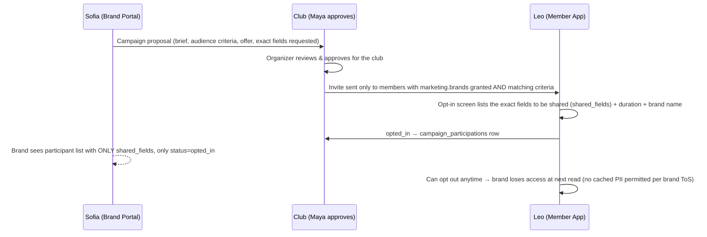
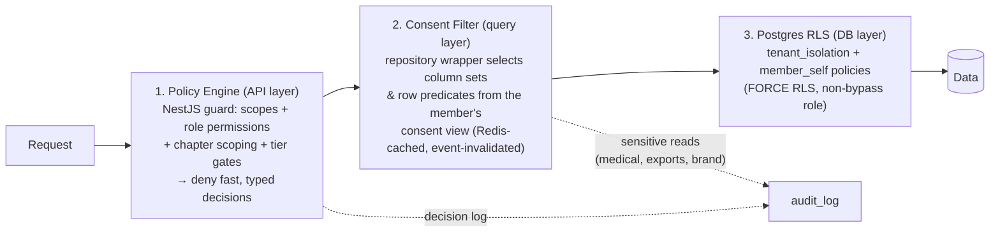

# RunOS — Permission & Consent Model

> Canonical brief §9: Organization (club) → Chapters → Members. Staff roles: **Owner,
> Admin, Organizer, Coach, Finance, Content, Volunteer-coordinator, Read-only**; custom
> roles on Pro+. Member consent scopes: `profile.basic`, `activity.summary`,
> `activity.detailed`, `health.medical`, `location.live`, `marketing.brands`,
> `photos.appearances`. Brands/vendors/cities: aggregate & anonymized only unless a
> member explicitly opts into a campaign.

Two orthogonal systems, both mandatory on every request:

1. **RBAC** answers "may this *staff actor* perform this *action*?"
2. **Consent** answers "may this club see this *member's data* at this *depth*?"

RBAC can never widen consent. An Owner with every permission still cannot see a member's
heart-rate data without `activity.detailed`.

---

## 1. Permission Catalog

Permissions are granular keys, `"<surface>.<resource>.<action>"`, grouped by the 8
surfaces. The catalog is data (`permissions` table), so custom roles and new permissions
ship without schema changes. Key actions per surface (representative, not exhaustive —
the full catalog lives in `permissions` seed data):

| Surface | Permission keys (core) |
|---|---|
| Community | `community.members.read`, `community.members.write`, `community.members.export`, `community.segments.manage`, `community.feed.moderate`, `community.messaging.send`, `community.coach_notes.read`, `community.coach_notes.write`, `community.volunteers.manage` |
| Events | `events.events.read`, `events.events.write`, `events.events.publish`, `events.checkin.write`, `events.waivers.manage`, `events.routes.manage`, `events.registrations.manage`, `events.emergency.view` *(consent-gated too)* |
| Money | `money.plans.manage`, `money.memberships.manage`, `money.payments.read`, `money.payments.refund`, `money.invoices.manage`, `money.payouts.read`, `money.products.manage`, `money.budget.manage` |
| Growth | `growth.automations.manage`, `growth.journeys.manage`, `growth.campaigns.send`, `growth.landing_pages.manage`, `growth.referrals.manage`, `growth.surveys.manage` |
| Engage | `engage.challenges.manage`, `engage.perks.manage`, `engage.redemptions.write`, `engage.ambassadors.manage`, `engage.rewards.adjust` |
| Partners | `partners.sponsors.manage`, `partners.deals.manage`, `partners.brand_campaigns.manage`, `partners.vendors.book`, `partners.roi.read` |
| Intelligence | `intelligence.analytics.read`, `intelligence.predictions.read`, `intelligence.pacer.use`, `intelligence.network.read` |
| Platform | `platform.settings.manage`, `platform.roles.manage`, `platform.integrations.manage`, `platform.api_keys.manage`, `platform.webhooks.manage`, `platform.white_label.manage`, `platform.audit.read`, `platform.billing.manage`, `platform.data.export`, `platform.data.delete` |

---

## 2. Staff Roles × Permissions Matrix

✅ = full, 👁 = read-only, ◐ = limited (noted), — = none.

| Permission | Owner | Admin | Organizer | Coach | Finance | Content | Volunteer-coordinator | Read-only |
|---|---|---|---|---|---|---|---|---|
| community.members.read | ✅ | ✅ | ✅ | ✅ | 👁 | 👁 | ◐ volunteers + event rosters | 👁 |
| community.members.write | ✅ | ✅ | ✅ | ◐ tags/goals only | — | — | — | — |
| community.members.export | ✅ | ✅ | — | — | — | — | — | — |
| community.segments.manage | ✅ | ✅ | ✅ | ◐ create, not delete | — | 👁 | — | 👁 |
| community.feed.moderate | ✅ | ✅ | ✅ | — | — | ✅ | — | — |
| community.messaging.send | ✅ | ✅ | ✅ | ◐ own groups | — | ✅ | ◐ volunteers | — |
| community.coach_notes.read/write | ✅ (read) | ✅ (read) | — | ✅ | — | — | — | — |
| community.volunteers.manage | ✅ | ✅ | ✅ | — | — | — | ✅ | 👁 |
| events.events.write / publish | ✅ | ✅ | ✅ | ◐ draft trainings, no publish | — | ◐ copy/media edits | — | — |
| events.registrations.manage | ✅ | ✅ | ✅ | 👁 | 👁 | — | ◐ volunteer shifts | 👁 |
| events.checkin.write | ✅ | ✅ | ✅ | ✅ | — | — | ✅ | — |
| events.waivers.manage | ✅ | ✅ | ✅ | — | — | — | — | — |
| events.emergency.view *(+ health.medical consent)* | ✅ | ✅ | ✅ during own events | ✅ during own sessions | — | — | — | — |
| money.plans/memberships.manage | ✅ | ✅ | — | — | ✅ | — | — | — |
| money.payments.read | ✅ | ✅ | ◐ own events' | — | ✅ | — | — | 👁 totals only |
| money.payments.refund | ✅ | ✅ | — | — | ✅ | — | — | — |
| money.payouts.read / invoices.manage | ✅ | ✅ | — | — | ✅ | — | — | — |
| money.products.manage | ✅ | ✅ | — | — | ✅ | ◐ copy/media | — | — |
| growth.automations/journeys.manage | ✅ | ✅ | ✅ | — | — | ◐ content steps | — | 👁 |
| growth.campaigns.send | ✅ | ✅ | ✅ | — | — | ✅ | — | — |
| growth.landing_pages.manage | ✅ | ✅ | ✅ | — | — | ✅ | — | 👁 |
| engage.challenges.manage | ✅ | ✅ | ✅ | ✅ | — | ◐ copy | — | 👁 |
| engage.perks.manage | ✅ | ✅ | ✅ | — | ◐ budget approval | — | — | 👁 |
| engage.redemptions.write | ✅ | ✅ | ✅ | — | — | — | ✅ (at events) | — |
| engage.ambassadors.manage | ✅ | ✅ | ✅ | ◐ nominate | — | — | — | 👁 |
| partners.sponsors/deals.manage | ✅ | ✅ | ◐ view + notes | — | ◐ invoicing | — | — | 👁 |
| partners.brand_campaigns.manage | ✅ | ✅ | — | — | — | — | — | 👁 |
| partners.roi.read | ✅ | ✅ | 👁 | — | ✅ | — | — | 👁 |
| intelligence.analytics.read | ✅ | ✅ | ✅ | ◐ training metrics | ✅ money metrics | ◐ content metrics | ◐ volunteer metrics | ✅ |
| intelligence.predictions.read | ✅ | ✅ | ✅ | ◐ own athletes | — | — | — | — |
| intelligence.pacer.use | ✅ | ✅ | ✅ | ✅ | ✅ | ✅ | ✅ | — |
| platform.settings/roles.manage | ✅ | ✅ | — | — | — | — | — | — |
| platform.integrations.manage | ✅ | ✅ | — | — | ◐ Stripe/Shopify | — | — | — |
| platform.api_keys/webhooks.manage | ✅ | ◐ not key create | — | — | — | — | — | — |
| platform.audit.read | ✅ | ✅ | — | — | ◐ financial entries | — | — | — |
| platform.billing.manage (RunOS subscription) | ✅ | — | — | — | ◐ view invoices | — | — | — |
| platform.data.export / data.delete (GDPR) | ✅ | ✅ (export) / ◐ delete needs Owner co-approval | — | — | — | — | — | — |

Invariants:

- Exactly ≥ 1 Owner per org; Owner transfer requires the current Owner + email + MFA
  confirmation. Only Owners delete the org or approve GDPR bulk deletion.
- Pacer (`intelligence.pacer.use`) answers within the caller's permissions and consent
  view — Pacer for a Coach cannot reveal finance data.
- Dangerous pairs are flagged in the roles UI (e.g., a custom role combining
  `payments.refund` + `audit.read`-none).

---

## 3. Custom Roles, Chapter Scoping, Multi-Org Users

- **Custom roles (Pro+):** clone a system role, toggle individual permission keys.
  Guardrails: cannot grant `platform.roles.manage` without `platform.audit.read`;
  cannot exceed the granting admin's own permissions (no privilege escalation by
  delegation); max 25 custom roles/org.
- **Chapter-scoped roles:** any `role_assignments` row may set `chapter_id`. Priya
  (Chapter lead persona) = Organizer scoped to her chapter: full Organizer powers over
  members/events/campaigns where `chapter_id` matches, read-only org-level dashboards
  (own-chapter slices), no org settings, no cross-chapter member PII. Enforced by the
  policy engine adding a chapter predicate to every query it authorizes (RLS guards
  org boundary; chapter is a policy-layer filter because rows may be org-wide with
  `chapter_id NULL`).
- **Multi-org users:** one `users` row, N `role_assignments`/`members` rows. Sessions
  carry an **active club context**; switching clubs re-issues the context token. No API
  call ever spans two clubs. A user can simultaneously be staff in club A and plain
  member in club B — the actor kind is per-context.

---

## 4. Member Consent Scopes — Exact Semantics

Consent is **per member, per club**, stored in `consent_grants`, versioned against the
consent text the member saw. Defaults are conservative; `health.medical` and
`marketing.brands` are **always opt-in** (never default, never bundled).

| Scope | Default | Unlocks (fields/queries) | Primary UI touchpoints |
|---|---|---|---|
| `profile.basic` | Granted at join (required to be a functioning member; refusing = anonymous roster entry "Member #1041") | Name, avatar, chapter, join date, tags, T-shirt/shoe size, attendance counts, membership status. Queries: roster, search, segments on these fields | Join flow step 1; Profile → Privacy |
| `activity.summary` | Prompted at join (pre-checked *off*) | Per-activity: sport, date, distance, moving time, elevation, average pace, race flag. Aggregates: weekly km, totals, streaks, PR list. Queries: leaderboards, challenge progress, activity feed entries, club distance stats | Join flow; first fitness connect ("What can your club see?"); challenge join |
| `activity.detailed` | Off; opt-in | Everything in summary **plus** HR, cadence, calories, laps/splits, route polyline & start point, per-activity detail view. Queries: coach training views, route heatmaps | Fitness connect "detailed" toggle; Coach-request flow (coach can *request*, member approves) |
| `health.medical` | **Off; explicit opt-in, re-confirmed yearly** (GDPR Art. 9 explicit consent) | Emergency contact, medical notes (allergies, conditions), blood type. Queries: **only** the emergency panel during a live event the member is checked into, visible to holders of `events.emergency.view`; every access is audit-logged and visible to the member | Event registration ("emergency info for race day"); Profile → Health |
| `location.live` | Off; opt-in **per event**, auto-expires at event end | Live GPS position during an active event (safety/sweeper view). Never stored beyond event + 24 h; never in profile | "Share my live location for this run" toggle at check-in |
| `marketing.brands` | Off; opt-in | Inclusion in brand-facing *audience counts*, eligibility to be invited to brand campaigns, inclusion in hashed custom-audience exports (Meta/TikTok). Without it a member is invisible to everything brand-related, including aggregate cohort membership | Perks/benefits onboarding ("get brand offers"); each campaign opt-in restates it |
| `photos.appearances` | Off; opt-in | Being tagged in club photos/media, appearing in generated content (Instagram carousels, newsletters), `content_appearances` counter. Without it: auto-face-blur pipeline applies where feasible on club uploads; tagging is disabled | Join flow media step; photo-tag prompt |

**Consent UX rules:** one screen per scope with plain-language "what your club will see"
examples; granular toggles, no bundling; the member's Privacy page shows *current
effective view* ("This is what organizers see about you") rendered through the same
serializer the club uses — guaranteed truth.

**Revocation behavior (what happens to already-shared data):**

- Revocation takes effect **immediately** on the query path (consent-view cache in Redis
  invalidated by `consent.revoked`).
- `activity.summary` revoked → existing activities become invisible to staff/queries;
  rows retained (member can re-grant) but excluded from all club views, aggregates
  recomputed (nightly full + immediate profile-row refresh). Historical *derived*
  aggregates in ClickHouse are recomputed by replay-with-filter within 24 h. Leaderboard
  and challenge entries are removed; already-awarded rewards stand (they were earned
  under valid consent — noted in the consent text).
- `activity.detailed` revoked → detailed columns nulled from club views immediately;
  stored detail is **downgraded at rest to summary tier within 30 days** unless
  re-granted (background job), because we minimize what we hold without a serving
  purpose.
- `health.medical` revoked → fields hard-deleted within 72 h (not soft-hidden); audit
  trail of past accesses retained (log contains access facts, not the medical values).
- `marketing.brands` revoked → removed from future audience builds immediately; active
  `campaign_participations` set to `opted_out` and the brand's next metrics period
  excludes them; previously exported hash audiences are re-uploaded (full replace) within
  7 days, which drops the member.
- `photos.appearances` revoked → tags removed immediately; appearance counter frozen;
  club prompted with a task list of published content containing confirmed tags
  (best-effort takedown; legal reality stated honestly in the consent copy).
- Data already lawfully exported by the club (e.g., CSV export while consent was active)
  is the club's controller responsibility — covered in the club DPA
  (`security-and-privacy.md` §5).

**Minors:** all scopes for members with `is_minor = true` require guardian action
(`granted_via='guardian'`, `guardian_user_id` recorded); `marketing.brands` and
`location.live` are unavailable to minors entirely. See `security-and-privacy.md` §6.

---

## 5. Brand / Vendor / City Access Model

**Baseline: aggregates only, k ≥ 50** (brief §9). Brand/city tokens can only reach
`/v1/reports/aggregates` and campaign endpoints.

- Every aggregate query runs through the **aggregate gate**: cohort computed → if
  `COUNT(DISTINCT member) < 50` → refuse (`k_anonymity_floor`). Cohorts count only
  `marketing.brands`-granted members for brand queries; cities see all-member aggregates
  (no marketing scope needed) because nothing member-linked is exposed — city dashboards
  are club-level counts/trends only.
- Complementary-query protection: overlapping cohort differencing is limited by rounding
  (counts rounded to nearest 5) + noise on small segments
  (`security-and-privacy.md` §7).
- **Campaign opt-in flow** (the only path to member-level brand access):

- **Vendors** see: their own services/bookings/reviews; a booking reveals the booking
  member's name + contact only after `status=confirmed`, and only for that booking.
  No roster access, ever.

---

## 6. Enforcement Architecture

Three independent layers; a bug must defeat all three:

- **Policy engine:** pure function `(policyContext, action, resource) → allow | deny(reason)`;
  decisions cached per request; unit-tested against the matrix in §2 (the matrix is a
  fixture — doc and code cannot drift, CI diffs them).
- **Consent filter:** the only way modules read member-linked data is via repositories
  that require a `ConsentView`; serializers are shared between REST, tRPC, webhooks, and
  Pacer context assembly so no surface can leak wider than another.
- **RLS:** last line; even raw SQL injected through a bug stays inside the tenant and,
  for member actors, inside self.
- **Audit logging:** every deny (with reason), every sensitive read (`health.medical`
  views, member exports, brand aggregate queries incl. the SQL-cohort hash), every
  permission/role/consent change. Members can see the access history of their own
  medical data (transparency requirement).
