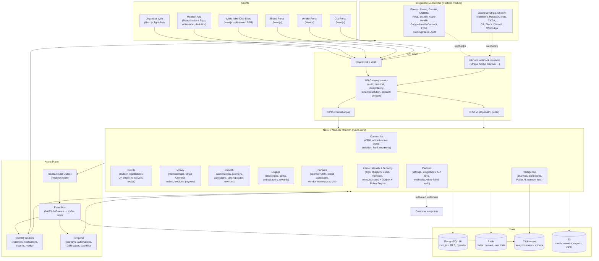
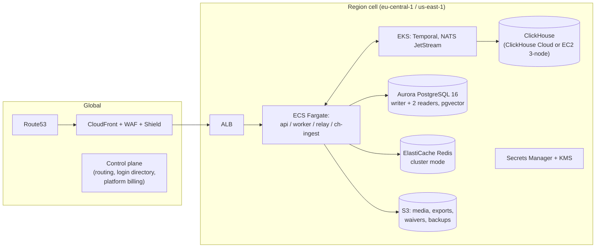

# RunOS — Technical Architecture

> Conforms to [`docs/00-foundation/canonical-brief.md`](../00-foundation/canonical-brief.md).
> Stack: Next.js + React Native (Expo) clients, **NestJS modular monolith** (TypeScript),
> PostgreSQL 16 + RLS, Redis, ClickHouse, S3, BullMQ, Temporal, outbox → NATS/Kafka,
> Stripe Connect, Anthropic Claude for Pacer. AWS (ECS/EKS), Terraform, EU + US residency.

---

## 1. System Overview



Key decisions:

1. **Modular monolith, not microservices.** One deployable (`runos-core`) with hard module
   boundaries enforced at compile time (Nx module-boundary lint rules + NestJS module
   encapsulation). Modules share a database but never each other's tables (§3).
2. **Everything asynchronous goes through the outbox.** No module publishes to the bus
   directly; domain events are written to `outbox_events` in the same transaction as the
   state change, then relayed to NATS JetStream. This gives exactly-once-ish semantics and
   a full replayable event log.
3. **Consent is a first-class runtime context.** Every request carries `{club_id, actor,
   role, consent_view}`; the consent filter (see `permission-model.md`) is applied in the
   query layer, RLS at the DB layer, and policy checks at the API layer — three
   independent enforcement points.
4. **ClickHouse is derived, never authoritative.** All analytics/read-heavy aggregation is
   served from ClickHouse mirrors fed by the event bus; Postgres remains the system of
   record.

---

## 2. Runtime Topology

| Process | Role | Scaling unit |
|---|---|---|
| `api` (runos-core, HTTP mode) | tRPC + REST + inbound webhooks | ECS service, HPA on CPU + p95 latency |
| `worker` (runos-core, worker mode) | BullMQ consumers: ingestion, notifications, media, exports | ECS service, HPA on queue depth |
| `relay` | Outbox → NATS relay (single-writer per partition) | 2 instances, leader-elected |
| `temporal-worker` | Journey/automation/DSR workflow + activity workers | ECS service, HPA on task queue backlog |
| `ch-ingest` | NATS → ClickHouse batcher | 2 instances |
| Temporal Server | Self-hosted on EKS (or Temporal Cloud on Network-tier scale) | StatefulSet |
| NATS JetStream | 3-node cluster per region | StatefulSet |

The same container image runs `api`, `worker`, and `relay` via a `PROCESS_ROLE` env var —
one build, one release train.

---

## 3. Module Boundary Map

**Rule: every module connects via events, not direct table access.** A module may only:
(a) read/write its own tables, (b) call another module's exported NestJS service interface
(synchronous, same process, still policy-checked), (c) publish/consume domain events.
Cross-module SQL joins are forbidden and blocked by per-module Postgres roles that only
have grants on their own schema-owned tables (CI runs a grant-diff check).

Read models that genuinely need cross-domain data (e.g., Unified Runner Profile, Pacer
context) are **projections** maintained by consuming events, or ClickHouse queries.

| Module | Owned tables (see `database-schema.md`) | Publishes | Consumes |
|---|---|---|---|
| **Kernel: Identity & Tenancy** | `organizations`, `chapters`, `users`, `members`, `roles`, `role_assignments`, `permissions`, `consent_grants` | `member.joined`, `member.left`, `member.updated`, `chapter.created`, `consent.granted`, `consent.revoked`, `role.assigned` | `payment.succeeded` (auto-activate membership-linked member state) |
| **Community** | `runner_profiles`, `profile_snapshots`, `activities`, `activity_sources`, `activity_laps`, `personal_records`, `segments`, `segment_members`, `feed_posts`, `coach_notes` | `activity.ingested`, `activity.deduplicated`, `activity.deleted`, `pr.achieved`, `profile.updated`, `segment.membership_changed` | `consent.granted/revoked` (re-materialize profile views), `checkin.recorded` (attendance onto profile), `perk.redeemed`, `order.completed`, `challenge.completed` (profile aggregates) |
| **Events** | `events`, `event_occurrences`, `registrations`, `check_ins`, `waivers`, `waiver_signatures`, `routes`, `event_roles` (pacers), `volunteer_shifts`, `volunteer_assignments`, `event_tasks`, `waitlist_entries` | `event.published`, `event.updated`, `event.cancelled`, `registration.created`, `registration.cancelled`, `waitlist.promoted`, `checkin.recorded`, `waiver.signed`, `volunteer_shift.filled` | `payment.succeeded` (confirm paid registration), `member.joined` |
| **Money** | `membership_plans`, `memberships`, `payments`, `orders`, `order_items`, `products`, `invoices`, `invoice_lines`, `payouts`, `refunds` | `membership.activated`, `membership.renewed`, `membership.lapsed`, `payment.succeeded`, `payment.failed`, `order.completed`, `invoice.paid`, `payout.settled`, `refund.issued` | `registration.created` (create payment intent), `booking.completed` (marketplace commission), `perk.redeemed` (paid perks) |
| **Growth** | `automations`, `automation_runs`, `journeys`, `journey_steps`, `journey_enrollments`, `messages`, `message_templates`, `campaigns_marketing`, `landing_pages`, `referrals`, `surveys`, `survey_responses` | `journey.enrolled`, `journey.step_executed`, `message.sent`, `message.delivered`, `message.bounced`, `campaign.launched`, `referral.converted`, `survey.completed` | Nearly everything — automations trigger on `member.joined`, `activity.ingested`, `checkin.recorded`, `membership.lapsed`, `pr.achieved`, `churn_risk.flagged`, `registration.created`, … |
| **Engage** | `challenges`, `challenge_participants`, `challenge_progress`, `perks`, `perk_redemptions`, `ambassadors`, `rewards_ledger`, `leaderboards` (config) | `challenge.joined`, `challenge.completed`, `perk.redeemed`, `reward.earned`, `ambassador.promoted` | `activity.ingested` (progress + leaderboards, consent-filtered), `checkin.recorded`, `referral.converted` (rewards) |
| **Partners** | `sponsors`, `sponsor_deals`, `brand_accounts`, `brand_campaigns`, `campaign_participations`, `campaign_metrics`, `vendors`, `vendor_services`, `bookings`, `reviews` | `sponsor_deal.signed`, `brand_campaign.launched`, `campaign.opt_in`, `campaign.opt_out`, `booking.created`, `booking.completed`, `review.submitted` | `consent.revoked` (`marketing.brands` → force opt-out), `payment.succeeded` (booking payments), aggregate events for `campaign_metrics` |
| **Intelligence** | `metric_snapshots`, `predictions`, `ai_conversations`, `ai_messages`, `embeddings` (pgvector) | `prediction.generated`, `churn_risk.flagged`, `metric_snapshot.created` | All events (fan-in to ClickHouse); reads only anonymized network aggregates cross-club |
| **Platform** | `integration_connections`, `sync_cursors`, `webhook_endpoints`, `webhook_deliveries`, `api_keys`, `audit_log`, `white_label_configs`, `outbox_events` | `integration.connected`, `integration.disconnected`, `integration.sync_failed`, `webhook.delivery_failed`, `api_key.created` | `*` — audit log consumer subscribes to every event; outbound webhook dispatcher fans out subscribed events to customer endpoints |

**Event envelope** (CloudEvents-compatible):

```json
{
  "id": "evt_01J8ZK2W7C9XQ4NPM6T3R8VBHE",
  "type": "community.activity.ingested",
  "source": "runos-core/community",
  "time": "2026-07-02T09:14:03.221Z",
  "club_id": "org_01J8ZJXQ...",
  "actor": { "kind": "system", "connector": "strava" },
  "dataschema": "runos.events.activity.ingested.v1",
  "data": { "activity_id": "act_01J8ZK...", "member_id": "mem_01J8...", "sport": "run" }
}
```

Schemas are versioned (`.v1`, `.v2`); consumers must tolerate unknown fields; breaking
changes require a new version published in parallel for ≥ 90 days.

---

## 4. Multi-Tenancy Deep Dive

Tenancy model (per brief §9): **Organization (club) → Chapters → Members.**

### 4.1 `club_id` everywhere

- Every tenant-scoped table carries `club_id` (FK → `organizations.id`), `NOT NULL`,
  indexed as the **leading column** of every composite index.
- Chapter scoping is additive: `chapter_id NULLABLE` where a row can be chapter-scoped;
  chapter-scoped staff roles filter on it at the policy layer (RLS handles the org
  boundary, the policy engine handles the chapter boundary).
- Global tables (no `club_id`): `users` (a person can belong to many clubs),
  `brand_accounts`, `vendors` (marketplace-global), provider catalogs. These have their
  own RLS policies keyed to ownership.

### 4.2 Postgres RLS

Application connects with a non-superuser role `runos_app` that cannot bypass RLS
(`FORCE ROW LEVEL SECURITY` on all tenant tables). Per request:

```sql
-- set by the request-scoped transaction interceptor
SELECT set_config('app.club_id', $1, true);       -- true = transaction-local
SELECT set_config('app.actor_kind', $2, true);    -- staff | member | api_key | brand | system
SELECT set_config('app.member_id', $3, true);
```

Canonical policy pattern (full policies in `database-schema.md`):

```sql
ALTER TABLE members ENABLE ROW LEVEL SECURITY;
ALTER TABLE members FORCE ROW LEVEL SECURITY;

CREATE POLICY tenant_isolation ON members
  USING (club_id = current_setting('app.club_id')::text)
  WITH CHECK (club_id = current_setting('app.club_id')::text);
```

Background workers that legitimately operate cross-tenant (relay, ClickHouse ingest,
platform billing) use a separate `runos_batch` role with explicit per-table `BYPASS`
policies and are code-review-gated (`CODEOWNERS`: platform team + security lead).

### 4.3 Tenant isolation testing (continuous)

- **Unit:** every repository test suite runs a canary — insert rows for tenant A, set
  context to tenant B, assert zero rows visible and writes rejected.
- **CI schema gate:** migration linter fails the build if a new table lacks `club_id` +
  RLS policy and isn't on the explicit global-table allowlist.
- **Nightly fuzzing:** a job replays the previous day's top 500 API routes with a
  synthetic tenant pair (A, B) and asserts no response for B ever contains A's IDs
  (scan for ULID prefixes tagged per tenant).
- **Pentest scope:** cross-tenant access is a standing item in every external pentest.

### 4.4 Noisy-neighbor controls

- API rate limits per tier (see `api-architecture.md`): token buckets in Redis keyed by
  `club_id` (and per-key for PATs).
- BullMQ queues use **group-based fair scheduling** (`bullmq-pro` groups keyed by
  `club_id`): one club backfilling 5 years of Strava history cannot starve others.
- Per-tenant Postgres statement timeout (5 s API / 60 s worker) + `pg_stat_statements`
  alerting on tenants exceeding 5% of cluster time.
- ClickHouse queries carry `club_id` quota profiles; Pacer AI calls have per-tenant
  daily token budgets (tier-dependent).
- Network tier can be pinned to a dedicated ECS service + Postgres via the same
  Terraform module ("cell" pattern) without code changes.

### 4.5 Data residency (EU + US)

- **Cell architecture:** a "region cell" = full stack (Postgres, Redis, ClickHouse, NATS,
  Temporal namespace, S3 buckets) in `eu-central-1` or `us-east-1`. A club is homed to
  exactly one cell at signup (`organizations.residency_region`); all its data, including
  backups and ClickHouse mirrors, stays in-cell.
- A thin **global control plane** (`us-east-1` + `eu-central-1` replicated) stores only:
  club → cell routing, user login directory (email hash + credentials + list of club
  memberships), platform billing. No member PII beyond the login record.
- Routing: edge (CloudFront function) resolves `club_id` → cell from a signed routing
  token in the session; API requests never cross cells.
- **Network intelligence** is the only cross-cell flow: each cell computes anonymized,
  k-anonymous (≥ 50) aggregates locally and ships **aggregates only** to a global
  benchmarks store (see `security-and-privacy.md` §7). Raw member data never leaves its
  cell.

---

## 5. Scaling Path: Monolith → Extracted Services

Stay in the monolith until an explicit trigger fires. Extraction order and triggers:

| # | Extract | Trigger ("extract when…") | Notes |
|---|---|---|---|
| 1 | **Activity Ingestion service** | Sustained > 50 webhook events/s OR ingestion workers > 40% of cluster CPU OR a provider outage backlog takes > 2 h to drain | Stateless normalize/dedup pipeline; already isolated behind the bus. Gets its own Postgres schema first, own DB at > 200 events/s. |
| 2 | **Notifications service** (email/SMS/push/WhatsApp send) | > 1 M messages/day OR deliverability requires dedicated IP pools/warm-up ops | Consumes `message.requested`, owns provider adapters + suppression lists. |
| 3 | **Analytics/Intelligence read side** | ClickHouse query concurrency degrades API p95 OR Intelligence deploys need to ship > 2×/day independently | Split the query API + prediction batch jobs; Pacer stays in core (needs policy engine locality) until its own trigger: > 20% of API pods busy on AI calls. |
| 4 | **Webhook dispatcher** | > 100 k outbound deliveries/day or retry storms affect API latency | Trivial extraction — already queue-driven. |
| 5 | **White-label site renderer** | SSR traffic to club sites > 3× app traffic | Move to its own Next.js fleet with per-club ISR cache. |

Non-goals: extracting Money, Events, Community — they are transactionally entangled with
the kernel and benefit from single-DB consistency. Revisit only past ~5,000 active clubs
per cell.

Prerequisites baked in from day 1 so extraction is a re-deploy, not a rewrite: per-module
schemas + DB roles, events-only cross-module writes, per-module CODEOWNERS, contract tests
on event schemas.

---

## 6. Infrastructure

### 6.1 AWS layout (per region cell)



- 3 AZs; Aurora PostgreSQL (writer + 2 readers; readers serve tRPC read paths tagged
  read-only). pgvector on the same cluster until Intelligence extraction.
- Fargate for stateless services; EKS only for stateful infra (Temporal, NATS,
  self-hosted ClickHouse if not using ClickHouse Cloud).
- All egress to integrations via NAT with static EIPs (some providers allowlist IPs).

### 6.2 Environments

| Env | Purpose | Data |
|---|---|---|
| `dev` | Per-engineer local (docker-compose: Postgres, Redis, NATS, Temporal, ClickHouse) | Seed fixtures |
| `preview` | Ephemeral per-PR (frontend on Vercel-style previews; API against `staging`) | Synthetic |
| `staging` | Full cell replica, EU region, continuous deploy from `main` | Synthetic + anonymized load-test corpus. **Never production PII.** |
| `prod-eu`, `prod-us` | Production cells | Real |

### 6.3 IaC & CI/CD

- **Terraform** monorepo (`infra/`): modules `cell`, `control-plane`, `observability`;
  workspaces per env; plans posted to PRs; applies via Atlantis-style pipeline with
  2-person approval for prod.
- **CI (GitHub Actions):** lint → typecheck → unit → module-boundary check → migration
  lint (RLS gate) → integration tests (Testcontainers) → tenant-isolation canaries →
  build image → deploy staging → smoke + contract tests → **manual gate** → canary 10%
  prod → auto-promote on SLO-clean 30 min → 100%.
- DB migrations: forward-only, expand/contract pattern, `pgroll`-style zero-downtime;
  run as a pre-deploy job with lock timeout 5 s and automatic retry.

### 6.4 Observability

- **Traces:** OpenTelemetry SDK in every process; propagation through BullMQ/Temporal/NATS
  headers; export to Grafana Tempo. Every span tagged `club_id` (hashed in cold storage).
- **Metrics:** Prometheus → Grafana Mimir. RED per route + per module; queue depth, outbox
  lag, connector sync lag per provider, webhook delivery success.
- **Logs:** structured JSON → Loki; PII scrubber at the log pipeline (denylist of field
  names + Luhn/e-mail regex); 30 d hot / 13 mo cold (audit-relevant only).
- **SLOs** (per cell, alerting on burn rate):

| SLO | Target |
|---|---|
| API availability (5xx) | 99.9% monthly |
| API latency p95 (reads) | < 300 ms |
| API latency p95 (writes) | < 600 ms |
| Activity ingestion lag (webhook → profile visible) | p95 < 60 s |
| Check-in write success (incl. offline sync) | 99.95% |
| Outbound webhook first-attempt delivery | 99% < 30 s |
| Message send (email/push) enqueue→provider | p95 < 2 min |

### 6.5 Disaster recovery

| Store | Backup | RPO | RTO |
|---|---|---|---|
| Aurora Postgres | Continuous PITR (5 min granularity) + daily snapshot, 35 d retention, cross-AZ | ≤ 5 min | ≤ 1 h (in-region failover ≤ 2 min) |
| ClickHouse | Rebuildable from bus replay (NATS 30 d retention) + daily S3 backup | ≤ 24 h (derived data) | ≤ 8 h rebuild |
| S3 | Versioning + same-region replication to second bucket; Object Lock on waivers/audit exports | ~0 | minutes |
| Redis | Not durable by contract (cache/queues); BullMQ jobs re-derivable from outbox | n/a | ≤ 15 min re-provision |
| Temporal | Persistence on Aurora (same PITR) | ≤ 5 min | ≤ 1 h |

- Whole-cell loss: Terraform re-provision + restore in-region-pair (`eu-west-1` /
  `us-west-2`) — **RTO 8 h, RPO 5 min** (Aurora cross-region snapshot copy every hour +
  PITR where available). Residency guarantee is preserved: EU cell only ever restores to
  EU regions.
- Game-days quarterly: restore drill, cell failover tabletop, connector outage replay.

---

## 7. Key Sequence Diagrams

### 7.1 Activity ingestion (Strava webhook → profile → automations)

```mermaid
sequenceDiagram
    autonumber
    participant ST as Strava
    participant WH as Webhook Receiver (api)
    participant Q as BullMQ (ingestion, grouped by club_id)
    participant CN as Strava Connector (worker)
    participant CM as Community module
    participant PG as Postgres (RLS)
    participant OB as Outbox → NATS
    participant EN as Engage module
    participant GR as Growth module (Temporal)

    ST->>WH: POST /webhooks/strava {athlete_id, activity_id, aspect: create}
    WH->>WH: verify subscription token, dedupe (Redis SETNX event id)
    WH-->>ST: 200 (fast-ack < 2s per Strava rules)
    WH->>Q: enqueue ingest job {connection_id, provider_activity_id}
    Q->>CN: job
    CN->>ST: GET /activities/{id} (OAuth token, rate-limit budgeted)
    CN->>CM: normalize → UnifiedActivity (see integrations.md §8)
    CM->>PG: BEGIN; set app.club_id
    CM->>PG: upsert activity_sources; dedup fingerprint check (time+distance+source)
    alt duplicate of existing activity
        CM->>PG: link source to canonical activity; COMMIT
        CM->>OB: activity.deduplicated
    else new activity
        CM->>CM: consent filter: member's activity.summary / activity.detailed grants<br/>decide stored detail level & visibility flags
        CM->>PG: insert activities (+ laps if detailed consented), update runner_profile aggregates, PR detection
        CM->>PG: insert outbox_events (activity.ingested [, pr.achieved]); COMMIT
    end
    OB-->>EN: activity.ingested
    EN->>EN: update challenge_progress, leaderboards (only consented fields)
    OB-->>GR: activity.ingested
    GR->>GR: match automation triggers ("first activity this month" → journey enrollment)
    OB-->>CH: ClickHouse mirror insert (analytics)
```

### 7.2 QR check-in (offline-capable)

```mermaid
sequenceDiagram
    autonumber
    participant M as Member App (RN)
    participant O as Organizer App (scanner)
    participant API as Events module API
    participant PG as Postgres
    participant OB as Outbox → NATS

    Note over M: Member QR = signed token<br/>{member_id, event_id, exp 24h, kid}<br/>issued at registration, cached offline
    Note over O: Organizer pre-downloads event roster +<br/>token verification key before event (works offline)
    O->>O: scan QR → verify signature locally → match roster<br/>→ append to local check-in log (SQLite) with client_checkin_id (ULID)
    O-->>M: instant visual confirm (offline OK)
    loop when connectivity returns (background sync)
        O->>API: POST /v1/events/{id}/check-ins/batch<br/>Idempotency-Key: device+batch hash<br/>[{client_checkin_id, member_id, scanned_at, method:"qr"}]
        API->>PG: upsert check_ins ON CONFLICT (club_id, event_id, member_id, occurrence) DO NOTHING<br/>(client_checkin_id unique → replay-safe)
        API->>PG: outbox: checkin.recorded (per new row)
        API-->>O: 200 {accepted, duplicates}
    end
    OB-->>CM: checkin.recorded → attendance on runner profile
    OB-->>GR: checkin.recorded → automations ("3rd attendance → ambassador candidate")
    Note over API: Conflict rule: earliest scanned_at wins;<br/>duplicates recorded in audit_log, not as rows
```

### 7.3 Payment (Stripe Connect destination charge + application fee)

```mermaid
sequenceDiagram
    autonumber
    participant L as Leo (Member App)
    participant API as Money module
    participant PG as Postgres
    participant STR as Stripe
    participant WH as Stripe Webhook Receiver
    participant OB as Outbox → NATS

    L->>API: POST /v1/registrations {event_id, ticket_type} (paid event)
    API->>PG: create registration (status=pending_payment) + payments row (status=requires_payment)
    API->>STR: PaymentIntent.create amount=2500 currency=eur<br/>on_behalf_of + transfer_data.destination = club's connected acct<br/>application_fee_amount = platform fee by tier (2%/1%/0.5%) + ticket fee (2% + $0.30 Starter/Club)
    STR-->>API: client_secret
    API-->>L: {registration_id, client_secret}
    L->>STR: confirm payment (Stripe SDK, SCA if required)
    STR->>WH: payment_intent.succeeded (signed)
    WH->>WH: verify signature, dedupe by stripe event id
    WH->>PG: BEGIN; payments.status=succeeded; registrations.status=confirmed;<br/>outbox: payment.succeeded, registration.confirmed; COMMIT
    OB-->>EVT: registration.confirmed → decrement capacity, waitlist logic
    OB-->>GR: payment.succeeded → receipts journey
    Note over STR: Club is merchant of record.<br/>Funds settle to club's connected account minus application fee.<br/>payouts table mirrors Stripe payouts via payout.paid webhooks.
    STR->>WH: payout.paid → upsert payouts, outbox: payout.settled
```

---

## 8. Cross-Cutting Concerns

- **Idempotency:** all mutating public endpoints accept `Idempotency-Key` (stored 24 h in
  Redis + `payments`/`check_ins` natural keys in Postgres as the durable backstop).
- **Caching:** Redis for session, consent-view snapshots (invalidated on
  `consent.granted/revoked`), hot rosters, rate limits. HTTP caching only on public
  white-label pages (ISR).
- **Search:** Postgres FTS + pg_trgm for CRM search; revisit OpenSearch only if member
  search p95 > 300 ms at scale.
- **Media:** direct-to-S3 presigned uploads; image resize worker; EXIF GPS stripped on
  member photo uploads by default (privacy).
- **Feature flags:** internal flags table + Redis; tier gating (Starter/Club/Pro/Network)
  is data, not code branches.
- **AI (Pacer):** Anthropic Claude via API; all prompts assembled server-side from
  consent-filtered projections + RAG (pgvector) over the club's own data + the anonymized
  network benchmark store. Pacer never receives another club's raw rows (enforced by the
  same RLS context as any request). Full details in `docs/04-intelligence/`.
