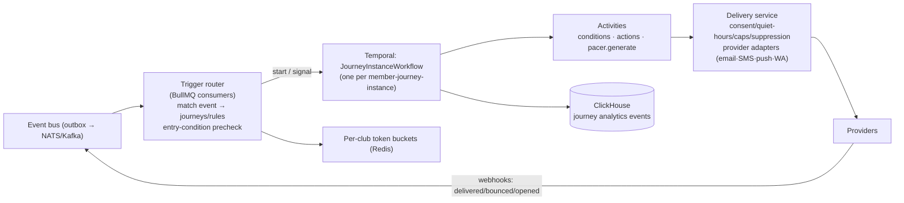
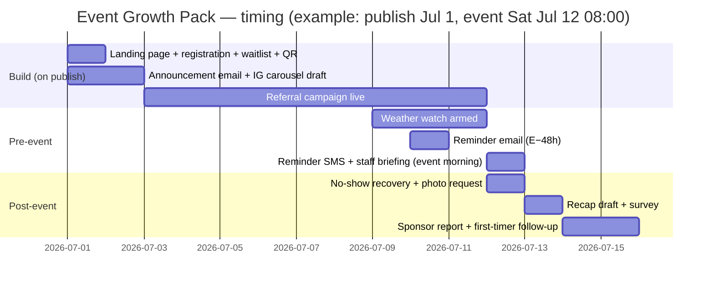

# Growth OS — Automation Engine Specification

> **Module:** Growth (runtime spans all modules) · **Codename:** the Growth OS runtime
> **Source of truth:** [`docs/00-foundation/canonical-brief.md`](../00-foundation/canonical-brief.md) (§4, §8, §9)
> **Companion docs:** [`ai-features.md`](./ai-features.md) (Pacer actions), [`network-intelligence.md`](./network-intelligence.md)
> **Audience:** platform engineering. Execution-ready: event/condition/action contracts, journey builder spec, Temporal architecture, the canonical Event Growth Pack, recipe library, observability.

---

## 1. Model: Trigger → Condition → Action

Everything in Growth OS reduces to one primitive, evaluated by one runtime:

```
WHEN  <trigger event>            (domain event on the platform event bus)
IF    <conditions>               (segment, consent, quiet hours, caps, custom filters)
THEN  <actions>                  (message, task, tag, perk, webhook, Pacer generation, ...)
```

Two packaging levels share this primitive:

- **Rules** — single trigger → conditions → 1–3 actions. No state between firings. ("When payment fails, send email + create task.")
- **Journeys** — stateful multi-step flows built in the journey builder (§3): a member enters on a trigger and moves through a graph of actions, waits, and branches over days or weeks. One journey definition → many **member-journey-instances**, each an isolated Temporal workflow (§4).

All triggers are **domain events** emitted through the transactional outbox (brief §8) — the automation engine never polls business tables. Event envelope (canonical):

```json
{
  "event_id": "ev_01J9XQ...",            // ULID, idempotency key
  "event_type": "member.joined",
  "occurred_at": "2026-07-02T09:14:03Z",
  "club_id": "club_7d1f",
  "chapter_id": "chap_02aa",             // nullable
  "subject": {"type": "member", "id": "mem_55c1"},
  "payload": { "...event-specific fields..." },
  "source": "community-service",
  "schema_version": 3
}
```

---

## 2. Catalog

### 2.1 Triggers (v1 canonical set)

| Trigger `event_type` | Emitted by | Key payload fields | Notes |
|---|---|---|---|
| `member.joined` | Community | join_source, referral_code, membership_tier | Fires after profile creation + consent defaults set |
| `member.profile_completed` | Community | completion_pct | For onboarding nudges |
| `activity.synced` | Ingestion | provider, distance_km, activity_type, is_first | Requires `activity.summary`; payload is summary-level only |
| `activity.milestone` | Ingestion | milestone_type (first_100km, PR, streak_7) | Derived events, consent-gated as above |
| `event.published` | Events | event_id, event_type, start_ts, capacity | Kicks off Event Growth Pack (§5) |
| `event.rsvp_created` / `event.rsvp_cancelled` | Events | event_id, waitlisted | |
| `event.checkin` | Events | event_id, method (qr/manual), is_first_event | |
| `event.no_show` | Events | event_id | Derived: RSVP'd, event ended, no check-in (emitted T+2 h after event end) |
| `event.waitlist_promoted` | Events | event_id, position | |
| `event.completed` | Events | event_id, final_attendance | T+2 h after end |
| `membership.expiring` | Money | expires_at, days_until (30/14/7/1 configurable emit points) | Scheduled derivations from membership records |
| `membership.renewed` / `membership.lapsed` | Money | tier, auto_renew | |
| `payment.failed` | Money (Stripe webhook) | invoice_id, attempt_n, failure_code | Feeds dunning recipe |
| `payment.succeeded` | Money | amount, product_type | |
| `order.placed` | Money (merch) | source (shopify/native), items | |
| `challenge.joined` / `challenge.completed` / `challenge.stalled` | Engage | challenge_id, progress_pct | `stalled` = no progress for 7 d while active |
| `perk.redeemed` | Engage | perk_id, partner_id | |
| `reward.earned` | Engage | reward_id, points | |
| `member.inactivity_threshold` | Intelligence | days_inactive (14/30/60 configurable), last_action_type | Derived nightly from WACM-action recency |
| `member.churn_risk_changed` | Intelligence | tier_from, tier_to, reason_codes | From churn model (ai-features.md §2.2) |
| `member.birthday` | Community | — | Fires at 08:00 club-local |
| `weather.changed` | Events (weather integration) | event_id, change_type (rain_added, heat_warning, storm), forecast | Only for events within 72 h, on material forecast change |
| `survey.submitted` | Growth | survey_id, nps_score | NPS-branch journeys |
| `referral.converted` | Growth | referrer_member_id, new_member_id | |
| `volunteer.shift_completed` | Community | event_id, hours | |
| `webhook.inbound` | Platform | integration_id, payload | Custom/third-party triggers (Pro+) |
| `manual.enrolled` | Staff UI / Pacer play | enrolled_by | Staff bulk-enroll a segment; Pacer `enroll_play` uses this |
| `segment.entered` / `segment.exited` | Community | segment_id | Dynamic segments re-evaluated on member-fact changes |

Adding a trigger = registering the event schema in the event registry + a row in `automation_trigger_types`; the runtime is generic.

### 2.2 Conditions

Conditions are AND/OR/NOT-composable predicates evaluated at each decision point (entry and before every action). All evaluate against the **current** state (not enrollment-time snapshots) unless the node opts into snapshotting.

| Condition | Semantics |
|---|---|
| `segment.member_of(segment_id)` | Membership in a saved segment (dynamic or static) |
| `profile.field(op, value)` | Tier, tenure, chapter, tags, language, join source |
| `consent.has(scope)` | **Mandatory implicit check** — every action that uses scoped data or a marketing channel auto-injects its required consent + channel-subscription check; builders can add stricter ones. A journey step touching `activity.summary` will silently skip (with `skipped_no_consent` audit reason) for non-consented members |
| `channel.reachable(channel)` | Verified address + not unsubscribed + not suppressed (§4.7) |
| `quiet_hours.outside()` | Auto-injected on every message action; see §4.6 |
| `frequency.cap_ok(channel)` | Auto-injected: per-member caps, default 1 marketing email/day, 3/week; 2 SMS/week; 1 push/day; per-club overrides bounded by platform maxima. Transactional class (receipts, event-day logistics, safety) is exempt |
| `event.property(op, value)` | Predicates on the triggering event payload |
| `history.did(event_type, window, count_op)` | "Attended ≥ 3 events in 90 d", "opened no emails in 30 d" |
| `prediction.value(model, op, value)` | Churn tier, attendance probability (Pro+) |
| `experiment.in_variant(exp_id, variant)` | For A/B coordination across journeys |
| `time.window(days_of_week, time_range)` | "Only Tue–Thu 09:00–18:00 club-local" |
| `journey.not_active(journey_id)` | Prevent overlapping enrollment (also enforced by entry rules) |

### 2.3 Actions

Every action executes as a Temporal activity with idempotency key `(instance_id, node_id, attempt_class)` (§4.3). All member-facing message actions are subject to consent, quiet hours, caps, and suppression **inside the delivery service** as a second enforcement layer — the journey cannot bypass them.

| Action | Params (abridged) | Notes |
|---|---|---|
| `message.email` | template_id \| pacer_draft_ref, subject, utm | Via email provider abstraction; club sending domain |
| `message.sms` | template_id, sender_id | Character/segment cost estimate shown at build time |
| `message.push` | title, body, deep_link | White-label member app |
| `message.whatsapp` | approved_template_id, variables | **Pre-approved WhatsApp templates only** (Meta policy); free-form session messages only within 24 h service window, transactional class |
| `task.create` | assignee (role or user), title, due, linked_record | Shows in staff inbox |
| `member.tag.add` / `member.tag.remove` | tag | |
| `member.field.set` | custom_field, value | |
| `segment.add_static` / `remove` | segment_id | |
| `perk.grant` | perk_id, expiry | Benefits passport entry |
| `reward.points` | points, reason | |
| `webhook.call` | url (verified endpoint), payload_template, hmac_secret_ref | Pro+; 3 retries, then dead-letter |
| `journey.enroll` / `journey.exit` | journey_id | Composition; cycle-guard at publish time |
| `event.waitlist_promote` | event_id | |
| `wait` / `wait.until` / `wait.for_event` | duration \| timestamp expr \| event_type + timeout | Journey-only pseudo-actions (§3.1) |
| `pacer.generate` | capability (content types from ai-features.md §2.6), context_ref, deliver_to (draft \| template_slot) | See §2.4 |

### 2.4 The `pacer.generate` action

Bridges the automation engine and Pacer (ai-features.md §3.3). Two modes:

1. **`deliver_to: draft`** — Pacer generates the asset (e.g., Instagram carousel for a just-published event) and places it in the club's review queue. The journey continues; publication is a human act. Used by the Event Growth Pack for social/sponsor assets.
2. **`deliver_to: template_slot`** — Pacer fills **variable slots inside a club-approved template** (e.g., personalizing a recap paragraph inside an approved recap email). Because the template and journey were human-approved at publish time, the filled message may send without per-message review, but: slot content passes the brand-safety lint, is length-bounded, may not contain links other than template-approved ones, and the whole message is sampled into a weekly QA digest (1% or ≥ 5 messages). This is the *only* path where generated text reaches a member without a per-item human click, and it is Pro-tier + per-journey opt-in.

Pacer generation runs as a child activity with its own cost metering (counts against the club's AI actions, ai-features.md §3.5); on Pacer failure the node falls back to the template's static default copy — journeys never stall on AI.

---

## 3. Journey Builder Spec

Visual graph editor in Growth → Customer Journey Builder. A journey definition is a versioned JSON document (DAG + limited cycles via re-entry rules).

### 3.1 Node types

| Node | Behavior |
|---|---|
| **Trigger (entry)** | 1..n trigger events + entry conditions + entry rules: re-entry policy (`never` / `after N days` / `always`), max concurrent instances per member (default 1), enrollment cap/day (backpressure guard) |
| **Action** | Any action from §2.3; per-node on-failure policy (`retry-then-skip` default, `retry-then-fail-instance` for critical steps) |
| **Condition / branch** | Multi-way branch on conditions (§2.2); ordered rules, first match wins, mandatory `else` lane |
| **Wait** | Fixed duration; until timestamp expression (`event.start_ts - 24h`); or **wait-for-event** (e.g., wait up to 7 d for `event.checkin`, with timeout branch). Implemented as Temporal timers/signal-waits — no polling |
| **A/B split** | Weighted random assignment (2–4 arms), sticky per member per experiment key; arms rejoin or diverge; linked to an experiment record for readouts (§6.3) |
| **Goal** | Declares journey success (e.g., `event.checkin` within 14 d, `membership.renewed`); reaching a goal records conversion and (configurably) exits the member |
| **Exit** | Explicit terminal; every leaf must reach one (validated at publish) |

### 3.2 Exit rules (journey-level, evaluated continuously)

Any of: goal reached · explicit exit node · global exit events (member deleted, consent revoked for a scope the journey requires, unsubscribed from the journey's primary channel, membership hard-cancelled) · staff manual removal · journey deactivated with `drain=false` · max instance lifetime (default 90 d, hard cap 180 d).

### 3.3 Versioning & safe-edit of live journeys

- Definitions are **immutable once published**: `journey_versions(journey_id, version, graph_json, published_at, published_by)`. Running instances pin the version they enrolled on (Temporal worker versioning keeps old code paths executable).
- Edit flow: *draft copy → validate → publish vN+1*. New enrollments use vN+1. For existing instances the publisher chooses: **drain** (finish on vN — default) or **migrate** (only allowed when a static analyzer proves the instance's current node id + consumed-state signature exists compatibly in vN+1; otherwise drain is forced).
- **Safe-edit guards:** publish-time validation (all leaves reach Exit, no orphan nodes, consent-impossible branches flagged, WhatsApp templates approved, referenced segments/templates/perks exist, webhook endpoints verified, cycle-guard on `journey.enroll` chains); a **simulation mode** runs a synthetic member through all branches with clock virtualization and renders the timeline before publish; deactivation offers `drain` (instances finish) vs `halt` (instances exit at next decision point, never mid-action).
- Rollback = republish prior version as vN+2 (append-only history; audit trail of who changed what).

---

## 4. Execution Architecture on Temporal



### 4.1 One workflow per member-journey-instance

`workflowId = journey:{journey_id}:v{n}:member:{member_id}:{enrollment_seq}` with `WorkflowIdReusePolicy: RejectDuplicate` for `enrollment_seq` — Temporal itself enforces "no duplicate concurrent enrollment". The workflow walks the graph: conditions and actions are activities; waits are durable timers; wait-for-event nodes block on **signals**.

Rationale for per-instance workflows (vs. one big per-journey workflow): isolation (one member's poison payload can't stall a cohort), natural per-member timers/signals, bounded history size, horizontal scale = worker count. Cost: instance volume — mitigated by aggressive `ContinueAsNew` on history growth and archiving completed instances to ClickHouse.

### 4.2 Signals

- `member_event(event_envelope)` — the trigger router forwards relevant domain events (check-in, open, purchase, consent change) to waiting instances (indexed lookup: which open instances of this member wait on this event_type).
- `staff_control(exit|pause|resume|skip_node)` — operator overrides from the instance inspector.
- `definition_control(drain|halt)` — broadcast on journey deactivation/migration.

### 4.3 Idempotency & at-least-once delivery with dedup

- Bus → router: at-least-once; router dedups on `event_id` (Redis SETNX, 72 h TTL) before matching.
- Workflow starts: idempotent via workflowId policy (above).
- Actions: every activity computes `idempotency_key = hash(instance_id, node_id, loop_iteration)`; the delivery service upserts a `message_ledger` row keyed on it — a Temporal retry of a timed-out send finds the ledger row and no-ops. Provider-side dedup keys are passed where supported (e.g., email provider `X-Idempotency-Key`).
- Provider webhooks (delivered/bounce/complaint) are themselves deduped on provider message id and folded into the ledger. Net effect: **exactly-once member experience over at-least-once infrastructure.**

### 4.4 Backpressure & fairness

- **Per-club token buckets** (Redis) at two choke points: enrollment starts/sec and message sends/min, sized by tier (Starter 60 msgs/min, Club 300, Pro 1,200, Network contracted). A viral trigger (e.g., 5,000-member org publishes an event) queues rather than floods; the router spreads enrollment starts with jitter.
- **Global provider budgets:** delivery service enforces provider rate limits with weighted-fair queuing across clubs — one tenant can never starve others (max 20% of a provider lane per club at contention).
- Temporal task-queue partitioning: `journeys-default` + `journeys-bulk` (mass enrollments) + `journeys-realtime` (event-day logistics get priority) so time-sensitive sends never sit behind a bulk win-back blast.
- Overload shedding order: pause bulk enrollments → stretch non-transactional sends within their allowed window → alert.

### 4.5 Delivery semantics summary

At-least-once from bus through activities; dedup ledger renders member-visible effects effectively-once; ordering is guaranteed only *within* an instance (workflow is sequential), not across instances — journeys must not assume cross-member ordering.

### 4.6 Quiet-hours engine

- Default quiet window 21:00–08:00 **member-local** (member timezone from profile/device; fallback: club timezone), club-configurable within platform bounds (cannot shrink below 22:00–07:00).
- Classes: `marketing` (fully quiet-hours-bound; deferred sends are re-checked against caps + suppression at release time and re-jittered over the first allowed hour), `lifecycle` (bound, but may send up to 20:59), `transactional` (receipts, waitlist promotion), `safety/event-day` (weather alerts, morning-of logistics) — the last two are exempt but rate-limited.
- SMS additionally respects per-country legal send windows (e.g., FR/US state rules) via a jurisdiction table in the delivery service.

### 4.7 Suppression & unsubscribe compliance (CAN-SPAM / GDPR)

- **Global suppression list** per club + **platform-global hard-suppression** (complaints, hard bounces ×2, legal requests) checked in the delivery service on every send — journeys cannot override.
- Every marketing email: one-click List-Unsubscribe header + footer link + physical address (CAN-SPAM); unsubscribe is per-channel and per-class (marketing vs. lifecycle), processed instantly and emitted as `channel.unsubscribed` → global exit rule fires for affected journeys.
- SMS: STOP/HELP keywords auto-handled at the gateway. WhatsApp: template opt-out honored per Meta policy.
- GDPR: consent basis recorded per channel subscription (`consent_records`: scope, basis, timestamp, source); erasure request → suppression + instance termination + ledger pseudonymization within 30 d; data-processing register lists all providers.
- Audit: every send in `message_ledger` stores the consent snapshot hash it was authorized under.

---

## 5. The Canonical "Event Growth Pack"

The flagship recipe: **publishing an event auto-creates its entire growth machine.** Trigger: `event.published`. Two cooperating parts: an **event-scoped orchestration workflow** (one per event — creates assets, schedules event-relative steps) and **member-journey enrollments** (per-member messaging).

Steps (all content passes through drafts/approved templates per §2.4):

| # | T (relative to publish P / event start E / end Z) | Step | Action type |
|---|---|---|---|
| 1 | P + 0 | Landing page generated (funnel-builder blocks, register CTA) | `pacer.generate` → draft; organizer approves → published |
| 2 | P + 0 | Registration + waitlist opened (capacity rules from event record) | Events API |
| 3 | P + 0 | QR check-in code + event-day staff sheet provisioned | Events API |
| 4 | P + 5 min | Announcement email to matching segment (approved template, Pacer-filled slots) | `message.email` |
| 5 | P + 1 d | Instagram carousel draft in review queue | `pacer.generate` → draft |
| 6 | P + 2 d | Referral campaign: "bring a friend" link per registrant | referral engine + `message.push` |
| 7 | rolling | Waitlist auto-promotion on cancellations (instant, transactional) | `event.waitlist_promote` |
| 8 | E − 72 h | Weather watch armed (`weather.changed` may inject alert/reschedule comms — safety class) | rule |
| 9 | E − 48 h | Reminder email (route, logistics, what to bring) | `message.email` |
| 10 | E − 3 h | Reminder SMS with QR check-in link (transactional class, quiet-hours exempt only if event is early-morning and member opted into event-day SMS) | `message.sms` |
| 11 | E − 4 h | Morning-of briefing to staff (Pacer, ai-features.md §1.1) | internal |
| 12 | Z + 2 h | No-show detection → `event.no_show` events → no-show recovery journey (§6 recipe 4) | derived |
| 13 | Z + 3 h | Photo gallery request to attendees ("upload your shots") | `message.push` |
| 14 | Z + 4 h | Community recap draft (feed + IG + email module) | `pacer.generate` → draft |
| 15 | Z + 1 d | Member survey (post-event NPS, Pacer-generated, approved) to checked-in attendees | `message.email` survey |
| 16 | Z + 2 d | Sponsor report draft (attendance actuals, impressions, photo highlights) for each event sponsor | `pacer.generate` → draft |
| 17 | Z + 3 d | First-timer follow-up enrollment for `is_first_event` check-ins (§6 recipe 6) | `journey.enroll` |



Pack behavior: enabled per event type in Events settings; each step individually toggleable; the pack is itself a versioned journey definition, so clubs can clone and customize it. Expected impact (design-partner targets): +25% registrations per event vs. pre-pack baseline, −30% no-show rate, sponsor report delivered < 72 h for 90% of sponsored events.

## 6. Recipe Library (12 pre-built templates)

Each ships as a draft journey the club reviews, edits, and publishes. "Impact" figures are target benchmarks used in-product ("clubs using this recipe typically see…") sourced from network intelligence once sample sizes allow (network-intelligence.md §5).

| # | Recipe | Trigger | Steps (abridged) | Expected impact |
|---|---|---|---|---|
| 1 | **Welcome series** | `member.joined` | Instant welcome email → D+1 push (complete profile) → D+3 "your first event" email (Pacer-personalized event picks) → D+7 buddy/chapter intro → goal: first check-in ≤ 14 d | First-event attendance +30%; 14-d activation ≥ 50% |
| 2 | **Win-back** | `member.inactivity_threshold` (30 d) | "We miss you" email (last-highlights recap) → wait 5 d → branch on open: push with easy next event / else SMS-free second email → perk nudge (guest pass) → goal: any WACM action ≤ 21 d | Reactivation 15–20% of enrolled |
| 3 | **Membership renewal** | `membership.expiring` (30 d) | D−30 value-recap email (year-in-review stats) → D−14 reminder + renew CTA → D−7 perk sweetener branch (at-risk only, via `prediction.value`) → D−1 final notice → goal: `membership.renewed` | Renewal +8–12 pts vs. no-journey |
| 4 | **No-show recovery** | `event.no_show` | T+4 h friendly "missed you" push with next-event one-tap RSVP → branch: 2nd no-show in 30 d → organizer task (personal note) → goal: check-in ≤ 21 d | Repeat no-show −25% |
| 5 | **Birthday** | `member.birthday` | 08:00 local push + feed shoutout (if mentions toggle on) → perk grant (partner birthday perk) | Perk redemption ≥ 35%; goodwill (NPS verbatims) |
| 6 | **First-timer follow-up** | `event.checkin` where `is_first_event` | T+3 h thanks + photo-gallery link → D+1 feedback micro-survey → D+3 "your next run" picks → goal: 2nd check-in ≤ 30 d | 2nd-event conversion ≥ 45% (vs. ~30% baseline) |
| 7 | **Volunteer thank-you** | `volunteer.shift_completed` | Same-evening thanks email (hours logged, impact stat) → reward points → quarterly milestone branch → task for organizer at 3rd shift (public shoutout draft) | Volunteer repeat rate +20% |
| 8 | **Challenge nudge** | `challenge.stalled` | Push "you're 40% in, 12 days left" → D+3 branch on progress: teammate/pacer-group suggestion → final-week countdown | Challenge completion +15% |
| 9 | **Payment dunning** | `payment.failed` | Instant transactional email (update card link) → D+3 retry + email attempt 2 → D+7 SMS (transactional) → D+10 organizer task + grace-period flag → D+14 `membership.lapsed` path | Involuntary churn recovery ≥ 60% of failed payments |
| 10 | **Ambassador invite** | `manual.enrolled` (from Pacer candidate list, ai-features.md §2.3) | Personal invite email (Pacer-drafted, human-approved) → wait-for-reply 7 d → accept: onboarding pack + perk + ambassador segment / decline or timeout: thank-you | Invite acceptance ≥ 50% |
| 11 | **Sponsor renewal** | deal `end_date − 60 d` (Partners CRM scheduled trigger) | Organizer task with auto-attached ROI report draft (Pacer) → D+7 draft renewal email to sponsor contact (review-before-send) → D+21 follow-up task → goal: deal renewed | Sponsor renewal +15 pts; renewal convo starts ≥ 30 d before expiry in 90% of deals |
| 12 | **Post-race congratulations** | `activity.milestone` (race_completed, PR) — requires `activity.summary` | Instant congrats push (time, PR delta) → feed celebration draft (mentions toggle) → D+1 recovery-content email + vendor cross-sell branch (physio/massage marketplace, only with `marketing.brands`) → challenge invite | Engagement spike; marketplace booking CTR ≥ 3% |

## 7. Observability

### 7.1 Per-journey analytics (ClickHouse, event-sourced from instance transitions)

Journey dashboard (Growth → journey → Analytics): live funnel (entered → per-node reached/completed/skipped-with-reason → goal → exited-by-reason), conversion to goal with time-to-goal distribution, node drop-off heat overlay on the graph, enrollment rate over time, cohort comparison by version (v3 vs. v4 after an edit), and per-node skip reasons (`no_consent`, `quiet_hours_deferred`, `cap_hit`, `suppressed`, `action_failed`) — the skip-reason table is the primary debugging surface.

### 7.2 Delivery metrics

Per channel/provider/club: sent, delivered, bounced (hard/soft), opened, clicked, unsubscribed, complained (with alert thresholds: complaint > 0.1%, hard bounce > 2% → auto-pause journey + notify), SMS segments + cost, WhatsApp template quality rating. Ledger-backed message search (who got what, when, under which consent snapshot) for support and compliance.

### 7.3 Experiment readouts

A/B split nodes bind to experiment records: readout shows arm allocation, per-arm goal conversion with sequential-test confidence (anytime-valid CIs so peeking is safe), minimum-sample warnings, and a "declare winner" action that rewrites the split to 100% (as a new version). Experiment results feed the recipe library's expected-impact benchmarks via network intelligence aggregation.

### 7.4 Platform SLOs & operator tooling

- SLOs: trigger→enrollment p95 < 30 s; scheduled-send accuracy p95 < 60 s of target; action success (after retries) ≥ 99.9%; dead-letter queue drained < 24 h.
- Instance inspector: staff view of any member's journey timeline (nodes, timestamps, skip reasons, message previews) with `staff_control` signals (exit/pause/skip) — permission-gated, audited.
- Temporal Web + metrics (workflow backlog, activity failure rates, task-queue latency per lane) piped to the platform dashboards; per-club anomaly alerts (sudden enrollment spike, send-failure burst).
