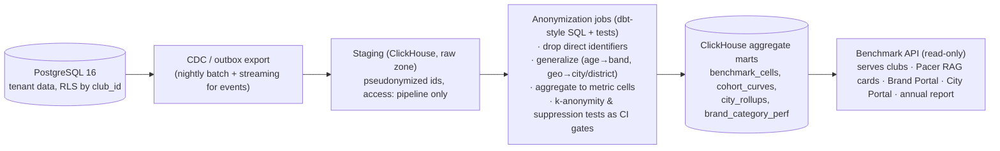

# Network Intelligence — Cross-Club Intelligence Product

> **Module:** Intelligence (network intelligence) · plus brand/city surfaces in Partners
> **Source of truth:** [`docs/00-foundation/canonical-brief.md`](../00-foundation/canonical-brief.md) (§2 principle 4, §9, §10)
> **Companion docs:** [`ai-features.md`](./ai-features.md) (Pacer consumes benchmarks), [`automation-engine.md`](./automation-engine.md) (recipe impact benchmarks)
> **Prime directive (brief §9):** cross-club data is anonymized and aggregated, k-anonymity threshold — **no segment smaller than 50 is ever shown**. The network gets insight; only each club gets its own data.

---

## 1. What the Network Can See That No Single Club Can

A single club sees its own history. The network sees the distribution. That difference is the product — and the moat: every club's operational exhaust makes every other club's decisions better, without any club's data being exposed.

Canonical network-only insights (v1 metric families):

| Insight family | Question a club can't answer alone | Example network answer |
|---|---|---|
| **City growth rates** | "Is running growing in my city, or just my club?" | "Active club runners in Amsterdam grew 23% YoY; new-club formation +18%; your catchment is under-penetrated east of the river" |
| **Event-format conversion benchmarks** | "Is 38% RSVP→show good for a Saturday long run?" | "Median show rate for weekend long runs, clubs your size in Northern Europe: 71% (you: 62%, P25)" |
| **Retention curves** | "Is losing 30% of joiners by month 3 normal?" | "Month-3 retention, clubs 200–500 members: median 64%, top decile 81%; your curve diverges at week 6" |
| **Route & format popularity** | "What formats are rising?" | "Track intervals sessions grew 2.1× YoY in your region; social 5k + coffee is the highest first-timer-return format" |
| **Brand performance** | "Do shoe-brand perks actually get redeemed?" | "Running-shoe perks: median redemption 4.2%, top-quartile campaigns pair perk with event presence (7.8%)" |
| **Price benchmarks** | "What should membership / a race entry cost?" | "Monthly membership, clubs your size/region: P25 €8, median €12, P75 €18; paid-event median €7.50" |
| **Best event times** | "When should we schedule?" | "Highest show-rate slot for your city/format: Sat 08:00–09:00; Thursday 19:00 outperforms Tuesday 19:00 by 9 pts" |
| **Ambassador benchmarks** | "How many ambassadors should a 450-member club have, and do they work?" | "Median 1 ambassador per 60 members; clubs at that ratio show +11 pts month-6 retention among ambassador-touched joiners" |
| **Automation efficacy** | "Which recipes actually work?" | Expected-impact figures for the recipe library (automation-engine.md §6) |
| **Seasonality & weather elasticity** | "How much does rain really cost us?" | "Rain > 60% forecast reduces show rate 12–18% for road events in your region; trail events are weather-inelastic" |

## 2. Product Surfaces

### 2.1 Club-facing benchmarks (Intelligence → Benchmarks; Pro+)

- **Benchmark cards:** every major club KPI (retention curve, show rate by format, WACM ratio, revenue per member, perk redemption, email engagement) rendered as *"you vs. similar clubs"* — your value, cohort median, quartile band, trend. "Similar clubs" = same size band × region × club age band (cohort must contain ≥ 20 clubs and every displayed aggregate ≥ 50 members, else the card shows the next-wider cohort with a "broader comparison" note).
- Delivered in the Intelligence surface, embedded in relevant module screens (event page shows format benchmarks), quoted by Pacer with the `network:benchmark:*` citation badge, and summarized in the weekly digest ("your month-3 retention crossed the cohort median").
- Never shows another club's identity, name, or any value attributable to fewer than the k-threshold of members / 20 clubs.

### 2.2 Recommendations engine

Benchmarks describe; recommendations prescribe. Powered by the same marts + Pacer narration:

- **Event format/time suggestions:** "Add a Thursday 19:00 easy run — in your city it's the top-performing weekday slot and you don't program it." Surfaced in the event builder and Plan-month flow (ai-features.md §2.8).
- **Pricing suggestions:** membership and event-fee positioning vs. cohort percentile, with elasticity notes where the network has experiment-grade evidence; always "suggested — you decide" framing (no algorithmic price-setting, no coordination — see §3.6 governance note on competition-law review for pricing surfaces).
- **Brand-fit:** category × format performance priors feed the brand-fit scorer (ai-features.md §2.4).
- **Recipe recommendations:** "Clubs like yours running the win-back recipe reactivate 18% of lapsed members — you haven't enabled it."

Every recommendation carries: evidence (benchmark citation + sample size), expected impact range, and a one-click "do it" that opens the relevant builder pre-filled (draft, human publishes).

### 2.3 Brand-facing market insights (Brand Portal; brand-side SaaS)

For Sofia's persona: aggregated market intelligence, never member data — audience composition of the *consented, aggregated* network by city/region (size, age bands, activity intensity bands), category benchmark performance (perk redemption, campaign CTR, cost-per-engaged-runner by format), seasonal demand curves, and campaign planning tools ("estimated reachable consented audience for trail-category campaign in Berlin: 12,400 runners across 41 clubs" — counts only, k ≥ 50 per displayed cell, no club list until clubs accept a campaign). Individual club audience details are shared only after the club opts into a specific campaign conversation, and even then as k-safe aggregates (brief §9).

### 2.4 City dashboards (City Portal; Network tier / Amsterdam Active persona)

Aggregate-only civic view: active runners and clubs in the municipality (trend), participation by district (suppressed below k), event volume and public-space usage patterns (aggregated route-corridor heat, jittered and threshold-suppressed — never individual traces), demographic reach vs. city population, program ROI for city-funded initiatives (funded clubs' aggregate growth vs. matched unfunded cohort). No member-level, no club-level financials without that club's explicit sharing agreement.

### 2.5 The annual "State of Running Communities" report

The marketing flagship: a public, PR-oriented annual report (plus quarterly pulse posts) — growth of community running by country/city, format trends, retention and volunteering patterns, the economics of run clubs (aggregate GMV, sponsorship trends, price indices), and "what the best clubs do differently" (top-decile behavioral patterns). Produced from the same k-safe marts; reviewed by the data-governance council (§3.6) before publication; gated download for lead capture; localized city editions co-branded with City Portal customers. Goal: make RunOS the citable authority on community running ("according to the RunOS State of Running Communities…").

## 3. Privacy Architecture

### 3.1 Pipeline: Postgres → ClickHouse aggregate marts



- **Raw zone** is pseudonymized on entry (member ids → salted rotating pseudonyms; names, emails, free text never leave Postgres). Access restricted to the pipeline service account; humans query marts only.
- **Marts contain only aggregate cells**, e.g.:

```sql
CREATE TABLE benchmark_cells (
  metric_id        LowCardinality(String),   -- 'show_rate_long_run', 'retention_m3', ...
  period           Date,
  cohort_keys      Map(String, String),      -- {size_band:'200-500', region:'north_eu', format:'long_run'}
  n_clubs          UInt32,                   -- must be >= 20
  n_members        UInt64,                   -- must be >= 50 (k-anonymity)
  p25 Float64, p50 Float64, p75 Float64, p90 Float64,
  mean Float64, stddev Float64,
  suppressed       UInt8 DEFAULT 0           -- 1 => served as null with reason
) ENGINE = ReplacingMergeTree ORDER BY (metric_id, period, cohort_keys);
```

### 3.2 k-anonymity ≥ 50 and small-cell suppression

- Hard invariant: **no served cell represents fewer than 50 members**, and comparative club cohorts additionally require **≥ 20 contributing clubs** (so no club can be singled out by subtraction within a small cohort).
- Suppression is structural, not cosmetic: cells failing thresholds are written with `suppressed=1` and null statistics; the API cannot return raw values for suppressed cells. **Complementary suppression** guards subtraction attacks (if city total is shown and all-but-one districts are shown, the last district is suppressed too).
- Percentiles/medians preferred over means for small-ish cells; extreme-value trimming so a single outlier club can't be inferred from a max. Quarterly re-identification red-team exercise (attempt to recover a known club/member from served cells) is part of the governance calendar.

### 3.3 No raw cross-tenant queries

- There is **no code path** that queries member- or club-level rows across tenants: Postgres RLS scopes every application connection to one `club_id`; the only cross-tenant readers are the CDC pipeline service (write-only into staging) and the anonymization jobs (staging → marts).
- Internal analysts and the annual-report team query marts only; staging-zone access requires break-glass approval, is time-boxed, and is fully audited.
- Pacer's benchmark access = the `network_benchmarks` RAG namespace + `get_benchmarks` tool, both fed exclusively from the marts API (ai-features.md §3.1).

### 3.4 What clubs and members are told

Plain-language layer in club onboarding and member privacy centers: "Your club's data is yours. The network only ever sees anonymous group statistics — never names, never one club's numbers." The clause is in the ToS and the member consent copy; contributing to network learning is the default with a real opt-out (§3.5), because reciprocity (you benchmark against others because others benchmark against you) is stated up front.

### 3.5 Club opt-out

- Any club can opt out (Platform → Settings → Data & privacy → Network intelligence). Effect: the club's data is excluded from all marts, ML network priors (ai-features.md §4.2), and reports at the next pipeline run (≤ 24 h); historical contributions are removed on the next full rebuild (≤ 30 d).
- Consequence, honestly stated in the toggle UI: opted-out clubs lose access to benchmark cards and network-prior-boosted cold-start predictions (they keep own-data predictions). No dark patterns; the trade is symmetric and explicit.
- Members additionally control their inputs upstream via consent scopes — a member's non-consented data never reaches even their own club's operational view, let alone the network.

### 3.6 Governance review process

- **Data-governance council:** Head of AI/Platform (chair), privacy counsel, security lead, one rotating customer-advisory-board organizer seat. Meets monthly; ad-hoc for launches.
- **Every new network data product or metric family requires a governance review before GA:** documented DPIA-style checklist — purpose, cells and thresholds, subtraction-attack analysis, opt-out propagation verified, competition-law check for anything price-related (pricing surfaces show historical distributions only, never forward-looking coordination signals), and member/club comms impact.
- Standing gates in CI: k-threshold tests on every mart model (pipeline fails closed — a threshold bug ships nulls, not small cells); quarterly re-identification red team; annual external privacy audit; public changelog of network-data-product changes.
- Incident rule: any suspected exposure of sub-threshold or attributable data = P0, disclosure per security policy, product frozen until council review.

## 4. Data Products Roadmap & the Moat

| Wave | Product | Depends on |
|---|---|---|
| **W1 (with Pro launch)** | Benchmark cards (top 10 metrics); network priors for cold-start predictions; recipe expected-impact figures | ~200 clubs, pipeline v1 |
| **W2** | Recommendations engine (formats, times, recipes); first annual State of Running Communities; brand category benchmarks in Brand Portal | ~800 clubs, 2 seasons of history |
| **W3** | Pricing benchmarks + elasticity notes; city dashboards GA; route/corridor popularity (heavily suppressed geo product); ambassador benchmarks | ~2,000 clubs, governance maturity |
| **W4** | Predictive market insights for brands (seasonal demand forecasts); federation/national views; benchmark API for Network-tier customers | 5,000+ clubs |

**Why this compounds (the moat mechanics):** every club that operates on RunOS contributes labeled operational outcomes (what was tried, what happened) that no competitor can buy — Strava sees activities but not operations; Eventbrite sees tickets but not retention. Each new club (a) improves prior quality for every cold-start prediction, (b) tightens benchmark cohorts (finer size × region × format cells clear the k-threshold), (c) grows the recipe-efficacy evidence base, and (d) makes the annual report more authoritative, which acquires more clubs. The loop: **more clubs → better intelligence → better outcomes per club → more clubs.** Switching cost grows in parallel: leaving RunOS means losing not just your tooling but your access to the network's compounding knowledge. This is why network learning is on by default with honest reciprocity framing, and why data quality (consistent event taxonomies, unified activities schema) is a first-class engineering concern — the moat is only as good as the labels.

## 5. Cold-Start Plan: 50 Clubs vs. 5,000

The k ≥ 50 members / ≥ 20 clubs invariants **never relax**. What changes is cohort width and product framing.

**At ~50 clubs (design-partner era):**

- Ships: coarse global benchmarks only — one or two cohort dimensions at a time (e.g., all clubs by size band; weekend vs. weekday show rate globally). Most fine cells won't clear thresholds; the UI says so honestly: "Benchmarks get sharper as the network grows."
- Supplement with **published-source priors** (public race-industry and sport-participation datasets, clearly labeled "industry estimate" vs. "RunOS network") so early cards aren't empty; retire these as network data clears thresholds.
- Predictions: pooled model + global priors (ai-features.md §4.2); confidence tier honesty does the expectation-setting.
- No brand market insights, no city dashboards, no public report (sample too small to be credible or safe). Recipe impact figures labeled "early data, n=X clubs".
- Focus: instrument everything with clean taxonomies now — cold-start is when data-model discipline is cheapest and most valuable.

**At ~500 clubs:** regional × size-band cohorts clear thresholds in core geos; first annual report (framed as "inaugural, n≈500 clubs"); recommendations engine beta; brand category benchmarks for top 3 categories.

**At ~5,000 clubs:** city-level cohorts (top ~50 cities), format × time × region cells, elasticity estimates from natural experiments across the network, city dashboards with district granularity (where k permits), credible national market insights for brands, and the report becomes the industry reference. At this scale the constraint flips from sample size to governance throughput — hence the standing council and CI-gated thresholds (§3.6) built from day one.
