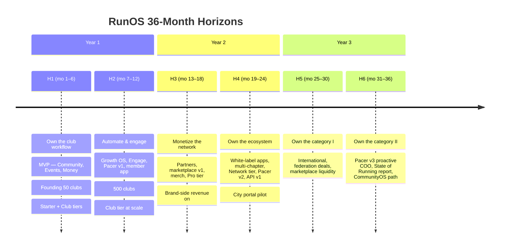
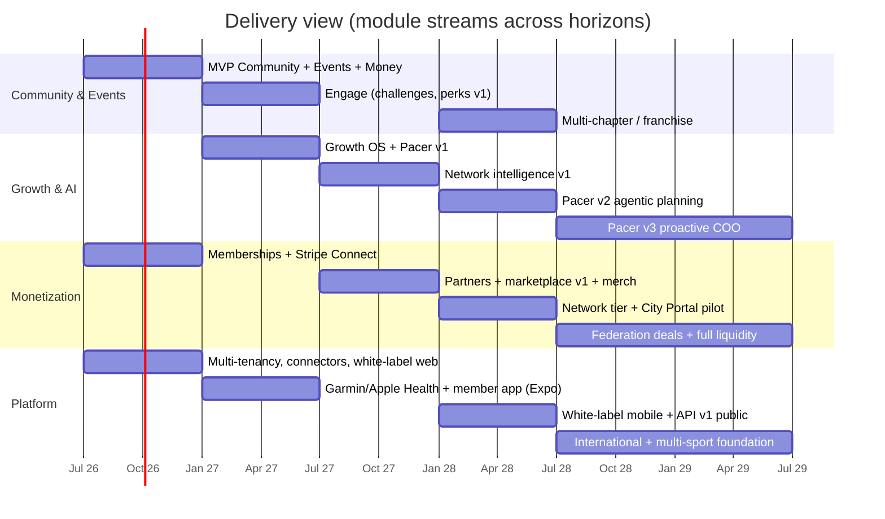

# RunOS — 36-Month Outcome Roadmap

> **Owner:** VP Product + Delivery. **Source of truth for scope:** [`docs/00-foundation/canonical-brief.md`](../00-foundation/canonical-brief.md).
> This roadmap is **outcome-based**: horizons commit to outcomes and metric movement, not feature lists. Modules listed per horizon are our current best bets to hit the outcomes; teams may swap tactics, never outcomes, without a roadmap change.
> North-star: **Weekly Active Community Members (WACM)** — members who attended, logged, posted, redeemed, or transacted in the last 7 days, across all clubs.

---

## Roadmap at a Glance

*(Calendar anchors assume month 1 = July 2026; they are planning anchors, not commitments.)*

---

## H1 (Months 1–6) — "Own the club workflow"

**Strategic bet:** If Maya can run her entire club week — members, events, money — inside RunOS with less effort than her spreadsheet + WhatsApp + bank-transfer stack, we earn the right to everything else. Win the organizer first; the member follows.

### Target outcomes

| Outcome | Metric | Target by end of month 6 |
|---|---|---|
| Founding cohort acquired | Clubs onboarded (active org, ≥ 1 admin weekly) | **50 founding clubs** |
| Activation | Clubs hitting "activated" (first 3 events published, 30% of imported members joined) | ≥ 60% of onboarded clubs |
| Engagement | WACM across founding cohort | ≥ 4,000 |
| Monetization proof | Clubs collecting membership payments through RunOS | ≥ 20 clubs; ≥ $50k cumulative GMV |
| Workflow ownership | Weekly organizer sessions per active club | ≥ 3 (Maya comes back without being pushed) |
| Data moat seeded | Members with a connected Strava account | ≥ 25% of joined members |

### Modules shipped (MVP)

- **Community:** member CRM, unified runner profile (v1: identity, membership, activity, attendance), community feed (light: announcements + event threads), consent scopes UI (`profile.basic`, `activity.summary`, `activity.detailed`, `health.medical`, `location.live`, `marketing.brands`, `photos.appearances`).
- **Events:** event builder, registration/RSVP, QR check-in (incl. offline mode), waivers, waitlists (basic).
- **Money:** membership plans, Stripe Connect payments (destination charges, club as merchant of record), dunning basics, platform fee handling per tier.
- **Platform:** onboarding importers (CSV, WhatsApp export, invite links), Strava connector + activity normalization, white-label web page per club ("Powered by RunOS"), roles/permissions v1 (Owner, Admin, Organizer, Coach, Finance, Content, Volunteer-coordinator, Read-only), multi-tenancy with RLS.

### Tier / revenue lines activated

- **Starter (Free)** — 2% platform fee on payments; **Club ($79/mo or $790/yr)** — 1% platform fee. Founding-50 get Club free for 6 months (design partner agreement: weekly feedback call, logo rights, case study).
- Ticket fees live: 2% + $0.30 per paid registration on Starter/Club.
- Revenue is a **proof metric**, not a P&L goal, in H1.

### Team shape

- 2 squads: **Core** (4 eng — Community/Events/Money) and **Growth/Platform** (3 eng — importers, connectors, white-label, infra), 1 designer per squad, founding PM (also owns founding-50 relationships with founder-led sales).
- Total ~12: 7 eng, 2 design, 1 PM, 2 founders (CEO on clubs, CTO in code).

### Non-goals (explicitly not doing in H1)

- No native mobile member app (white-label web page + responsive web app only).
- No Growth OS, challenges, perks, sponsors, marketplace, merch.
- No Pacer AI surface (we log the data Pacer will need; we do not ship AI UX).
- No connectors beyond Strava (Garmin/Apple Health are H2).
- No public API, no GraphQL, no multi-chapter, no i18n (English only), no city/enterprise anything.
- No custom roles (fixed role bundles only; custom roles are a Pro+ feature later).

### Dependencies

- **Stripe Connect** onboarding for club payouts (KYC friction is on our critical path — build the "payments pending" degraded state).
- **Strava API** partner agreement + rate-limit tier; consent-scope mapping approved by legal before launch.
- Design tokens + auth/RLS foundation from Sprint 0 block everything (see sprint backlog).
- Founding-50 pipeline: ≥ 150 qualified clubs in conversation by month 2 (GTM dependency, `docs/05-business/`).

### Kill / pivot criteria (evaluated month 6)

- **Pivot onboarding** if < 40% of clubs activate: importer friction is the #1 suspect — invest in white-glove onboarding + WhatsApp-export parsing before adding any new module.
- **Pivot pricing** if < 25% of engaged founding clubs convert intent to pay (signed order or card on file at discount end): re-test Club price point and packaging before H3 assumes Pro willingness-to-pay.
- **Kill white-label web page priority** if < 30% of clubs publish theirs; redirect the effort into deeper WhatsApp interop.
- **Hard gate to H2:** do not start Growth OS build until ≥ 30 clubs are activated. If we're below, H2 slips and we fix activation.

---

## H2 (Months 7–12) — "Automate & engage"

**Strategic bet:** Retention comes from automation (Maya saves hours) and member-side engagement (Leo has a reason to open the app between events). This is where the "every action creates valuable data" flywheel starts spinning.

### Target outcomes

| Outcome | Metric | Target by end of month 12 |
|---|---|---|
| Scale | Active clubs | **500** |
| Engagement | WACM | ≥ 40,000; ≥ 35% of joined members are WACM |
| Automation adoption | Clubs with ≥ 1 live Growth OS journey | ≥ 50% of Club-tier clubs |
| Event growth | Avg. registrations per event (clubs using Event Growth Pack vs. not) | +25% lift, measured as controlled comparison |
| Revenue | SaaS MRR | ≥ $25k (majority Club tier) |
| Retention | Logo churn (clubs), monthly | < 2% |
| Data moat | Members with ≥ 1 connected fitness source | ≥ 40% |

### Modules shipped

- **Growth:** Growth OS automations — email/SMS, customer journey builder v1 (trigger → wait → branch → send), **Event Growth Pack** (announce → remind → last-call → post-event recap + review ask, one-toggle automation), landing pages (event pages upgraded), referral engine (basic).
- **Engage:** challenges (distance/streak/attendance), leaderboards, **benefits passport v1** — local perks (club-sourced local benefits: the café discount, the physio intro rate), redemption via QR.
- **Intelligence:** **Pacer v1** — content generation (event descriptions, newsletters, Instagram captions) + attendance prediction v1 (gradient boosting on check-in history + weather + event features), surfaced in ⌘K command bar and inline "draft for me."
- **Platform:** Garmin + Apple Health connectors on the unified `activities` schema; **mobile member app (Expo)** — feed, events, RSVP, check-in QR, challenges, profile + consent controls; integrations page v1 (Mailchimp export, Slack/Discord webhooks).

### Tier / revenue lines activated

- **Club tier at scale** is the H2 business: Growth OS + benefits passport + integrations are the Club-tier hooks per canonical pricing.
- **Premium AI add-on ($29/mo)** for Starter/Club — Pacer v1 metered on Starter/Club, unlimited later on Pro.
- Payment processing margin becomes measurable as GMV grows.

### Team shape

- Core squad 5 eng (adds mobile), Growth/Platform 4 eng (adds data/ML eng for attendance prediction + connectors). +1 PM (squad-level), +1 designer (mobile), first 2 CS/onboarding hires, 1 data analyst.
- Total ~20.

### Non-goals

- No sponsor/brand features, no marketplace, no merch (H3 — do not let brand-side interest pull us early; collect a waitlist instead).
- No white-label *mobile* (the Expo app is RunOS-branded member app; white-label mobile is H4/Network tier).
- No churn prediction or revenue forecasting (attendance prediction only — one model done well).
- No push-notification journeys in journey builder v1 (email/SMS only; push is broadcast-only from the app).
- No COROS/Polar/Suunto/Fitbit/TrainingPeaks/Zwift connectors yet.

### Dependencies

- Temporal cluster in production before journey builder GA (long-running automations per canonical stack).
- SMS provider (Twilio) compliance: sender registration per region; email deliverability (dedicated IP warm-up starts month 7).
- Expo app store review cycles — submit v0 by month 9 to de-risk.
- Attendance prediction needs ≥ 6 months of check-in data from H1 cohort: **model quality gates on H1 check-in adoption.**
- Apple Health requires the mobile app (HealthKit is on-device) → connector sequenced after Expo app beta.

### Kill / pivot criteria

- **Kill journey builder v1 UI complexity** if < 25% of clubs build a custom journey by month 10 but Event Growth Pack adoption is high → pivot Growth OS to a "packs, not canvas" model (pre-built automations only) and defer the visual builder.
- **Pivot perks v1** if < 15% of members redeem a perk in their first 60 days → benefits passport isn't a member hook yet; re-scope Engage around challenges, delay perks to ride H3's Partners work.
- **Pacer gate:** if attendance prediction MAE is worse than a naive "same as last similar event" baseline, ship it as "estimated turnout (beta)" or not at all — never ship AI that embarrasses the club.
- **Hard gate to H3:** ≥ 300 active clubs and < 3% monthly logo churn; otherwise H3 monetization is premature and we spend a quarter on retention.

---

## H3 (Months 13–18) — "Monetize the network"

**Strategic bet:** With hundreds of clubs and tens of thousands of verified, consented runners, RunOS becomes a demand-side asset. Sofia (brand) and Emre (vendor) will pay to reach it — but only through the consent model: aggregated/anonymized by default, opt-in campaigns only.

### Target outcomes

| Outcome | Metric | Target by end of month 18 |
|---|---|---|
| Scale | Active clubs | ≥ 1,200 |
| Brand-side revenue | Brand Portal seats + campaign fees | ≥ 15 paying brands; ≥ $20k MRR brand-side |
| Marketplace | Vendor bookings GMV (10% commission) | ≥ $30k/mo GMV run-rate |
| Pro conversion | Clubs on Pro ($199/mo) | ≥ 10% of clubs > 200 members |
| Sponsorship outcomes | Clubs closing ≥ 1 sponsorship via Sponsor CRM | ≥ 100 clubs |
| Total revenue | MRR (SaaS + brand + marketplace commission + payments margin) | ≥ $120k |
| Consent health | Members opted into `marketing.brands` | ≥ 20%, with < 5% opt-out reversal rate |

### Modules shipped

- **Partners:** Sponsor CRM (pipeline, proposals, deliverables tracking, partnership ROI reporting v1), **Brand Portal v1** (Sofia's surface: audience discovery via anonymized aggregates, campaign manager, verified reach reporting), **vendor marketplace v1** (Emre's surface: listings, availability, bookings, payments, reviews — 10% commission).
- **Money:** merchandise via Shopify integration (native light commerce deferred), invoices + budget basics.
- **Intelligence:** **network intelligence v1** — anonymized cross-club benchmarks (attendance rate, retention, revenue per member; k-anonymity, no segment < 50), churn prediction v1 for members.
- **Platform / tier completion:** **Pro tier complete** — Pacer unlimited, white-label web (full site, not just page), Sponsor CRM + Brand Portal access, predictions, custom roles, 0.5% platform fee.

### Tier / revenue lines activated

- **Pro ($199/mo)** complete and sellable. **Brand-side SaaS** (Brand Portal seats from $499/mo + campaign fees). **Marketplace commission (10%)**. Shopify-powered merch (referral/affiliate economics, not our margin line yet).

### Team shape

- 3rd squad: **Partners/Marketplace** (4 eng + designer + PM). First sales hires (1 AE clubs, 1 brand partnerships lead), CS to 4, data team to 3 (network intelligence).
- Total ~30.

### Non-goals

- No self-serve programmatic brand buying — every H3 campaign has a human in the loop (quality > volume while we set network norms).
- No native commerce/fulfillment (Shopify only). No City Portal (pilot is H4). No public API (private partner endpoints only). No white-label mobile.
- No paid member-side features — members never pay RunOS directly in H3.

### Dependencies

- `marketing.brands` consent adoption from H2 sets the addressable campaign audience — brand GTM waits for ≥ 15% opt-in.
- Marketplace payments = Stripe Connect expansion (vendor accounts, refund/dispute flows); legal review of commission + review-liability terms.
- Network intelligence requires the ClickHouse analytics pipeline hardened (H2 debt item) + k-anonymity enforcement audited before any external exposure.
- Brand Portal credibility depends on verified attendance data → QR check-in adoption ≥ 60% of events.

### Kill / pivot criteria

- **Chicken-and-egg breaker:** if by month 15 brand demand lags (< 5 paying brands), pivot Brand Portal to *sponsor-fulfillment tooling for deals clubs already have* (Sponsor CRM-led, bottom-up) and pause top-down brand sales.
- **Marketplace kill:** if < $10k/mo GMV by month 18 with < 20% MoM growth, freeze marketplace investment and keep vendors as a perks-passport supply source only. Revisit in H5.
- **Pro pricing pivot:** if Pro attach < 5% of eligible clubs, unbundle (Pacer add-on à la carte) before discounting — protect the ladder.
- **Hard gate to H4:** at least two of the three new revenue lines (brand, marketplace, Pro) beating 50% of target; otherwise H4 ecosystem spend is premature.

---

## H4 (Months 19–24) — "Own the ecosystem"

**Strategic bet:** The largest orgs — multi-chapter clubs (Priya's world), franchises, and cities (Amsterdam Active) — need RunOS as *infrastructure*: their brand, their app, their chapters, our rails. This is where switching costs become structural.

### Target outcomes

| Outcome | Metric | Target by end of month 24 |
|---|---|---|
| Scale | Active clubs | ≥ 2,500; WACM ≥ 250,000 |
| Enterprise | Network-tier contracts (from $999/mo) | ≥ 10 signed, incl. 1 city (City Portal pilot) |
| White-label | Club-branded mobile apps live in stores | ≥ 25 |
| Multi-chapter | Orgs running ≥ 3 chapters on RunOS | ≥ 40 |
| Platform | External developers/integrations on API v1 | ≥ 50 active API consumers |
| Pacer | Clubs using Pacer v2 monthly planning ("Plan October") | ≥ 30% of Pro+ clubs |
| Revenue | ARR run-rate | ≥ $4M |

### Modules shipped

- **Platform:** **white-label mobile apps** (one Expo codebase, per-club theming, automated store submission pipeline); **multi-chapter & franchise management** (org → chapters → members; shared or separate billing; chapter-lead role for Priya with scoped autonomy); SSO (SAML/OIDC) for Network tier; **API v1 public** (REST + webhooks, OpenAPI, key management, rate limits).
- **Partners:** **City Portal pilot** — aggregate-only dashboards for a municipal program (Amsterdam Active profile): club discovery, funding distribution, participation reporting. One design-partner city.
- **Intelligence:** **Pacer v2 agentic planning** — multi-step plans (month plan → draft events → draft comms → budget estimate) executed as *reviewable proposals*; club-approves-before-anything-sends, always.
- Revenue forecasting v1; ambassador candidate scoring.

### Tier / revenue lines activated

- **Network tier (custom, from $999/mo)**: unlimited members, white-label mobile app, API access, SSO, SLA, dedicated CSM. API access as a revenue line. Enterprise licensing conversations open (federations groundwork for H5).

### Team shape

- 4 squads (Core, Growth, Partners/Marketplace, **Platform/Enterprise**), ~22 eng total. Enterprise AE + solutions engineer + 2 CSM (dedicated Network accounts). Security/compliance hire (SOC 2 Type II in flight — a Network-tier sales blocker if late). Total ~45.

### Non-goals

- No international localization yet (English-market expansion only — UK/IE/AU/CA; i18n architecture prep is allowed, translation is not).
- No federation product (deals scoped in H4, built in H5). No GraphQL API. No multi-sport anything.
- Pacer v2 never auto-executes irreversible actions (sends, charges, publishes) without explicit approval — this is a product principle, not a temporary limit.

### Dependencies

- White-label mobile depends on H2 Expo architecture (theming + config-driven build matrix) — budget a hardening month.
- City Portal requires legally reviewed aggregate-only data contracts; k-anonymity (≥ 50) enforced at query layer; EU data residency (canonical infra) live for the pilot city.
- API v1 requires internal API stabilization (freeze breaking changes month 20) + developer docs.
- SOC 2 Type II + DPA templates gate Network-tier closes.

### Kill / pivot criteria

- **White-label mobile:** if per-app store maintenance cost > $500/app/mo at 25 apps, pivot to a single "RunOS Clubs" container app with deep club theming; sell white-label only into Network tier.
- **City Portal:** one pilot only; if the pilot city can't articulate renewal value by month 24, park the City Portal and keep cities as Network-tier buyers of the standard product.
- **API:** if < 20 active consumers by month 24, keep API as an enterprise checkbox (no public dev-rel investment) until pull emerges.
- **Hard gate to H5:** ≥ 8 Network contracts retained and NRR ≥ 110%; international expansion rides on proven enterprise motion.

---

## H5 (Months 25–30) — "Own the category I: expand the map"

**Strategic bet:** The playbook works; now multiply it — geographies and federations — while marketplace liquidity compounds.

### Target outcomes

| Outcome | Metric | Target by end of month 30 |
|---|---|---|
| International | Non-English-market clubs | ≥ 20% of new club signups; 5 localized languages (NL, DE, FR, ES, PT-BR) |
| Federations | National federation / franchise-network deals | ≥ 3 signed (each = hundreds of clubs distribution) |
| Marketplace | Vendor GMV | ≥ $250k/mo; ≥ 30% of clubs transacting with vendors quarterly |
| Scale | Active clubs / WACM | ≥ 6,000 clubs; ≥ 700k WACM |
| Revenue | ARR run-rate | ≥ $12M; brand + marketplace ≥ 25% of revenue |

### Modules shipped

- **Platform:** full i18n/l10n (product + comms templates), multi-currency payments + local rails via Stripe, EU + US data residency GA, federation admin (federation → clubs hierarchy above org level).
- **Partners:** marketplace liquidity work — vendor discovery/matching, standardized service categories, cross-club vendor reputation; brand campaigns multi-market.
- **Intelligence:** network intelligence v2 (city/country benchmarks), churn + LTV predictions GA.

### Non-goals / dependencies / kill criteria

- **Non-goals:** no multi-sport modules yet; no new AI surfaces beyond hardening; no non-Stripe payment processors unless a federation deal forces one (then a hard evaluation, not a default yes).
- **Dependencies:** federation deals need multi-year contract + procurement capability (enterprise legal); localization needs in-market GTM partners; VAT/tax handling per market (Stripe Tax).
- **Kill/pivot:** if a launched market shows < 30% of home-market activation after 2 quarters of investment, exit rather than drip; if federation sales cycles exceed 9 months with no closes by month 28, refocus on franchise networks (faster cycles, same hierarchy tech).

### Team shape

~65: 5 squads (adds **International/Federation**), in-market GTM pods (2–3 people per launch market), marketplace ops lead, localization PM.

---

## H6 (Months 31–36) — "Own the category II: define it"

**Strategic bet:** Category kings publish the map. Pacer becomes genuinely proactive, the *State of Running Communities* report makes RunOS the reference dataset, and the architecture opens the path to CommunityOS (multi-sport) without betting the company on it yet.

### Target outcomes

| Outcome | Metric | Target by end of month 36 |
|---|---|---|
| Category leadership | *State of Running Communities* annual report | Published; ≥ 100 press citations; report-sourced pipeline ≥ 15% of enterprise leads |
| Pacer as COO | Clubs where Pacer proactively initiates ≥ 1 accepted action/week | ≥ 40% of Pro+ clubs |
| Scale | Clubs / WACM | ≥ 10,000 clubs; ≥ 1.5M WACM |
| Revenue | ARR run-rate | ≥ $25M; NRR ≥ 120% |
| Expansion optionality | CommunityOS multi-sport pilot | 1 vertical (cycling or triathlon) piloted with ≤ 10% of eng capacity, behind a flag |

### Modules shipped

- **Intelligence:** **Pacer v3 — proactive COO**: watches the club's operating metrics, opens weekly "here's what I'd do" proposals (at-risk member outreach lists, sponsor renewal prep, event calendar gaps, budget alerts), executes approved multi-step plans end-to-end via Temporal; strict grounding rules unchanged (club's own data + anonymized benchmarks, never another club's raw data).
- **Network:** *State of Running Communities* data pipeline (methodology-reviewed, k-anonymity ≥ 50, opt-out honored), public benchmarks explorer.
- **Platform:** sport-agnostic core extraction (activities schema, event types, terminology packs) — the CommunityOS foundation; marketplace full liquidity features (instant book, packages, subscriptions for vendor services).

### Non-goals / dependencies / kill criteria

- **Non-goals:** no full multi-sport launch (pilot only); no consumer social-network ambitions (we orchestrate Strava/Instagram, we don't replace them); no ads product — brand revenue stays campaign/consent-based.
- **Dependencies:** Pacer v3 needs H4/H5 agentic infrastructure + trust track record (proposal acceptance rates); report needs legal/privacy review and a comms function.
- **Kill/pivot:** if Pacer v3 proposal acceptance < 20%, drop proactivity back to digest-only and invest in prediction quality; if the multi-sport pilot's activation is < 50% of running-club benchmarks, stay a running category king — depth over breadth.

### Team shape

~85–95: 6 squads + data science team (5), dev-rel (2), research/insights team for the report (2), M&A/partnerships lead.

---

## Headcount Plan (cumulative, end of horizon)

| Function | H1 | H2 | H3 | H4 | H5 | H6 |
|---|---|---|---|---|---|---|
| Engineering | 7 | 9 | 14 | 22 | 30 | 38 |
| Product | 1 | 2 | 3 | 5 | 7 | 8 |
| Design | 2 | 3 | 4 | 5 | 7 | 8 |
| Data/ML | 0 | 1 | 3 | 5 | 8 | 12 |
| GTM (sales/marketing/partnerships) | 1* | 2 | 5 | 8 | 14 | 18 |
| CS/Support/Ops | 0 | 2 | 4 | 7 | 12 | 16 |
| G&A (finance/legal/people/security) | 0 | 1 | 2 | 4 | 6 | 8 |
| **Total** | **~12** | **~20** | **~35** | **~56** | **~84** | **~108** |

\* Founder-led sales in H1; founding PM double-hats on founding-50 success.

---

## Risks Register

| # | Risk | Likelihood | Impact | Mitigation | Early-warning signal | Owner |
|---|---|---|---|---|---|---|
| R1 | **Strava API dependency** — rate limits, terms changes, or partner-program restrictions break our highest-adoption connector | Medium | High | Unified `activities` schema means no Strava-specific coupling; ship Garmin + Apple Health in H2 so no single source > 50% of activity data; manual/GPX upload as universal fallback; maintain Strava partnership relationship at exec level; cache + degrade gracefully (attendance/CRM never depend on activity sync) | Strava share of connected sources > 60% at end of H2; any Strava ToS revision touching "community platforms" | CTO |
| R2 | **Chicken-and-egg benefits network** — perks need vendors/brands; vendors/brands need members | High | Medium | Sequence deliberately: H2 perks v1 = *club-sourced local* benefits (Maya's café deal — no network needed); marketplace vendors seeded manually in 5 launch cities; brand demand held to H3 when audience is real; Sponsor CRM works bottom-up on deals clubs already have, so Partners creates value with zero network | Perk redemption < 15% at H2 gate; < 5 paying brands at month 15 | VP Product |
| R3 | **Club willingness-to-pay** — clubs are volunteer-run and cash-poor; free tools are "good enough" | Medium | Existential | Anchor pricing to money we *move* (memberships GMV) not admin features — the platform-fee model means clubs pay from revenue we unlock; founding-50 conversion test at month 6 is a formal pricing gate; Starter free tier keeps top-of-funnel; payment-processing margin monetizes even free clubs | Founding-50 conversion < 25%; Club-tier trial→paid < 15% in H2 | CEO |
| R4 | **Consent friction** — granular scopes depress data sharing, starving Pacer, brands, and network intelligence | Medium | High | Conservative defaults with *progressive, contextual* asks (request `activity.summary` when joining a challenge, not at signup); show value before asking (`marketing.brands` asked only when a real perk is on the table); measure consent funnel as a first-class metric from H1; never dark-pattern — trust is the moat per canonical philosophy #4 | `activity.summary` opt-in < 50% of Strava-connected members; consent-screen abandonment > 30% | VP Product |
| R5 | Stripe Connect onboarding drop-off (club KYC) blocks Money activation | Medium | High | "Payments pending" degraded mode (publish events/memberships, collect later); onboarding concierge for founding 50; Stripe-hosted onboarding to minimize our surface | > 30% of clubs stuck in KYC > 7 days | Eng lead, Core |
| R6 | WhatsApp remains the real workflow; RunOS becomes "the database nobody opens" | Medium | High | Don't fight WhatsApp in H1 — importer + share-to-WhatsApp links make RunOS the source that feeds it; win sessions via check-in + money (things WhatsApp can't do); measure weekly organizer sessions as a gate metric | Organizer sessions < 2/week per active club | VP Product |
| R7 | AI trust failure — Pacer produces wrong predictions/content publicly attributed to the club | Low | High | Quality gates before GA (beat-baseline rule); human-approval-before-send forever for irreversible actions; "beta" labeling; per-club Pacer off-switch | Prediction MAE worse than naive baseline; content-edit rate > 80% | Head of AI |
| R8 | Multi-tenant data breach / consent violation | Low | Existential | RLS from Sprint 0 (never bolted on); automated cross-tenant access tests in CI; k-anonymity enforced at query layer; SOC 2 by H4; security hire before Network tier | Any RLS bypass found in pen test | CTO |
| R9 | Enterprise (Network/city/federation) sales cycles drain focus from SMB engine | Medium | Medium | Hard gates: city = 1 pilot; federation deals scoped H4, built H5; enterprise squad separate so Core roadmap never blocks on a contract | > 20% of Core squad sprint capacity on enterprise one-offs | VP Product |
| R10 | Hiring pace — plan doubles headcount roughly yearly | Medium | Medium | Recruit ahead of gates, not after; squads capped at 5 eng before splitting; contractor bench for mobile/store-ops spikes | Open eng roles > 90 days | COO/founders |

---

## Operating Rules for This Roadmap

1. **Horizons commit to outcomes; quarters commit to bets.** Squads may swap tactics mid-horizon if the metric says so — with a written decision log.
2. **Gates are real.** Each horizon's "hard gate" must pass before the next horizon's net-new spend starts. Slipping a gate slips the roadmap; it never silently lowers the bar.
3. **The brief wins.** Any naming, pricing, persona, or scope conflict resolves to `docs/00-foundation/canonical-brief.md`.
4. **20% tech-debt budget** is protected in every sprint, every horizon (see sprint backlog, Backlog Hygiene).
5. Review cadence: monthly metric review per squad; horizon gate review with founders + board in months 6, 12, 18, 24, 30, 36.
