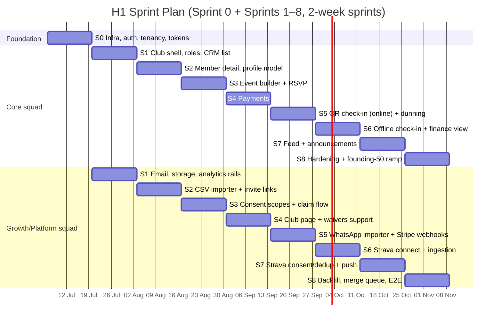

# RunOS — Sprint Backlog (Sprint 0 → Sprint 8)

> **Source of truth for scope:** [`docs/00-foundation/canonical-brief.md`](../00-foundation/canonical-brief.md). Acceptance criteria referenced below are the full Given/When/Then sets in [`feature-specifications.md`](./feature-specifications.md) (F1–F6). This backlog delivers roadmap **H1: "Own the club workflow."**
>
> **Team assumption:** 2 squads — **Core** (4 eng: Community, Events, Money) and **Growth/Platform** (3 eng: importers, connectors, white-label, infra) — 1 designer per squad, 1 founding PM across both. 2-week sprints.
>
> **H1 exit test (end of Sprint 8):** a founding club can **onboard, import members, publish events, take membership payments, run QR check-in, and sync Strava** — end to end, on production, with real money and a real Saturday run.

---

## Sprint Map

**Estimate scale:** S ≈ ≤ 1 dev-day · M ≈ 2–3 dev-days · L ≈ 4–6 dev-days (anything bigger gets split). Squad capacity per sprint ≈ Core 32 dev-days / Growth-Platform 24 dev-days, minus the 20% tech-debt budget and on-call tax from Sprint 5 onward.

---

## Sprint 0 — Foundation (no product demo; everything below blocks everything else)

**Goal:** a deployable, multi-tenant, RLS-enforced skeleton with CI and design tokens — so Sprint 1 ships product, not plumbing.

| ID | Title | Description | Acceptance criteria (summary) | Est | Deps | Squad |
|---|---|---|---|---|---|---|
| RUN-001 | Monorepo scaffold | pnpm + Turborepo: `apps/web` (Next.js App Router, TS), `apps/api` (NestJS modular monolith), `packages/ui`, `packages/db`, `packages/config`. Strict TS, ESLint, Prettier, commit hooks. | Clean clone → `pnpm i && pnpm dev` runs web+api locally; lint/typecheck pass; module boundaries enforced (eslint import rules between NestJS modules) | M | — | Growth/Platform |
| RUN-002 | CI/CD pipeline | GitHub Actions: typecheck, lint, unit/integration (testcontainers Postgres), build, preview deploy per PR, main → staging auto-deploy. | PR shows all checks < 10 min; preview URL comment on PR; failed check blocks merge; main deploy to staging < 15 min | L | RUN-001 | Growth/Platform |
| RUN-003 | AWS infra via Terraform | ECS services (web, api, worker), RDS Postgres 16, ElastiCache Redis, S3 buckets, CloudFront, secrets manager, staging + prod environments. | `terraform apply` idempotent from scratch; staging + prod isolated; secrets never in repo; infra README/runbook | L | — | Growth/Platform |
| RUN-004 | Database foundation + RLS | Postgres schema baseline: `clubs`, `users`, `memberships_staff`, `members`; **every tenant table carries `club_id` with RLS policies on**; migration tooling; `app.current_club_id` session GUC pattern; seed script. | RLS enabled by default on tenant tables; cross-tenant read/write test fails as required; migrations run in CI; no superuser app connections | L | RUN-003 | Core |
| RUN-005 | AuthN + session + tenancy resolution | Email magic-link + password auth; session management; club-context middleware (subdomain/slug → `club_id` → RLS GUC); user ↔ multiple clubs supported in model. | Login/logout/reset flows pass E2E; every API request resolves tenant before any query; missing/foreign tenant → 404 not 403 (no existence leaks) | L | RUN-004 | Core |
| RUN-006 | AuthZ: roles & permissions v1 | Canonical staff roles (Owner, Admin, Organizer, Coach, Finance, Content, Volunteer-coordinator, Read-only) as permission bundles; deny-by-default guard decorators; permission matrix as data, not code branches. | Matrix unit-tested per role; endpoints without an explicit permission annotation fail CI (static check); role checks integration-tested | L | RUN-005 | Core |
| RUN-007 | Design tokens + UI kit seed | Tailwind theme from design tokens (color/type/space/radius per brand: dark-first member, light-first organizer); `packages/ui` primitives: Button, Input, Select, Table, Modal, Toast, EmptyState, Badge. Storybook. | Tokens match `docs/02-product` UI system; both themes render; primitives keyboard-accessible with axe zero-critical in Storybook CI | L | RUN-001 | Core (w/ both designers) |
| RUN-008 | Observability + error reporting | Tracing (OpenTelemetry), structured logs (PII-scrub middleware), error reporting, uptime checks, alert routing to on-call channel. | Error in staging visibly reported < 1 min; trace spans across web→api→db; log scrubber test (email/phone never logged) | M | RUN-002, RUN-003 | Growth/Platform |
| RUN-009 | Analytics event pipeline | Event SDK (typed, snake_case), API ingestion endpoint → queue → ClickHouse; dev sink for verification; base dashboard (events by name/club/day). | Emitting `club_created` in staging appears in ClickHouse < 1 min; schema enforces `club_id`/`actor_id`/`ts`; consent-safety lint (no scope-gated payload fields) | M | RUN-003 | Growth/Platform |
| RUN-010 | Background jobs + email infra | BullMQ worker service + queues; transactional email provider integration (per-club sender identity "Club via RunOS", SPF/DKIM/DMARC on staging domain); email template base. | Job retry/backoff/dead-letter verified; test email delivered with correct identity headers; template renders in major clients | M | RUN-003 | Growth/Platform |
| RUN-011 | Feature flag + audit log foundations | Flag service (per-club ramp lists); append-only `audit_log` table (actor, action, entity, before/after, ts) with write helper; no UPDATE/DELETE grants. | Flag flips without deploy; audit rows immutable (grant test); helper used via lint rule for mutations tagged auditable | M | RUN-004 | Core |

**Sprint 0 demo (internal):** deploy a change through CI to staging; log in, switch between two seeded clubs, show RLS test failing a cross-tenant query; flip a feature flag live; show an event landing in ClickHouse. *No product yet — on purpose.*

---

## Sprint 1 — "A club exists"

**Goal:** Maya signs up, creates Lagos Road Runners, invites Priya as staff, and sees a real (empty) CRM. Ladders to: **onboard**.

| ID | Title | Description | Acceptance criteria (summary) | Est | Deps | Squad |
|---|---|---|---|---|---|---|
| RUN-101 | Signup + club creation flow | F1 req 1: signup, club form (name, slug w/ suggestions, city/country, logo, color, schedule), Owner assignment. | F1 AC "Club creation": tenant created, Owner role, slug collision UX; `club_created` fires | L | S0 | Core |
| RUN-102 | Onboarding checklist | F1 req 2: 6-item persistent checklist card, deep links, completion tracking driving activation metric. | Checklist states persist; completion collapses card; `onboarding_step_completed` per step | M | RUN-101 | Core |
| RUN-103 | Staff invites + role assignment | F1 req 3: email invites with canonical role picker, 14-day expiry, resend/revoke; accept flow. | F1 staff-invite ACs; Priya accepts as Organizer and sees role-appropriate nav | M | RUN-101, RUN-006, RUN-010 | Core |
| RUN-104 | CRM member list v1 | F2 req 1: virtualized table, search, filters (status/tags/joined), sort, default saved views; empty states. | F2 list ACs: < 1 s first rows, 60 fps at 450 rows; filters compound; axe pass | L | RUN-101 | Core |
| RUN-105 | Member data model + provisional status | F2 req 3 + F1 req 8: `members` schema (identity, status provisional/member/lapsed/alumni, tags, source attribution), staff-visible provisional banner rules. | Provisional excluded from member-facing audiences (enforced in audience resolver); schema additive-ready per F2 | M | RUN-004 | Core |
| RUN-151 | Object storage + image pipeline | Upload service (S3 presigned), client resize, EXIF strip (incl. GPS), content-type sniffing, CDN delivery. Used by logos now; posts/covers later. | Fake-extension file rejected; EXIF verified stripped server-side; CDN URLs responsive | M | S0 | Growth/Platform |
| RUN-152 | Tag & segment data model | F2 req 6 foundation: tags CRUD, saved segment definitions (filter AST), live count endpoint. UI lands Sprint 2. | Segment definition round-trips; count query < 300 ms at 2k members; unit-tested filter AST | M | RUN-105 | Growth/Platform |
| RUN-153 | Transactional email templates v1 | Staff invite, magic link, claim invite (used S2+): branded per-club, unsubscribe plumbing for non-transactional class. | Renders across clients; per-club identity; unsubscribe link only on announcement class | S | RUN-010 | Growth/Platform |
| RUN-154 | CSV import engine (backend) | F1 req 4 backend: file upload, encoding/delimiter detection, streaming parse, validation pass, BullMQ import job, idempotency (file hash + row index), formula-escape on export. | F1 CSV ACs (backend half): 100 rows/s; crash-resume test; 10 MB/10k row limits | L | RUN-105, RUN-151 | Growth/Platform |

**Sprint 1 demo script:** Maya signs up live → creates Lagos Road Runners (logo, colors) → checklist appears → invites Priya (Organizer) who accepts from a real email → opens the CRM with seeded members: search "Leo", filter by tag, show role-gated nav differences between Maya and Priya. Close on the empty-import teaser for next sprint.

---

## Sprint 2 — "450 members arrive"

**Goal:** Maya imports her real spreadsheet, dedup works, invite links exist, and every member has a detail view. Ladders to: **import members**.

| ID | Title | Description | Acceptance criteria (summary) | Est | Deps | Squad |
|---|---|---|---|---|---|---|
| RUN-201 | Member detail view | F2 req 2: header, Overview/Timeline/Profile/Notes tabs, consent-indicator placeholders, role-gated fields (Finance hidden per role). | F2 detail ACs incl. notes never member-visible; Priya (Organizer) sees no finance fields | L | RUN-104 | Core |
| RUN-202 | Staff notes + timeline v1 | F2: attributed timestamped notes; unified timeline events (joined, imported, tagged; RSVP/paid/check-in join later sprints). | Notes ACs; timeline renders mixed event types chronologically; `staff_note_added` | M | RUN-201 | Core |
| RUN-203 | Bulk actions + CSV export | F2 req 1: multi-select tag/export; formula-escaped export; audit-logged. | 40-member bulk tag AC; export respects current filter; audit rows written | M | RUN-104, RUN-011 | Core |
| RUN-204 | Segments UI | F2 req 6: save filter as segment, manage, live counts; default segments seeded (New this month, Lapsed 30+). | Segment ACs: save in ≤ 2 clicks, dynamic recount at use | M | RUN-152, RUN-104 | Core |
| RUN-205 | Dedup engine + auto-merge | F1 req 7 (part 1): exact email/E.164 auto-merge (fill-blanks-only), dedup within import batches, 30-day reversible merge records. | F1 dedup ACs (exact-match set); re-import same file → 0 dupes; unmerge restores | L | RUN-154 | Core |
| RUN-251 | CSV importer UI | F1 req 4 frontend: upload, column mapping with fuzzy suggestions, validation review table (inline fix / skip / errors CSV), progress, summary. | F1 CSV ACs (UI half); 450-row file end-to-end < 60 s; a11y on mapping UI | L | RUN-154 | Growth/Platform |
| RUN-252 | Invite links + QR | F1 req 6: default + named links, caps, expiry, QR PNG, source attribution on join; open/claim landing page (claim flow completes S3). | F1 link ACs: cap, expiry, attribution; `invite_link_*` events | M | RUN-105 | Growth/Platform |
| RUN-253 | Import audit + file retention | F1 NFRs: import audit entries, S3 30-day lifecycle on import files, encryption, rate limit (10 jobs/club/day). | Lifecycle policy verified; audit complete (who/when/hash/counts); limit returns friendly error | S | RUN-154, RUN-011 | Growth/Platform |
| RUN-254 | Analytics: activation dashboard v1 | Wire funnel: `club_created` → steps → `club_onboarding_completed`; import funnel; internal dashboard for founding-50 tracking. | PM can read activation % per club cohort from dashboard; events verified in ClickHouse | S | RUN-009 | Growth/Platform |

**Sprint 2 demo script:** upload the real (anonymized) 450-row founding-club CSV — messy headers, semicolons, 12 broken rows → mapping auto-suggests → validation table fixes live → import runs with progress → summary: 438 created, 7 merged, 12 skipped. Open Leo's detail view, add a staff note, save a "Lapsed 30+" segment. Re-upload the same CSV: zero duplicates. Generate a QR invite link and scan it from a phone.

---

## Sprint 3 — "Members join themselves; events exist"

**Goal:** Leo claims his profile through the consent flow; Maya publishes the first real events. Ladders to: **onboard + publish events**.

| ID | Title | Description | Acceptance criteria (summary) | Est | Deps | Squad |
|---|---|---|---|---|---|---|
| RUN-301 | Event data model + builder | F3 req 1: full builder (type, schedule/tz, location + meeting point, capacity, visibility, cover, waiver flag, deadline), draft/publish states. | F3 builder ACs; drafts return not-found to members; `event_created/published` | L | S0 | Core |
| RUN-302 | Recurrence engine | F3 req 2: weekly/biweekly/monthly, ≤ 52 materialized instances, this/this-and-future/all edit semantics, DST-safe wall-clock. | F3 recurrence ACs incl. DST-crossing test | L | RUN-301 | Core |
| RUN-303 | RSVP + capacity + waitlist | F3 req 3: 2-tap RSVP, guest registration on public events, capacity race-safety (DB constraint), waitlist auto-promote with 4 h claim window. | F3 registration ACs incl. simultaneous-last-spot; `event_rsvp`, `waitlist_*` | L | RUN-301 | Core |
| RUN-304 | Event pages + ICS | Member-facing event page (web), public event page (SEO, SSG revalidate ≤ 60 s), ICS download; cancellation flow with typed confirm + notifications (refund hook lands S8). | F3 cancel AC (notify path); public page LCP < 2.5 s budget in CI | M | RUN-301, RUN-153 | Core |
| RUN-351 | Consent scopes: model + enforcement middleware | F2 req 4–5: seven canonical scopes per-club per-member, API field-level filter layer, immutable consent audit, revocation propagation ≤ 60 s. **The most safety-critical ticket in H1.** | F2 consent ACs (enforcement set); property-test harness scope × role live in CI | L | RUN-105 | Growth/Platform |
| RUN-352 | Profile claim flow + consent UI | F1 req 6 / F2 req 4 UI: claim via invite/claim email, phone-match linking to provisional record, consent screens (plain language, conservative defaults, extra confirm for `health.medical` + `marketing.brands`, dependency handling summary↔detailed). | F2 consent-UI ACs; F1 claim ACs; grade-8 copy reviewed; axe + screen-reader pass | L | RUN-351, RUN-252 | Growth/Platform |
| RUN-353 | Member self-service settings | F2 req 7 (part 1): edit own profile/photo/emergency contact, scope management screen w/ history, notification settings shell. | Scope change ACs incl. immediate staff-view effect; history visible | M | RUN-352 | Growth/Platform |
| RUN-354 | "Invite imported members" bulk claim | F1 req 8: explicit bulk/per-person claim emails, rate limits (1/contact/7 days), recipient-count confirm. | F1 provisional ACs; importing alone sends nothing (test) | S | RUN-352, RUN-153 | Growth/Platform |

**Sprint 3 demo script:** Maya publishes "Saturday Long Run" as a 12-week recurring event with capacity 50 → edits week 6 "this and future" → shows the public event page on a phone. Then the star: Leo receives a claim email, links to his imported record by phone number, walks the consent screens (defaults off, plain words), grants `activity.summary` — and we show Maya's view of Leo change in real time; he revokes it, her view empties. RSVP to Saturday: capacity fills, the 51st joins the waitlist, someone cancels, promotion fires with a claim window.

---

## Sprint 4 — "Real money"

**Goal:** the club connects Stripe and sells its first membership; waivers gate risky events; the club page goes live. Ladders to: **take membership payments**.

| ID | Title | Description | Acceptance criteria (summary) | Est | Deps | Squad |
|---|---|---|---|---|---|---|
| RUN-401 | Stripe Connect onboarding + degraded mode | F4 req 1: hosted onboarding, status tracking with plain-language requirements, "payments activating" states + interest queue. | F4 onboarding ACs; restricted-state guidance; webhook-driven status ≤ 30 s | L | S0 | Core |
| RUN-402 | Membership plans CRUD | F4 req 2: plans (name, price/currency, interval, cap, grace default 7 d, visibility), archive semantics. | F4 plan ACs incl. cap-full block + interest; `plan_created` | M | RUN-401 | Core |
| RUN-403 | Checkout + destination charges + fee schedule | F4 req 3, 8: Stripe Checkout, destination charge to club, versioned application-fee schedule (Starter 2% / Club 1% / Pro 0.5%; ticket fee rails for S8), member-linked payments (no guest membership checkout). | F4 checkout ACs incl. fee-versioning on tier change; webhook-not-redirect source of truth | L | RUN-402, RUN-405 | Core |
| RUN-404 | Subscription lifecycle states | F4 req 4: active/past_due/grace/lapsed/cancelled/comped state machine; member self-cancel (period end) + reactivate; staff comp with $0 reporting label. | F4 lifecycle ACs (state set); CRM membership badges; timeline entries | M | RUN-403 | Core |
| RUN-405 | Stripe webhook consumer (outbox, idempotent) | F4 req 9: verified endpoint, idempotency keys, out-of-order + duplicate handling, replay tooling, alerting at 30 min backlog. | Duplicate/out-of-order fixture tests; delayed-webhook pending-state AC; P95 < 2 s | L | RUN-401 | Core |
| RUN-451 | White-label club page | F1 req 9: `{slug}.runos.club` — brand, about, schedule, upcoming public events, join CTA, "Powered by RunOS" footer (Starter/Club); publish toggle in checklist. | F1 club-page ACs; Lighthouse ≥ 90 perf/a11y in CI; SSG revalidation | L | RUN-304, RUN-151 | Growth/Platform |
| RUN-452 | Waivers: documents + signature flow | F3 req 4: versioned waiver docs, sign-once-per-version interposed on RSVP (members + guests), typed-name signature record (ts, IP, text hash), per-event PDF export. | F3 waiver ACs (all four); re-sign on new version | L | RUN-303 | Growth/Platform |
| RUN-453 | Member "download my data" + leave club | F2 req 7 (part 2): JSON export job (< 15 min, signed expiring link), leave-club flow (alumni + auto scope revocation), deletion request with 30-day grace + anonymization job (payments carve-out). | F2 lifecycle ACs (export/leave/delete set) | M | RUN-351 | Growth/Platform |
| RUN-454 | Billing for RunOS tiers (Starter/Club) | Club-tier subscription to RunOS itself ($79/mo, $790/yr) with founding-50 comp flags; tier drives fee schedule + feature flags. | Tier upgrade flips fee schedule mid-month correctly (AC in F4); founding comp visible internally | M | RUN-403 | Growth/Platform |

**Sprint 4 demo script:** Maya connects a Stripe test account (show the restricted → active journey and the degraded "payments activating" state first). Create "Annual ₦25,000" and "Monthly ₦2,500" plans. Leo pays on his phone via the club page — we kill the browser tab before redirect and show the membership activate anyway (webhooks, not redirects). His CRM record shows the plan; the checklist completes "set up payments." A waiver-gated trail run interposes the waiver on RSVP; the signed record exports. Finish on the live club page: lagosroadrunners.runos.club.

---

## Sprint 5 — "Saturday morning works"

**Goal:** QR check-in runs a real event (online), failed payments chase themselves, and WhatsApp members arrive. Ladders to: **run QR check-in** (online half).

| ID | Title | Description | Acceptance criteria (summary) | Est | Deps | Squad |
|---|---|---|---|---|---|---|
| RUN-501 | Member QR pass | F3 req 5: per-member-per-club signed QR (opaque token, HMAC per-club key, 24 h rotating window), in web profile + reminder email embed. | F3 QR ACs: cross-club rejection, no PII in payload; renders in email clients | M | RUN-105 | Core |
| RUN-502 | Check-in mode PWA (online) | F3 req 6: full-screen scanner + torch, manual name search fallback, walk-in add (guest or matched member), undo, running counters, multi-device concurrency (≤ 5 s convergence). | F3 online check-in ACs; scan→confirm < 1 s P95; Organizer+ only | L | RUN-501, RUN-303 | Core |
| RUN-503 | Attendance records + post-event summary | F3 req 9: check-ins to member timelines, event summary (attended/no-shows/first-timers/walk-ins), live count tile on dashboard. | F3 summary AC; timeline integration; `member_checked_in` w/ method | M | RUN-502, RUN-202 | Core |
| RUN-504 | Medical info at check-in (consented) | F3 req 8: discreet indicator for `health.medical` grantees, role-gated panel (Organizer+ ∩ consent), every open audit-logged. | F3 medical ACs; F2 role ∩ consent matrix cases added | M | RUN-502, RUN-351 | Core |
| RUN-505 | Dunning engine | F4 req 5: Stripe smart retries config + day 0/3/7 emails w/ billing-portal links, past_due CRM badges, auto-lapse at grace end, staff digest. | F4 dunning ACs (fail/recover/lapse) using Stripe test clocks | L | RUN-404, RUN-405 | Core |
| RUN-551 | WhatsApp export importer | F1 req 5: .txt/.zip parse (iOS + Android formats), E.164 normalization vs club country, candidate review UI, message-content-never-stored guarantee (tested), media ignored. | F1 WhatsApp ACs (all six) | L | RUN-154, RUN-251 | Growth/Platform |
| RUN-552 | Event reminder emails + QR embed | Minimal pre-Growth-OS reminders: T-48 h to registrants with QR pass, meeting point, cancel link. (Full Event Growth Pack is H2 — this is the hardcoded seed.) | Reminder delivers with working QR; respects event edits/cancellation | M | RUN-501, RUN-153 | Growth/Platform |
| RUN-553 | Ops hardening: on-call + runbooks | Alert rules (webhook silence 30 min, queue depth, error spikes), runbooks (imports, Stripe, check-in), on-call rotation start, status page. | Simulated webhook outage pages on-call; runbooks peer-reviewed | M | RUN-008 | Growth/Platform |
| RUN-554 | Consent-safe analytics audit | Sweep all events shipped so far against consent-safety convention; add CI lint for scope-gated payload fields; document event catalog. | Zero violations; catalog published; lint blocks a seeded bad event | S | RUN-009 | Growth/Platform |

**Sprint 5 demo script:** live check-in theater — 15 teammates' phones with QR passes, two staff devices scanning simultaneously, counters converging; a walk-in added by name; a re-scan showing "already checked in 08:03"; the `health.medical` indicator with its audit trail. Then dunning on Stripe test clocks: card fails → day-0 email → card updated → recovered, CRM badge flipping throughout. Close by importing a real WhatsApp chat export: 300 candidates, names + normalized phones, zero message content stored.

---

## Sprint 6 — "No signal, no problem; Strava arrives"

**Goal:** check-in survives a park with no connectivity; Leo connects Strava and runs flow in. Ladders to: **run QR check-in (complete) + sync Strava** (ingest half).

| ID | Title | Description | Acceptance criteria (summary) | Est | Deps | Squad |
|---|---|---|---|---|---|---|
| RUN-601 | Offline check-in: cache + local validation | F3 req 7 (part 1): roster + key pre-cache ("prepare for offline"), IndexedDB queue, local signature validation, offline counters, battery-death persistence, uncached-member signature path. | F3 offline ACs (cache/validate/queue set); < 1 s offline scans | L | RUN-502 | Core |
| RUN-602 | Offline check-in: sync + reconciliation | F3 req 7 (part 2): reconnect sync, server dedup (`event_id+member_id`, first-timestamp wins), flapping-connectivity idempotency, reconciliation notes, roster-drift handling. | F3 offline ACs (sync set) incl. two-device dedup + flap test | L | RUN-601 | Core |
| RUN-603 | Finance view v1 | F4 req 7: transactions table (gross/Stripe fee/RunOS fee/net), payout drill-down, monthly summary, CSV export; reconciles to Stripe exactly (test-clock integration test). | F4 finance ACs; Finance-role gating; integer-money lint on | L | RUN-405, RUN-011 | Core |
| RUN-604 | CRM ↔ money integration polish | Membership state everywhere it matters: list filters (plan/state), detail badges, timeline payment entries, lapsed segment default. | Filters + badges + timeline verified; "who's paid?" answerable in one filter | M | RUN-603, RUN-404 | Core |
| RUN-651 | Strava OAuth + connection management | F5 req 1: OAuth (`read,activity:read`), encrypted per-member tokens, refresh + revocation detection, connection health UI, deny/cancel handling; sharing-level step wired to F2 scopes (defaults off, member-private mode valid). | F5 connect ACs (OAuth + consent-step set) | L | RUN-351, RUN-353 | Growth/Platform |
| RUN-652 | Canonical activities schema + normalization | F5 req 3–4: `activities` table (additive-safe), metric normalization, pace/tz rules, sport filtering, manual-entry + virtual flags, quarantine guards, raw payload → S3 with lifecycle. | F5 normalization ACs (ride exclusion, quarantine, tz) ; provider-abstracted `ActivityProvider` interface (architecture test) | L | RUN-651 | Growth/Platform |
| RUN-653 | Strava webhooks + polling fallback | F5 req 2: webhook subscription (create/update/delete/deauth), verified + idempotent endpoint, polling fallback with rate-limit budget + backoff, 30-min silence alert. | F5 ingestion ACs: 60 s webhook latency, 6 h outage backfilled dup-free | L | RUN-652 | Growth/Platform |
| RUN-654 | Member activity views | F5 req 7 (part 1): activities list + weekly summary in Leo's own profile, connection health, quarantine include-anyway override. | Member sees own data regardless of club-sharing level; quarantine UX AC | M | RUN-652 | Growth/Platform |

**Sprint 6 demo script:** the airplane-mode demo — open check-in, "prepare for offline," kill connectivity, scan 20 passes (instant, "queued — will sync"), kill the app mid-queue, reopen, restore network, watch dedup reconcile against a second device that scanned three of the same people. Then: Leo connects Strava on stage, chooses summary-only sharing, goes for a (pre-recorded webhook) run — it lands in his profile in under a minute, normalized. Finance view finale: the month's transactions reconciled line-by-line against the Stripe dashboard.

---

## Sprint 7 — "The club has a pulse"

**Goal:** consent-filtered activity reaches Maya; the feed and announcements go live. Ladders to: **sync Strava (complete)** + Community feed light.

| ID | Title | Description | Acceptance criteria (summary) | Est | Deps | Squad |
|---|---|---|---|---|---|---|
| RUN-701 | Feed core: posts, reactions, comments | F6 req 1–4: club feed (pinned + reverse-chron), member posts (text + 4 images), event cards w/ inline RSVP, reactions set, one-level threads, 15-min edit window, rate limits. | F6 feed/post ACs; P95 load < 1.5 s; provisional contacts excluded | L | RUN-151, RUN-303 | Core |
| RUN-702 | Event threads | F6 req 3: per-event comment threads, participant notifications, 7-day post-event auto-lock, cancelled-event card states. | F6 thread ACs (all four) | M | RUN-701 | Core |
| RUN-703 | Announcements + audience picker | F6 req 5: staff compose, audience = all/segment (fresh evaluation at send), feed pin + optional email fan-out, schedule-send, quiet-hours queue for push. | F6 announcement ACs (compose/send/schedule/quiet-hours) | L | RUN-701, RUN-204, RUN-153 | Core |
| RUN-704 | Moderation basics + WhatsApp share | F6 req 7–8: pin/delete-with-reason + tombstones, mute (duration), report → staff inbox; share-to-WhatsApp deep links on announcements/events. | F6 moderation ACs; tombstone thread integrity; `whatsapp_share_clicked` | M | RUN-701 | Core |
| RUN-751 | Consent-filtered activity for staff | F5 req 6: staff views per scope — none (anonymous aggregate only, k ≥ 10), summary rollups, detailed w/o routes/polylines (contract test); ≤ 60 s revocation recompute; CRM "active runners" filter; club aggregate tile. | F5 consent-filtering ACs (complete set) — server-enforced, property-tested | L | RUN-652, RUN-351 | Growth/Platform |
| RUN-752 | Dedup engine (activities) | F5 req 5: dedup_key (±90 s, ±2% distance), duplicate linking, source-priority config with Garmin-fixture test, update/delete propagation + stat recompute. | F5 dedup ACs incl. H2 Garmin fixture; distinct-runs-20-min-apart pass | M | RUN-652 | Growth/Platform |
| RUN-753 | 90-day backfill + disconnect flows | F5 req 2, 7: paged rate-aware backfill (< 30 min/100 activities) with progress note; disconnect w/ remove-vs-keep data choice; Strava-side deauth webhook honoring stored preference; S3 raw deletion ≤ 24 h. | F5 backfill + disconnect/deauth ACs | L | RUN-653, RUN-751 | Growth/Platform |
| RUN-754 | Notifications: inbox + web push | F6 req 6: in-app inbox, VAPID web push, settings matrix (type × channel) with sane defaults, denied-permission fallback UX, email digest class separation (transactional vs announcement unsubscribe). | F6 notification ACs; abstraction ready for Expo push (H2) without schema change | L | RUN-353, RUN-153 | Growth/Platform |

**Sprint 7 demo script:** Leo posts four photos from Saturday's run (EXIF-stripped — we prove it), teammates react; the event thread answers "which gate?" once and for all. Maya sends "Race registration closes Friday" to the "lapsed 30+" segment — audience count shown pre-send, email lands, push arrives (one phone in quiet hours shows it queued). The consent payoff: Maya's dashboard shows "this week: 61 active runners, 743 km" (anonymous aggregate) — then Leo grants `activity.summary` live and appears by name in "ran 3× this week"; revokes it; vanishes. Disconnect-with-removal finale: his history disappears from staff views, stats recompute.

---

## Sprint 8 — "Founding-50 ready"

**Goal:** close the loops (refunds, reach, merges), pass the golden E2E suite and load/chaos gates, and ramp the first founding clubs onto production. Ladders to: **the full H1 exit test**.

| ID | Title | Description | Acceptance criteria (summary) | Est | Deps | Squad |
|---|---|---|---|---|---|---|
| RUN-801 | Refunds + event-cancellation auto-refund | F4 req 6 + F3 cancel: full/partial refunds w/ typed-amount confirm + proportional fee reversal; cancelled paid event → automatic refund run w/ per-refund status + failure retry + staff digest. | F4 refund ACs incl. 40-registrant cancellation | L | RUN-603, RUN-304 | Core |
| RUN-802 | Announcement reach panel + bounce handling | F6 req 5 (measure half): delivered/opened per announcement, bounce flagging to CRM + skip-on-repeat w/ visible counts, unsubscribe split math. | F6 reach/bounce/unsubscribe ACs | M | RUN-703 | Core |
| RUN-803 | Fuzzy merge suggestion queue | F1 req 7 (part 2): trigram-match suggestions, side-by-side diff review, approve/reject, 30-day unmerge; conflict toast for concurrent profile edits (F2 edge). | F1 fuzzy-merge ACs; F2 concurrent-edit AC | M | RUN-205 | Core |
| RUN-804 | Golden-flow E2E suite + load tests | Playwright: the six golden flows (onboard, import, publish event + RSVP, pay, check in incl. offline, connect Strava) on every merge; k6: check-in burst (120 scans/5 min), import (10k rows), webhook flood replay. | All six green in CI; perf budgets hold under load; chaos-lite gates (offline sync storm, webhook replay) pass | L | all Core S1–S7 | Core |
| RUN-805 | Bug-bash + polish reserve | Time-boxed capacity (~20% of Core sprint) for bug-bash findings, empty states, error copy, loading states across all six flows. | Zero Sev-1/Sev-2 open at ramp; UX walkthrough sign-off by design + PM | M | — | Core |
| RUN-851 | Production readiness: security + privacy gate | Pen-test pass on tenant isolation + consent layer (external), PII log audit, backup/restore drill, data-processing records, privacy policy + consent copy legal sign-off, incident-response drill. | Zero cross-tenant or consent findings open; restore drill < 2 h RPO/RTO documented | L | RUN-351, RUN-004 | Growth/Platform |
| RUN-852 | Founding-50 onboarding tooling | Internal admin: club provisioning w/ founding-comp flag (RUN-454), import concierge tools (dry-run preview vs live), activation dashboard per club (RUN-254 extended), health-check list per club. | PM onboards a club end-to-end in < 30 min using only these tools | M | RUN-454, RUN-254 | Growth/Platform |
| RUN-853 | Ticket fees on paid events | F4 req 8 (ticket half): paid event registrations through checkout rails w/ ticket fee (2% + $0.30 Starter/Club) + F3 paid-toggle wiring; refunds ride RUN-801. | Paid RSVP end-to-end; fee math property-tested; guest paid registration works on public events | M | RUN-403, RUN-303 | Growth/Platform |
| RUN-854 | Ramp: flags → first 10 founding clubs | Staged ramp per release gate (DoD §release): flag-dark → 10 clubs → 48 h watch; dashboards for WACM, activation, error rates per ramped club; rollback rehearsal. | 10 real clubs live on prod; 48 h watch clean; rollback rehearsed on staging | M | RUN-852, RUN-804 | Growth/Platform |

**Sprint 8 demo script — the H1 exit demo, run end-to-end with a real founding club on production:** (1) club onboards live — profile, staff, WhatsApp + CSV import, fuzzy merges reviewed; (2) publishes the recurring Saturday run + a paid trail race with waiver; (3) a member claims via QR link, walks consent, pays the annual membership on their phone; (4) event morning: offline check-in in the demo room with Wi-Fi off, syncs on reconnect; (5) member's Strava run appears in their profile; Maya's aggregate tile ticks; (6) she cancels a paid event — refunds run themselves; sends a segment announcement and reads its reach. Close on the activation dashboard: first founding clubs, first WACM curve.

---

## Sprint Goals → H1 Roadmap Ladder

| Sprint | Goal (one line) | H1 exit-test capability unlocked |
|---|---|---|
| 0 | Deployable multi-tenant skeleton with RLS, CI, tokens | — (foundation) |
| 1 | A club exists with staff, roles, and a CRM | Onboard (start) |
| 2 | 450 members imported, deduped, detailed | Import members |
| 3 | Members self-join with consent; events publish with RSVP | Onboard (complete) + publish events |
| 4 | Stripe connected; first membership sold; club page live | Take membership payments |
| 5 | QR check-in runs a real event; dunning runs itself | Run QR check-in (online) |
| 6 | Check-in survives offline; Strava activities flow in | Check-in (complete) + sync Strava (ingest) |
| 7 | Consent-filtered insight + feed + announcements | Sync Strava (complete) + feed light |
| 8 | Loops closed, gates passed, founding clubs on production | **Full H1 exit test** |

---

## Backlog Hygiene

### Prioritization: RICE-lite

Every candidate ticket entering a sprint is scored `(Reach × Impact × Confidence) / Effort`:

- **Reach:** clubs (or members) touched per month — use activation-dashboard numbers, not vibes. Buckets: 3 = most clubs weekly, 2 = many clubs monthly, 1 = few/edge.
- **Impact** on the current horizon's gate metrics (H1: activation %, WACM, payments GMV, organizer weekly sessions): 3 = moves a gate metric, 2 = supports one, 1 = quality-of-life.
- **Confidence:** 1.0 = validated with founding clubs, 0.7 = strong signal, 0.4 = hypothesis. Anything at 0.4 with L effort needs a cheaper probe first.
- **Effort:** S=1, M=3, L=6.

Tie-breakers, in order: (1) unblocks the H1 exit test, (2) consent/tenant-safety work, (3) founding-club commitment with a date. The founding PM owns the score; scores are visible on tickets; re-score anything older than two sprints.

### Bug policy

- **Sev-1** (data leak, cross-tenant, consent violation, money incorrectness, check-in down during an event): drop everything; fix-forward or rollback within 2 h; postmortem within 3 days. Consent and tenant-isolation bugs are always Sev-1 regardless of blast radius.
- **Sev-2** (golden flow broken for some clubs, no workaround): into the current sprint within 24 h, fixed before sprint end.
- **Sev-3** (broken with workaround / non-golden flow): next sprint, prioritized via RICE-lite with Impact floor 2.
- **Sev-4** (cosmetic): backlog; batch into polish tickets (à la RUN-805) or close after 90 days untouched ("if it hasn't hurt in 90 days, it isn't a bug, it's a preference").
- Every Sev-1/2 gets a regression test before the fix merges — no test, no close.

### Tech-debt budget: 20%

- **20% of each squad's sprint capacity is reserved for debt** — protected in planning, visible as tagged tickets, never borrowed for features two sprints in a row (one borrow allowed per quarter with PM + eng-lead sign-off, paid back the next sprint).
- Debt enters the register at merge time (DoD rule: shortcuts are ticketed when taken) with an owner and an interest note ("what gets worse if we wait").
- Standing debt priorities in H1: test flake burn-down, importer parser robustness, webhook consumer resilience, RLS/consent test-matrix expansion, bundle-size regressions.
- Quarterly debt review: anything on the register > 2 quarters gets fixed, formally accepted as permanent, or deleted — no zombie debt.

### Working agreements

- Tickets must be spec-linked (F-spec section or one-pager) before entering a sprint; "we'll figure it out during" is a planning failure, not agility.
- Mid-sprint scope additions require removing equal-or-greater scope, in writing, in the ticket.
- Demos show production-path builds (staging at minimum), real data shapes, and at least one failure/edge case per demo — we sell the truth internally before we sell anything externally.
- Definition of Done ([feature-specifications.md §Definition of Done](./feature-specifications.md#definition-of-done--quality-bar)) applies to every ticket above; no ticket closes on "code merged."
